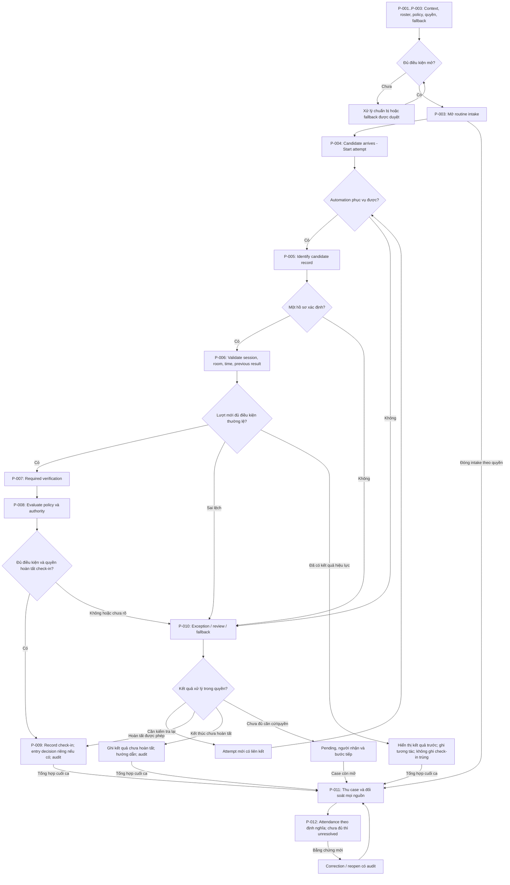
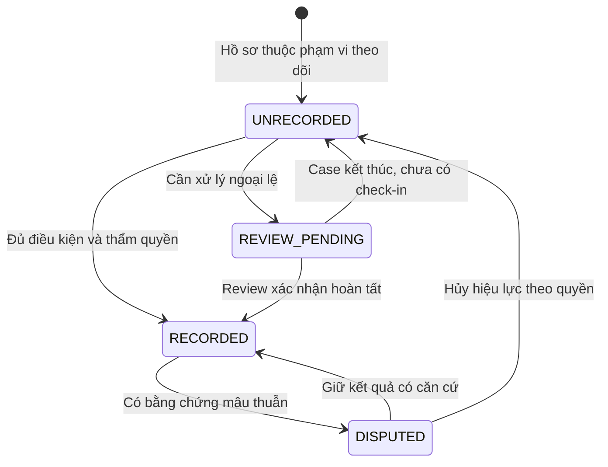
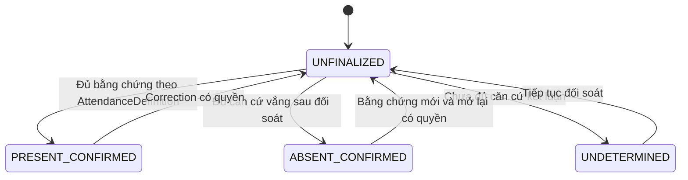

# T-008 — Generic Exam Entry Business Baseline

**Trạng thái:** DRAFT FOR REVIEW — chưa freeze thành baseline đã duyệt.
**Phụ trách:** Quốc An; Minh Hy review theo Sheet.
**Nguồn:** yêu cầu refactor T-008 của Quốc An; [T-002](T-002-quoc-an-proposal.md), [T-007](../02-survey/T-007-selection.md), [D-001](../00-project/decisions/T-004-D-001-chon-bai-toan-cua-phong-thi.md), [D-002](../00-project/decisions/T-007-D-002-chon-huong-khao-sat-t005.md).

> T-008 defines a generic reference business workflow for candidate entry/check-in at an exam room.

Tài liệu thiết kế bộ nghiệp vụ dùng chung khi chưa chọn kỳ thi cụ thể, làm business baseline cho nghiên cứu và business contract/reference cho application sau này. BA là phương pháp suy luận; đầu ra là workflow, rule, lifecycle, policy và capability cần phục vụ.

- **CONFIRMED:** có nguồn trực tiếp; xác nhận mục tiêu không phải bằng chứng hiệu quả thực địa.
- **ASSUMPTION:** giả định thiết kế/đề xuất cho baseline đang chờ nhóm review, không phải fact về tổ chức cụ thể.
- **OPEN QUESTION:** vấn đề còn cần review, cấu hình hoặc chuyển nghiên cứu, giữ ID OQ-xxx.
- **TBD:** giá trị hoặc lựa chọn chưa quyết định.

Các process/BR/FR/state dưới đây là bản thiết kế đề xuất. “The system shall” diễn đạt capability nghiệp vụ để nhóm duyệt; chưa chỉ định implementation. Generic baseline có thể freeze với policy chưa gán giá trị kỳ thi, miễn interface nghiệp vụ, thẩm quyền và cách xử lý thiếu policy đã rõ.

## 1. Purpose / Executive Summary

T-008 trả lời: **một hệ thống hỗ trợ kiểm tra đầu vào tại cửa phòng thi, trong kịch bản chung, cần phục vụ nghiệp vụ nào và có capability nào?**

Mục tiêu là tạo đầu vào ổn định cho T-009/T-010/T-011 và reference khi xây app. Đổi kỳ thi được xử lý qua policy, nguồn dữ liệu và phân quyền; nếu một kỳ thi đưa ra concept nằm ngoài scope baseline thì cần review mở rộng rõ ràng.

### Core Business Flow / Core Decisions

**Chuẩn bị context + roster + policy + vai trò → tiếp nhận attempt → xác định hồ sơ → kiểm tra ca/phòng/thời gian/lượt trước → thực hiện kiểm tra được yêu cầu → đánh giá theo policy → ghi check-in hoặc review → entry decision nếu thuộc scope → đối soát → correction có audit.**

Sáu nguyên tắc baseline đề xuất để nhóm review:

1. **Đơn vị nghiệp vụ:** một lượt kiểm tra gắn với ngữ cảnh kỳ thi/ca/phòng; mỗi lượt tìm một candidate record hoặc kết thúc/chuyển review vì chưa xác định.
2. **Bốn kết quả riêng:** attempt là lượt tương tác; check-in là kết quả hoàn tất kiểm tra; entry authorization là quyết định cho vào; attendance là kết luận theo định nghĩa cấu hình sau đối soát. Không tự suy kết quả sau từ kết quả trước.
3. **Policy quyết định giá trị thay đổi:** thời gian, bằng chứng yêu cầu, retry, authority, re-entry, attendance và retention là tham số nghiệp vụ; chưa gán giá trị cho kỳ thi.
4. **Thẩm quyền rõ:** hệ thống chỉ áp dụng quyết định trong quyền cấu hình; ngoại lệ do vai trò được cấp quyền xử lý. Thiếu policy/quyền thì chưa xác nhận kết quả phụ thuộc.
5. **Có đường thất bại:** unresolved, interrupted, fallback và correction giữ dấu vết; sự cố không biến thành success hoặc absent.
6. **Giới hạn bàn giao:** T-008 đi tới capability và technical question; task sau chọn cách đáp ứng, thiết kế phép thử và tạo evidence.

**Cách đọc:** mục 3 phân ba lớp và chính sách; mục 4–8 định nghĩa kịch bản/quy trình; mục 9–17 là contract chi tiết; mục 18 phân loại phần còn mở; mục 19–20 nối sang nghiên cứu và điều kiện freeze. Không cần As-Is thực địa để hoàn tất thiết kế generic này.

## 2. Business Problem & Objectives

| ID | Vấn đề nghiệp vụ | Căn cứ / trạng thái |
|---|---|---|
| BP-001 | Công việc đối chiếu đầu vào tại từng phòng tạo nhu cầu bố trí người thực hiện. | CONFIRMED — bối cảnh/mục tiêu nhóm cung cấp; khối lượng thực tế chưa đo. |
| BP-002 | Cần phân biệt hợp lệ, đến muộn, nhầm phòng, chưa đến và ngoại lệ liên quan. | CONFIRMED — phạm vi nhóm đã nêu. |
| BP-003 | Cần khả năng đối soát và sửa ghi nhận sai/thiếu có căn cứ. | CONFIRMED — yêu cầu phân tích, chưa có thống kê sự cố thực tế. |
| BP-004 | Quy trình cần tiếp tục khi automation thất bại. | CONFIRMED — mục tiêu human fallback; tính khả thi chưa xác minh. |

Mục tiêu đề xuất: giảm tổng công sức; ghi nhận đúng người/ca/phòng; chuyển ngoại lệ đúng người; điều tra và sửa được; duy trì vận hành khi có sự cố. Cần tính cả chuẩn bị dữ liệu, hỗ trợ, review, phục hồi và đối soát để tránh chỉ chuyển công việc sang chỗ khác.

### Giới hạn bằng chứng thực địa

Chưa chọn kỳ thi hoặc tổ chức cụ thể nên T-008 không mô tả một As-Is thực địa đã xác minh. Tài liệu định nghĩa generic reference workflow. Quan sát As-Is sẽ cần trước khi tuyên bố giảm nhân sự hoặc cải thiện vận hành đo được (OQ-005); thiếu As-Is không ngăn hoàn thành/freeze generic business baseline.

> This baseline defines a generic research/application scenario and does not demonstrate measured improvement over a specific real-world exam process.

## 3. Scope & Boundaries — Generic / Configurable / Technical

Phạm vi: chuẩn bị roster/context → từng lượt tại cửa → review/fallback → đóng tiếp nhận → reconciliation → correction. Mỗi attempt có một ngữ cảnh rõ; một thiết bị có thể phục vụ nhiều context theo cách task sau xác định.

| Lớp | Nội dung | Điều được chốt ở T-008 |
|---|---|---|
| Generic / Fixed Business Structure | Exam/session/room context, candidate record, attempt, check-in result, review, duplicate handling, fallback, reconciliation, correction, audit. | Ý nghĩa, quan hệ, lifecycle, trách nhiệm và invariant của baseline để nhóm review. “Fixed” nghĩa là cấu trúc reference, không tuyên bố mọi kỳ thi trên thực tế đều vận hành như vậy. |
| Configurable Exam Policy | Arrival window, late, required evidence, retry, authority, re-entry, attendance, retention và các policy trong bảng dưới. | Capability áp dụng policy, người sở hữu/phê duyệt, kết quả khi thiếu/mâu thuẫn policy; giá trị kỳ thi vẫn TBD. |
| Technical Implementation | Cách nhận thông tin hồ sơ/thu bằng chứng, AI/non-AI, model/data/algorithm, lưu trữ và kiến trúc. | Câu hỏi phải nghiên cứu và output nghiệp vụ cần trả về; lựa chọn để task sau. |

Core baseline có check-in, review và đối soát theo AttendanceDefinition. Quản lý dự thi bên trong phòng, tái nhập đầy đủ và điều khiển cửa vật lý là **optional/scope-dependent**. Baseline giữ ranh giới và cách biểu diễn quyết định của chúng, không mặc định phải xây tất cả.

D-001/D-002 giữ lịch sử hướng nghiên cứu nhóm đã chọn. Các lựa chọn kỹ thuật trong T-002/T-005 không trở thành generic business fact. T-009 cần chứng minh candidate đáp ứng capability; nếu phát hiện mâu thuẫn thì nhóm review quyết định liên quan, không sửa requirement để candidate fit.

### Configurable Exam Policies

Các example chỉ minh họa dạng giá trị, **không phải default hoặc policy đã chọn**. Nhóm phê duyệt profile giả lập khi nghiên cứu; đơn vị tổ chức/người có quyền phê duyệt profile của kỳ thi thật. Không điền số phút, số lần thử, ngưỡng hay loại giấy tờ/biometric tại đây.

| Policy | Generic capability required | Example values | Who configures/approves | Current status |
|---|---|---|---|---|
| ArrivalWindow | Xét thời gian quan sát so với cửa sổ tiếp nhận; ghi rõ policy hiệu lực. FR-005, FR-018. | Các mốc được kỳ thi cung cấp; tiếp nhận mở/đóng theo lệnh có quyền. | Exam Administrator cấu hình; người được tổ chức giao quyền phê duyệt. | Capability đề xuất; mốc cụ thể TBD. |
| LatePolicy | Phân biệt late với quyền tiếp tục; chuyển review hoặc xử lý đúng quyền. FR-005, FR-007, FR-009. | Gắn cờ và review; tiếp tục khi được người có quyền chấp thuận. | Policy approver phê duyệt; Authorized Exam Staff xử lý trong quyền. | Capability đề xuất; outcome theo kỳ thi TBD. |
| IdentityEvidenceRequirement | Xác định loại bằng chứng/điều kiện cần đáp ứng để kiểm tra người hiện tại với hồ sơ đã chọn; giữ không đạt/chưa rõ/unavailable. FR-006. | Một bằng chứng được phê duyệt; tổ hợp bằng chứng; kiểm tra bổ sung bởi người có quyền. | Người chịu trách nhiệm chính sách danh tính; người quản lý dữ liệu xác nhận quyền dùng. | Capability đề xuất; loại bằng chứng và phương thức TBD. |
| RetryPolicy | Cho phép/từ chối yêu cầu kiểm tra lại theo policy, liên kết attempt và hướng xử lý khi không thể tiếp tục. FR-006, FR-008, FR-009. | Thử lại theo điều kiện; chuyển review; người có quyền cho phép tiếp tục. | Policy approver; người vận hành áp dụng. | Điều kiện/giới hạn TBD, không default số lần. |
| DecisionAuthority | Tách quyền ghi check-in, cho vào, xác nhận attendance và quản trị cấu hình; xác định việc được tự động hóa. FR-007, FR-013. | Hệ thống ghi lượt thường lệ trong quyền; mọi kết luận cần người duyệt. | Tổ chức/nhóm duyệt vai trò và phạm vi; admin cấu hình theo ủy quyền. | Ranh giới generic đề xuất; mapping kỳ thi TBD. |
| OverrideAuthority | Xác định rule nào được ngoại lệ, ai duyệt và bằng chứng/lý do cần giữ. FR-010. | Không cho override một rule; yêu cầu vai trò được chỉ định. | Policy approver; Authorized Exam Staff quyết từng case trong quyền. | Capability đề xuất; rule/quyền cụ thể TBD. |
| ManualFallbackPolicy | Chuyển cách phục vụ khi automation không khả dụng; quy định bằng chứng thay thế và đối soát. FR-011. | Ghi thủ công có người chịu trách nhiệm; chuyển điểm hỗ trợ; giữ chờ có hướng dẫn. | Người phụ trách vận hành cấu hình; policy approver duyệt. | Capability đề xuất; phương án tại điểm thi TBD. |
| ReEntryPolicy | Phân biệt lượt quay lại với check-in mới; xử lý yêu cầu tái nhập nếu scope bật. FR-015. | Ngoài phạm vi và chuyển người phụ trách; review; quyết định tái nhập riêng. | Người quản lý ra/vào được ủy quyền. | Optional; scope/profile cụ thể TBD. |
| AttendanceDefinition | Đối soát dựa trên định nghĩa hiện diện được cấu hình và nguồn đủ căn cứ; không tự đồng nhất check-in với tham dự thi. FR-012, FR-013. | Đã đến làm thủ tục; đã vào phòng; đã tham dự với nguồn xác nhận tương ứng. | Policy approver định nghĩa; Attendance Approver xác nhận theo quyền. | Semantics tham số hóa; định nghĩa của profile TBD. |
| CorrectionAuthority | Cho phép mở lại/sửa theo quyền, bảo toàn bản gốc và nêu ảnh hưởng báo cáo. FR-014. | Vai trò được chỉ định duyệt correction; mở lại khi có bằng chứng mới. | Policy approver; người duyệt correction. | Capability đề xuất; phạm vi/thời hạn TBD. |
| RosterUpdatePolicy | Xác định nguồn có hiệu lực, quyền sửa, thời điểm áp dụng và xử lý kết quả bị ảnh hưởng. FR-001, FR-002. | Bản roster đã duyệt cho ca; cập nhật có hiệu lực và review tác động. | Roster Owner xác nhận dữ liệu; người có quyền duyệt thay đổi. | Capability đề xuất; nguồn/hiệu lực cụ thể TBD. |
| EvidenceRetention | Giữ/xem/xóa bằng chứng theo mục đích và quyền; thể hiện phần đã hết hạn không còn khả dụng. FR-016, FR-017. | Thời hạn theo loại bằng chứng; hạn chế xem; xử lý giữ bằng chứng cho case theo policy. | Người phụ trách dữ liệu được ủy quyền; policy approver duyệt. | Capability đề xuất; thời hạn/quyền cụ thể TBD. |

**Quy tắc áp dụng chung:** một phiên hoặc attempt phải tham chiếu policy có hiệu lực. Thiếu hoặc mâu thuẫn policy cần cho một quyết định thì kết quả đó chưa được xác nhận; chuyển review/giữ unresolved theo quyền, không tự đặt default. Policy không cần vì feature ngoài scope phải được đánh dấu “không áp dụng”. Thay policy giữa ca phải xác định hiệu lực và kết quả bị ảnh hưởng theo BR-001/BR-013/BR-016; không tự viết lại quyết định lịch sử.

Policy có thể yêu cầu các điều kiện đầu vào khác ngoài danh tính; chúng cần nguồn/quyền và cách trả kết quả như các kiểm tra ở P-007. Policy không được hợp thức hóa một kết luận kỹ thuật chưa có bằng chứng.

## 4. Generic Scenario & Design Assumptions

### Kịch bản reference

Một kỳ thi có các ca và phân phòng. Một điểm kiểm tra tiếp nhận từng lượt và biết context đang phục vụ. Khi người đến, workflow tạo attempt, tìm đúng candidate record, kiểm tra điều kiện và bằng chứng theo policy, ghi check-in hoặc chuyển review. Người có quyền xử lý ngoại lệ; cuối ca đối soát mọi nguồn và có thể correction khi phát hiện sai.

Đây là **kịch bản thiết kế generic đề xuất**, không phải mô tả một tổ chức thật. Một thiết bị phục vụ nhiều ca/phòng vẫn phải gắn đúng context cho từng attempt.

| ID | Điều đã biết | Status / nguồn |
|---|---|---|
| CF-001 | Nhóm định hướng thiết bị hỗ trợ tại cửa phòng thi. | CONFIRMED — D-001 và yêu cầu T-008. |
| CF-002 | Mục tiêu giảm công đối chiếu và ghi nhận tình trạng thí sinh. | CONFIRMED — yêu cầu nhóm; hiệu quả thực địa chưa đo. |
| CF-003 | Chưa chọn kỳ thi/quy chế cụ thể. | CONFIRMED — phản hồi Quốc An. |
| CF-004 | T-008 định nghĩa generic business baseline trước khi chốt giải pháp. | CONFIRMED — chỉ dẫn refactor T-008. |
| CF-005 | Workflow cần human fallback khi automation thất bại. | CONFIRMED — yêu cầu thiết kế, không phải năng lực đã triển khai. |

| ID | Giả định thiết kế generic để nhóm review | Cách workflow xử lý / phần cấu hình sau |
|---|---|---|
| A-001 | Có nguồn roster quy được trách nhiệm và quan hệ hồ sơ–ca/phòng. | Thiếu/mơ hồ/sai dữ liệu thành exception; nguồn thực tế và quyền sửa theo RosterUpdatePolicy, OQ-013. |
| A-002 | Mỗi attempt có context ca/phòng xác định. | Context sai/không rõ chuyển review; điểm dùng chung/đổi ca không thay invariant này, OQ-008. |
| A-003 | Có vai trò xử lý ngoại lệ được phân quyền. | Không có người nhận thì giữ unresolved và chuyển escalation; người trực cụ thể cấu hình trước vận hành, OQ-009/OQ-011. |
| A-004 | Workflow hỗ trợ một đường ghi nhận/fallback có audit. | Phương án cụ thể theo ManualFallbackPolicy; không khả dụng thì giữ pending có hướng dẫn, không giả success, OQ-018. |
| A-005 | Attendance cần nguồn bằng chứng tương ứng với định nghĩa được cấu hình. | Nếu nghĩa là tham dự trong phòng thì phải có nguồn bổ sung; thiếu nguồn giữ UNDETERMINED, OQ-001/OQ-015. |
| A-006 | Mọi quyết định/correction có chủ thể hoặc quyền tự động truy vết được. | Phân vai theo DecisionAuthority/CorrectionAuthority; quyền thực tế được cấp sau, OQ-009/OQ-012. |

A-001–A-006 là ASSUMPTION thiết kế chờ nhóm duyệt. Khi được duyệt chúng xác định phạm vi reference; không đòi hỏi khảo sát thực địa để trở thành baseline. Các policy/value còn mở ở mục 18 không làm mất định nghĩa workflow.

## 5. Actors, Responsibilities & Decision Authority

Các vai trò dưới đây là cấu trúc generic đề xuất; một người có thể kiêm nhiệm nếu được phê duyệt. Policy Approver là vai trò nghiệp vụ của tổ chức/nhóm có quyền duyệt profile; Exam Administrator chỉ cấu hình theo ủy quyền, không tự có quyền phê duyệt. Danh tính người thực hiện được gán khi áp dụng vào profile/ca cụ thể.

| Actor | Trách nhiệm | Quyền đọc/ghi đề xuất | Giới hạn quyết định |
|---|---|---|---|
| Candidate | Cung cấp thông tin, thực hiện kiểm tra, phản ánh sai lệch. | Xem hướng dẫn/kết quả lượt của mình; cung cấp thông tin. | Không tự sửa roster/attendance. |
| Check-in Device/System | Áp dụng quy tắc, ghi event, phát hiện mâu thuẫn, chuyển ngoại lệ. | Đọc dữ liệu tối thiểu; ghi attempt và kết quả hệ thống. | Chỉ tự quyết định trong phạm vi được ủy quyền. |
| Entry Operator / Invigilator | Hỗ trợ và ghi nhận tình huống tại chỗ. | Xem hồ sơ cần xử lý; bổ sung bằng chứng/yêu cầu review. | Hỗ trợ không mặc định có quyền override, sửa roster hoặc kết luận vắng. |
| Authorized Exam Staff | Xử lý ngoại lệ trong phạm vi được giao. | Xem case; ghi quyết định/lý do. | Quyền theo loại quyết định. |
| Attendance Reconciler / Approver | Đối chiếu nguồn và xác nhận/mở lại attendance. | Đọc roster/event/nguồn đối soát; ghi kết luận. | Vai trò và phạm vi quyền cụ thể TBD. |
| Exam Administrator / Roster Owner | Chuẩn bị dữ liệu và chính sách, xác nhận hiệu lực. | Tạo/import/cập nhật theo quyền. | Quản trị hệ thống không mặc định có mọi quyền nghiệp vụ. |
| Exam Management System / Candidate Database | Cung cấp dữ liệu từ nguồn được công nhận. | Cung cấp roster và cập nhật được phép. | Nguồn ưu tiên khi có xung đột TBD. |

Nguyên tắc xuyên suốt project:

- **Business decision:** tổ chức/nhóm có quyền phê duyệt chính sách.
- **System decision:** hệ thống áp dụng một chính sách đã được phê duyệt.
- **Human-authorized decision:** người có quyền xử lý một trường hợp hoặc ngoại lệ.
- **Technical implementation:** cách thực hiện kiểm tra và lưu kết quả.

Khi thẩm quyền tự động chưa rõ, hệ thống ghi bằng chứng/flag/recommend và chuyển review. Không tự suy quyền từ chối, cho vào hoặc miễn một bước kiểm tra từ kết quả kỹ thuật.

## 6. Pre-Session Setup & End-to-End Generic Workflow

### Trước ca — khi nào sẵn sàng?

P-001–P-003 tạo một context nghiệp vụ gồm kỳ thi/ca/phòng, roster có hiệu lực, policy profile, vai trò được ủy quyền và đường fallback. Roster xác định người dự kiến và phân công; bản thân một record không chứng minh người đang đứng tại cửa là chủ record.

Điều kiện sẵn sàng đề xuất:

- Context rõ, roster có nguồn/hiệu lực; lỗi dữ liệu được phát hiện và có đường xử lý.
- Policy cần cho scope đang bật được cung cấp và phê duyệt; policy ngoài scope được đánh dấu không áp dụng.
- Đã gán vai trò mở/đóng, review, override, correction và đối soát trong phạm vi quyền.
- Có đường ghi audit và phương án tiếp nhận/ghi nhận khi automation thất bại.
- Người có quyền hoặc hệ thống được ủy quyền xác nhận mở tiếp nhận và lưu căn cứ.

Thiếu điều kiện thiết yếu thì chưa mở luồng tự xử lý thường lệ; chuyển xử lý chuẩn bị hoặc chế độ fallback đã được duyệt. T-008 chỉ định nghĩa điều kiện sẵn sàng này. Một profile cụ thể cần điền giá trị trước khi chạy kịch bản phụ thuộc; bản baseline không phải tự điền chúng.

| ID | Bước generic | Đầu ra và vì sao cần bước sau |
|---|---|---|
| P-001 | Xác định exam/session/room context, policy và trách nhiệm. | Có ngữ cảnh để chuẩn bị nguồn và quyền. |
| P-002 | Kiểm tra/xác nhận roster có hiệu lực. | Có hồ sơ dùng được hoặc exception dữ liệu. |
| P-003 | Kiểm tra sẵn sàng và mở phiên check-in. | Có context/policy hợp lệ, vai trò nhận review và đường fallback. |
| P-004 | Tiếp nhận và bắt đầu attempt. | Có dấu vết kể cả chưa tìm được hồ sơ. |
| P-005 | Xác định candidate record. | Một hồ sơ hoặc case không tìm thấy/mơ hồ. |
| P-006 | Validate session → room → thời gian theo policy → kết quả trước/duplicate. | Điều kiện thường lệ, cờ tình huống hoặc sai lệch cần xử lý. |
| P-007 | Thực hiện required identity/entry verification. | Bằng chứng thuộc người đang làm thủ tục, kết quả và giới hạn. |
| P-008 | Evaluate result under configured policy and authority. | Kết luận được phép, yêu cầu review/retry hoặc unresolved. |
| P-009 | Ghi check-in hoặc chuyển review; entry decision riêng nếu thuộc scope; thông báo và giữ audit. | Kết quả nghiệp vụ phân biệt, người đến biết bước tiếp. |
| P-010 | Xử lý exception, fallback, override hoặc correction trong quyền. | Quyết định có căn cứ, liên kết attempt/case gốc. |
| P-011 | Đóng routine intake, thu case mở, đối soát điện tử/thủ công/fallback. | Bằng chứng và khoảng thiếu được tập hợp, không tự suy absent. |
| P-012 | Xác định attendance theo policy; giữ unresolved nếu thiếu; báo cáo/correction/reopen. | Kết luận có định nghĩa, nguồn, người xác nhận và lịch sử. |

Review tách rõ hoàn tất được phép, kết thúc chưa hoàn tất và giữ pending; chỉ nhánh hoàn tất được phép mới ghi check-in có hiệu lực. Duplicate có mâu thuẫn hoặc yêu cầu re-entry đi qua P-010 theo policy. Không có policy/quyền không đồng nghĩa được từ chối hoặc được cho vào.

## 7. Main Flow

**Điều kiện trước:** phiên đã mở theo P-003; scope, roster và policy profile hiệu lực đã xác định.

1. Candidate arrives → tạo attempt gắn context và nguồn tiếp nhận.
2. Xác định đúng một candidate record bằng thông tin được cung cấp; phương thức để task sau chọn.
3. Validate session, room; xét arrival window/late theo policy; kiểm tra kết quả trước và duplicate.
4. Thực hiện kiểm tra bằng chứng danh tính/điều kiện đầu vào mà policy yêu cầu. Bằng chứng phải liên kết với người đang thực hiện attempt và record đã chọn.
5. Đánh giá kết quả theo policy: đáp ứng, chưa đáp ứng, chưa rõ hoặc không thể kiểm tra; chỉ chủ thể có quyền được kết luận bước tiếp.
6. Đủ điều kiện/quyền → ghi check-in có hiệu lực. Nếu chưa đủ → review/retry/fallback theo policy và giữ reason.
7. Nếu entry authorization thuộc scope, ghi quyết định riêng trong phạm vi quyền; không suy “RECORDED” nghĩa là đã được cho vào hoặc đã đi qua cửa.
8. Thông báo kết quả/hướng dẫn và bảo toàn audit. Nếu attendance cần bằng chứng vào phòng/tham dự, nguồn đó được bổ sung ở bước đối soát.

**Sau lượt:** attempt có kết quả hoặc bị ngắt có lý do; check-in, entry outcome và attendance vẫn là các concept độc lập. Thứ tự generic kiểm tra ngữ cảnh trước bằng chứng là lựa chọn thiết kế để review, không phụ thuộc có một As-Is thực địa.

## 8. Alternative & Exception Flows

| ID | Luồng | Xử lý đề xuất |
|---|---|---|
| AF-001 | Tìm hồ sơ bằng cách khác | Người hỗ trợ tìm theo quyền, ghi phương thức và kết quả; loại mã/thẻ TBD. |
| AF-002 | Kiểm tra lại | Tạo attempt mới liên kết lượt trước; điều kiện/giới hạn thử lại TBD. |
| AF-003 | Quay lại sau check-in | Phân biệt hỏi lại, retry và re-entry; không tạo attendance mới. |
| EF-001 | Sai lệch hồ sơ/ca/phòng hoặc chưa rõ | Tạo case và chuyển đúng người; không tự suy quyền cho vào. |
| EF-002 | Không thực hiện được kiểm tra | Ghi unavailable và nguyên nhân biết được; chuyển fallback. |
| EF-003 | Thiết bị/nguồn dữ liệu không hoạt động | Kích hoạt cách vận hành đã phê duyệt và duy trì dấu vết. |
| EF-004 | Phát hiện ghi sai | Mở correction, giữ bản gốc và xem ảnh hưởng tới attendance. |

**Đối soát cuối ca theo AttendanceDefinition:** người có quyền đóng tiếp nhận thường lệ → xác định roster có hiệu lực → tập hợp nguồn điện tử/thủ công và khoảng gián đoạn → phân loại có bằng chứng/chưa ghi nhận/mâu thuẫn/pending → xác minh → kết luận theo quyền hoặc giữ chưa xác định → phát hành báo cáo có phiên bản/case còn mở → correction khi có bằng chứng mới.

Không có check-in điện tử không tự chuyển thành absent. Case còn mở có người chịu trách nhiệm và bước tiếp theo ngay cả khi tiếp nhận thường lệ đã đóng.

## 9. Scenario Matrix

Giữ 24 scenario để review coverage của generic baseline. ASSUMPTION chỉ trạng thái thiết kế chờ duyệt; TBD ở dòng policy là value theo kỳ thi chưa gán, không có nghĩa thiếu generic flow. “Bằng chứng” không mặc định là ảnh/video/sinh trắc học. Cột check-in state giả định chưa có kết quả hiệu lực trừ khi nêu khác; nếu đã RECORDED thì giữ kết quả cũ và chỉ mở DISPUTED khi cần correction, không ghi đè bằng cờ của lượt mới.

| Scenario | Preconditions | Detection Condition | System Action | Recorded State | Human Responsible | Next Step | Audit Evidence | Status |
|---|---|---|---|---|---|---|---|---|
| SC-001 — Hợp lệ, đúng người/phòng/ca | Roster, quy trình có hiệu lực | Các kiểm tra đạt, đủ quyền | Ghi một kết quả; hướng dẫn | RECORDED | Người vận hành/người duyệt theo quyền | Thực hiện hướng xử lý được cho phép | Hồ sơ, attempt, kết quả, quyền | ASSUMPTION |
| SC-002 — Nhầm phòng | Xác định được hồ sơ | Phòng nguồn khác điểm hiện tại | Flag; hướng dẫn/review | REVIEW_PENDING; cờ wrong room | Người hỗ trợ/người có quyền | Xác minh phân phòng/chuyển điểm | Phiên bản roster, hai phòng, quyết định | ASSUMPTION |
| SC-003 — Nhầm ca | Có ca của hồ sơ | Không khớp ca hoạt động | Flag; chuyển review | REVIEW_PENDING; cờ wrong session | Người có quyền | Kiểm tra lịch/thay đổi hợp lệ | Ca nguồn/hiện tại, quyết định | ASSUMPTION |
| SC-004 — Có khả năng đến muộn | Có thời gian lượt đến | So mốc có nguồn nếu có | Giữ thời gian; chỉ gắn late khi đủ căn cứ | Cờ thời gian/review | Người được quyền xử lý late | Áp dụng chính sách | Mốc, thời gian, độ tin cậy, quyết định | TBD |
| SC-005 — Thông tin không khớp | Đã chọn hồ sơ | Mâu thuẫn thông tin/quan sát | Tạo case; giữ sai lệch | REVIEW_PENDING | Người xác minh/roster owner | Xác minh hoặc sửa nguồn theo quyền | Nội dung, nguồn, lý do | ASSUMPTION |
| SC-006 — Kiểm tra danh tính không đạt | Thực hiện được kiểm tra | Không đáp ứng tiêu chí được duyệt | Ghi kết quả; review; không tự kết luận giả mạo | Attempt kết luận; check-in chưa hoàn tất | Người có quyền | Kiểm tra bổ sung/quyết định | Kết quả, quy trình, nguyên nhân biết được | ASSUMPTION |
| SC-007 — Không thể xác minh | Thiếu dữ liệu/phương tiện | Không đủ điều kiện kiểm tra | Phân biệt unavailable và không đạt | REVIEW_PENDING | Người nhận fallback | Phương án được duyệt | Dữ liệu thiếu, lỗi, cách thay thế | ASSUMPTION |
| SC-008 — Nhiều lần thử | Có attempt trước | Tương tác lặp | Liên kết attempt; giữ lần trước | Attempt mới; giữ kết quả hiệu lực | Người hỗ trợ khi cần | Retry/review theo chính sách | Chuỗi attempt, thời gian, lý do | ASSUMPTION |
| SC-009 — Check-in trùng | Có kết quả hiệu lực | Yêu cầu ghi thêm cùng người/ca | Hiển thị kết quả trước; tránh trùng | Giữ RECORDED | Người xử lý khi mâu thuẫn | Kết thúc hoặc mở case | Bản ghi trước và yêu cầu mới | ASSUMPTION |
| SC-010 — Thiết bị hỏng | Điểm đang hoạt động | Không phục vụ được | Fallback; đánh dấu gián đoạn | Lượt thủ công/INTERRUPTED | Người vận hành/được quyền fallback | Tiếp tục, đối soát khi phục hồi | Sự cố, thời gian, người ghi, bản gốc | ASSUMPTION |
| SC-011 — Mất mạng/database | Cần truy cập nguồn | Nguồn không khả dụng | Nêu giới hạn; dùng phương án được duyệt | Review/fallback; chờ đối soát | Người vận hành | Khôi phục, xét dữ liệu cũ/xung đột | Nguồn, phiên bản, thời gian, lượt phát sinh | ASSUMPTION |
| SC-012 — Không tìm thấy hồ sơ | Đã nhận thông tin tra cứu | Không có kết quả phù hợp | Ghi attempt chưa liên kết; review | Case mở, attempt chưa gắn hồ sơ | Roster owner/người có quyền | Xác minh nguồn hoặc thông tin | Thông tin tối thiểu, nguồn đã kiểm tra | ASSUMPTION |
| SC-013 — Manual override | Case cần ngoại lệ | Đề nghị xử lý khác luồng thường lệ | Kiểm tra phạm vi quyền; ghi riêng | Theo quyết định; giữ cờ gốc | Người có quyền tương ứng | Áp dụng, đối soát | Actor, quyền, lý do, trước/sau | TBD |
| SC-014 — Không có ghi nhận xuất hiện | Hồ sơ trong roster đối soát | Không tìm thấy bằng chứng | Danh sách chưa ghi nhận | UNRECORDED; attendance chưa xác nhận | Người đối soát | Xét fallback/case trước kết luận | Nguồn đã xét, khoảng mất dữ liệu | ASSUMPTION |
| SC-015 — Check-in sai phát hiện sau | Có kết quả hiệu lực | Bằng chứng mâu thuẫn | Disputed; mở correction | DISPUTED | Người có quyền correction | Giữ/sửa sau xác minh | Bản gốc, bằng chứng mới, ảnh hưởng báo cáo | ASSUMPTION |
| SC-016 — Ghi vắng sai phát hiện sau | Đã xác nhận vắng | Có bằng chứng trái kết luận | Mở lại attendance; giữ lịch sử | Attendance về review | Người có quyền đối soát/correction | Xác minh và phát hành bản sửa | Kết luận cũ, nguồn mới, trước/sau | ASSUMPTION |
| SC-017 — Rời đi rồi quay lại | Có lịch sử trước | Yêu cầu xử lý lượt quay lại | Tách retry và re-entry | Giữ check-in; cờ yêu cầu nếu thuộc scope | Người có quyền ra/vào | Theo chính sách re-entry | Kết quả cũ, yêu cầu, quyết định | TBD |
| SC-018 — Roster đổi trong ca | Phiên đang mở | Nguồn đổi ca/phòng/tư cách hồ sơ | Ghi phiên bản; tìm kết quả bị ảnh hưởng | Review hồ sơ xung đột | Roster owner/người đối soát | Xác minh hiệu lực | Trước/sau, nguồn, hiệu lực, người xác nhận | ASSUMPTION |
| SC-019 — Case còn mở khi đóng | Có review chưa hoàn tất | Bắt đầu đối soát | Giữ case và người nhận | Attendance chưa xác định | Người đối soát/người xử lý case | Tiếp tục hoặc báo cáo ngoại lệ | Case, người nhận, điều còn thiếu | ASSUMPTION |
| SC-020 — Chưa biết ghi thành công hay chưa | Gián đoạn khi ghi | Thiếu xác nhận kết quả | Tra kết quả trước khi ghi mới | Chờ đối soát | Người vận hành | Tra cứu, đối soát, thông báo | Thao tác gốc, kết quả lưu, retry | ASSUMPTION |
| SC-021 — Bỏ dở lượt | Attempt đang mở | Người rời đi/quy trình dừng | Giữ dấu vết và lý do biết được | INTERRUPTED | Người vận hành khi cần | Lượt mới nếu quay lại; xét cuối ca | Tiến độ, thời gian, lý do | ASSUMPTION |
| SC-022 — Hồ sơ mơ hồ/trùng | Tra cứu nhiều kết quả | Chưa xác định duy nhất | Không tự chọn; review | Case mở | Roster owner/người xác minh | Làm rõ hồ sơ | Các tham chiếu, nguồn, quyết định | ASSUMPTION |
| SC-023 — Sai ngữ cảnh/giờ không tin cậy | Điểm đã cấu hình | Sai ca/phòng hoặc thời gian | Dừng kết luận bị ảnh hưởng; fallback/review | Kết quả cần đối soát | Người vận hành/người có quyền | Sửa ngữ cảnh, rà soát ảnh hưởng | Trước/sau, khoảng thời gian, hồ sơ | ASSUMPTION |
| SC-024 — Không có người nhận ngoại lệ | Cần human decision | Không liên hệ được người đủ quyền | Giữ pending; tuyến escalation | REVIEW_PENDING | Vai trò trực/escalation TBD | Chờ/phương án đã phê duyệt | Lần chuyển giao, thời gian chờ | TBD |

## 10. Business Rules

Các BR là ASSUMPTION. Chưa đặt số phút trễ, số retry, threshold hay mặc định mọi rule đều được override.

| ID | Business Rule | Source | Phụ thuộc chưa chốt |
|---|---|---|---|
| BR-001 | Kết quả gắn với ngữ cảnh ca/phòng và nguồn roster có hiệu lực khi xử lý. | P-001–P-003; SC-018, SC-023 | Nguồn chuẩn/hiệu lực. |
| BR-002 | Chỉ hoàn tất thường lệ khi candidate record được xác định rõ. | P-005; SC-012, SC-022 | Cách xác định hồ sơ. |
| BR-003 | Sai lệch ca/phòng cần được giải quyết theo quyền trước khi hoàn tất ở điểm hiện tại. | P-006; SC-002, SC-003 | Quyền sửa phân phòng/ngoại lệ. |
| BR-004 | Late và quyền tiếp tục dựa chính sách có hiệu lực; giữ riêng thời gian quan sát. | SC-004, SC-023 | Mốc và cách xử lý TBD. |
| BR-005 | Kiểm tra người đang làm thủ tục với hồ sơ đã chọn theo yêu cầu bằng chứng; tách đáp ứng, không đạt, unavailable và chưa rõ; không tự biến thiếu bằng chứng thành success hoặc giả mạo. | P-007; SC-006, SC-007 | Tiêu chí/quy trình kiểm tra. |
| BR-006 | Quyền hoàn tất check-in và cho vào được xác định riêng; hệ thống chỉ tự quyết trong quyền. | P-008; SC-001, SC-013 | Mức tự động hóa/quyền cuối. |
| BR-007 | Nhiều attempt không tạo check-in có hiệu lực trùng cho cùng người/ca; attendance được đối soát riêng và không đếm lặp; giữ lịch sử attempt. | SC-008, SC-009, SC-020 | Cách xử lý đăng ký trùng. |
| BR-008 | Case chưa rõ có trạng thái, vai trò nhận và bước tiếp; quá thời gian chờ không mặc định bị từ chối. | P-010; SC-019, SC-024 | Escalation/thời hạn. |
| BR-009 | Override đúng loại/phạm vi quyền; ghi actor, thời gian, lý do, trước/sau và bằng chứng. | SC-013 | Rule nào được ngoại lệ. |
| BR-010 | Fallback giữ đủ dấu vết đối soát; không tự ghi đè xung đột thiếu căn cứ. | SC-010, SC-011, SC-020 | Phương án fallback. |
| BR-011 | Thiếu check-in điện tử chưa đủ kết luận absent; xét thủ công, lỗi hệ thống và case mở. | SC-014, SC-016, SC-019 | Định nghĩa attendance/căn cứ vắng. |
| BR-012 | Attendance cuối ca cần bằng chứng và người có quyền; chưa đủ thì giữ chưa xác định. | P-011, P-012 | Người xác nhận/điều kiện khóa báo cáo. |
| BR-013 | Correction giữ bản gốc/lý do; xác định báo cáo và hồ sơ bị ảnh hưởng. | SC-015, SC-016 | Quyền/thời hạn correction. |
| BR-014 | Lượt quay lại không tạo attendance mới; quyền tái nhập là chính sách riêng. | AF-003; SC-017 | Re-entry có thuộc scope. |
| BR-015 | Chỉ thu/hiển thị/lưu dữ liệu phục vụ kiểm tra, xử lý, đối soát; xác định quyền xem và retention. | P-004–P-012; RISK-012 | Danh mục/quyền/thời gian lưu. |
| BR-016 | Đổi roster/ngữ cảnh cho phép xác định kết quả cũ bị ảnh hưởng để review. | SC-018, SC-023 | Quyền cập nhật/hiệu lực. |
| BR-017 | Đóng tiếp nhận không xóa/tự kết luận case mở; chuyển sang đối soát. | P-011; SC-019 | Xử lý sau đóng. |

## 11. Candidate / Check-in State Model

**Mô hình lifecycle nghiệp vụ đề xuất cho baseline/app reference; không phải enum/database/API schema.** Giữ riêng trạng thái attempt, kết quả check-in, attendance và cờ tình huống. Late/sai phòng có thể đồng thời tồn tại; chúng không thay trạng thái chính. Roster giữ trạng thái/hiệu lực riêng.

### Trạng thái một attempt

| State | Meaning / entry condition | Who creates it | Allowed transitions | Terminal? | Sửa và audit |
|---|---|---|---|---|---|
| STARTED | Tiếp nhận lượt | Hệ thống/người ghi fallback | IN_PROGRESS, INTERRUPTED | Không | Ghi thời gian, nguồn. |
| IN_PROGRESS | Đang kiểm tra | Hệ thống/người xử lý | CONCLUDED, INTERRUPTED | Không | Giữ bước đã làm và kết quả. |
| CONCLUDED | Có kết quả: hoàn tất, chuyển review hoặc chưa đáp ứng | Chủ thể trong phạm vi quyền | Lượt mới/correction có liên kết | Có, cho attempt | Không sửa mất bản gốc. |
| INTERRUPTED | Dừng trước kết quả đầy đủ | Hệ thống/người vận hành | Lượt mới nếu tiếp tục | Có, cho attempt | Ghi nguyên nhân biết được. |

Attempt kết thúc không có nghĩa case đã giải quyết. Hồ sơ chưa rõ: giữ attempt/case chưa liên kết, không tạo candidate giả.

### Kết quả check-in theo người/ca

| State | Meaning / entry condition | Who creates it | Allowed transitions | Terminal? / quyền sửa |
|---|---|---|---|---|
| UNRECORDED | Chưa có kết quả hiệu lực | Từ roster hoặc correction | REVIEW_PENDING, RECORDED | Không; theo workflow được cấp quyền. |
| REVIEW_PENDING | Cần xử lý trước xác nhận | Hệ thống/người vận hành tạo case | RECORDED; UNRECORDED khi case kết thúc chưa hoàn tất | Không; có quyết định/lý do. |
| RECORDED | Có check-in được xác nhận | Hệ thống được ủy quyền/người có quyền | DISPUTED khi có mâu thuẫn | Ổn định cho lượt thường lệ; correction vẫn được xét. |
| DISPUTED | Kết quả đã ghi đang được xem xét | Quy trình correction | RECORDED nếu giữ; UNRECORDED nếu hủy hiệu lực | Không; người có quyền quyết, giữ bản gốc. |

### Attendance cuối ca

| State | Meaning / entry condition | Chủ thể | Đường ra / sửa |
|---|---|---|---|
| UNFINALIZED | Chưa đối soát xong hoặc mở lại | Khởi tạo/người có quyền | Sang một kết luận bên dưới. |
| PRESENT_CONFIRMED | Đủ căn cứ hiện diện theo AttendanceDefinition đã duyệt | Người/vai trò được quyền | Mở lại UNFINALIZED khi có correction. |
| ABSENT_CONFIRMED | Đủ căn cứ vắng sau đối soát | Người/vai trò được quyền | Mở lại khi có bằng chứng mới. |
| UNDETERMINED | Đã review nhưng chưa đủ căn cứ | Người đối soát | UNFINALIZED khi xử lý tiếp. |

Kết luận có hiệu lực cho một phiên bản báo cáo; không bất biến. Mở lại ghi actor/lý do/nguồn/trước–sau. Đổi liên kết nhầm người là correction cho cả hồ sơ cũ và mới. Semantics generic của state được đề xuất tại đây; OQ-001/OQ-015 xác định policy và nguồn bằng chứng cho mỗi profile, không yêu cầu chọn kỳ thi để định nghĩa lifecycle.

### Entry authorization và situation flags

Entry authorization là kết quả riêng nếu feature thuộc scope: chưa có quyết định, được phép hoặc không được phép theo policy/quyền; ngoài scope phải biểu diễn là không áp dụng, không hiểu là được phép. Mỗi quyết định có căn cứ và chủ thể, được mở lại/sửa theo CorrectionAuthority. Không tự chuyển check-in thành “đã qua cửa”.

LATE, WRONG_ROOM, WRONG_SESSION và cờ lỗi là thông tin của attempt/case; có thể đồng thời tồn tại. Ghi cờ không tự sửa kết quả check-in có hiệu lực trước đó. Nếu cờ làm nghi ngờ kết quả cũ, mở DISPUTED/correction theo quyền.

Attendance không phải chuỗi PRESENT → ABSENT → UNDETERMINED. Đó là các kết luận thay thế từ UNFINALIZED dựa AttendanceDefinition và bằng chứng:

Meaning của state được cố định ở mức generic; policy quyết định bằng chứng nào đáp ứng meaning đó. Báo cáo phải nêu AttendanceDefinition được dùng. Một kết quả RECORDED ở cửa không tự chuyển thành PRESENT_CONFIRMED dưới định nghĩa “tham dự thi”.

## 12. Business Data & Evidence Requirements

“Cần” dưới đây là cần cho quy trình đề xuất, chưa phải schema hoặc danh mục dữ liệu triển khai đã duyệt.

| ID | Nhóm dữ liệu | Cần theo nghiệp vụ đề xuất | Có thể cần / TBD | Source |
|---|---|---|---|---|
| DATA-001 | Candidate/Roster | Tham chiếu hồ sơ; thông tin phân biệt; quan hệ ca/phòng; nguồn/phiên bản/hiệu lực | Thuộc tính nhận dạng và bằng chứng theo phương thức được duyệt | BR-001–BR-003, BR-016 |
| DATA-002 | Session/Room | Định danh; trạng thái tiếp nhận; tham chiếu policy profile/phiên bản hiệu lực và scope bật/tắt; vai trò phụ trách | Mốc giờ, sơ đồ hướng dẫn, điểm dùng chung | BR-001, BR-004, BR-006 |
| DATA-003 | Attempt | Tham chiếu lượt; thời gian và độ tin cậy; điểm tiếp nhận; hồ sơ nếu xác định; kết quả/cờ; nguồn điện tử/thủ công; lượt trước | Bằng chứng bổ sung theo phương thức | BR-005, BR-007, BR-010 |
| DATA-004 | Check-in/Entry Decision | Kết quả; cơ sở; actor/quyền tự động; thời gian; ca/phòng; attempt/case | Quyết định cho vào riêng nếu thuộc scope | BR-006, BR-009 |
| DATA-005 | Review/Override | Lý do tạo; vai trò/người nhận; trạng thái; bằng chứng; quyết định; quyền; trước/sau | Phê duyệt bổ sung nếu có quy định | BR-008, BR-009, BR-013 |
| DATA-006 | Attendance/Reconciliation | Roster; nguồn đã xét; kết luận; case mở; người/thời gian xác nhận; phiên bản báo cáo | Bằng chứng tham dự trong phòng nếu cần | BR-011, BR-012, BR-017 |
| DATA-007 | Sự cố/Fallback/Recovery | Khoảng gián đoạn; phạm vi ảnh hưởng; bản gốc; người ghi; thời gian sự kiện/nhập; kết quả đối soát | Mức chi tiết điều tra vận hành | BR-010, BR-016 |
| DATA-008 | Quyền/lịch sử thay đổi | Actor/role, phạm vi quyền; thay đổi chính sách/quyền; trước/sau, lý do, thời gian | Thời gian lưu, cách thu hồi quyền | BR-006, BR-009, BR-015 |

Không mặc định thu ảnh, video, bản sao giấy tờ hoặc dữ liệu sinh trắc học. Dữ liệu bổ sung phải có mục đích, requirement sử dụng, quyền truy cập và thời gian lưu. Thông tin đo hàng chờ/công sức chỉ thu trong kế hoạch đánh giá đã duyệt, không suy ra cần theo dõi liên tục mọi người tại cửa.

## 13. Audit & Correction Requirements

Cần tái dựng hồ sơ/nguồn nào đã dùng, kết quả do ai đưa ra, cơ sở là gì, thời gian có nghĩa gì, có sự cố liên quan không và ai sửa kết quả sau đó.

| ID | Nhu cầu audit đề xuất | Ví dụ |
|---|---|---|
| AUD-001 | Liên kết roster → attempt → case → decision → attendance/report. | Check-in gắn nhầm người. |
| AUD-002 | Tách thời điểm xảy ra và ghi/nhập; đánh dấu độ không chắc. | Nhập lại bản ghi sau sự cố. |
| AUD-003 | Giữ bản gốc và correction. | Sửa kết luận vắng. |
| AUD-004 | Truy thẩm quyền/chính sách có hiệu lực lúc quyết định. | Kiểm tra override. |
| AUD-005 | Ghi nguồn đã đối soát và khoảng mất dữ liệu. | Thiếu event điện tử khi thiết bị hỏng. |
| AUD-006 | Người có quyền truy cập bằng chứng trong thời hạn được duyệt. | Giải quyết khiếu nại. |

Audit một lượt chỉ chứng minh điều được quan sát/ghi; không chứng minh đã ngồi thi nếu thiếu nguồn tương ứng.

## 14. System / App Functional Capabilities

Các FR là business capabilities để app phục vụ workflow. Nhóm review baseline này trước khi freeze; task xây app sau đó chọn implementation và phạm vi release.

- **Core business capability:** cần có trong reference workflow dù policy thay đổi.
- **Configurable policy capability:** giữ cấu trúc xử lý nhưng kết quả/quyền/bằng chứng theo policy ở mục 3.
- **Optional / scope-dependent:** đánh dấu rõ phần bật/tắt; không làm mất invariant của core.
- **Technical implementation detail:** không có lựa chọn trong FR; task sau xác định phương tiện nhập, thuật toán, lưu trữ, tích hợp và deployment từ contract mục 20.

P1/P2 giữ ưu tiên review hiện có, không phải lịch triển khai. Capability đối soát attendance là core; thu bằng chứng tham dự bên trong phòng là scope-dependent. Phân biệt lượt quay lại là core; quản lý tái nhập đầy đủ là optional.

Attempt khác kết quả hiệu lực; override cho phép ngoại lệ trong quyền còn correction sửa kết quả sai; AUD ở mục 13 mô tả bằng chứng, FR-017 mô tả quyền truy cập bằng chứng. Không suy implementation từ tên state hoặc phiên bản nghiệp vụ.

| ID | Requirement | Source | Priority | Status | Capability class |
|---|---|---|---|---|---|
| FR-001 | The system shall associate each active check-in point with an authorized room, session, roster source and policy context. | P-001–P-003; BR-001; SC-023 | P1 | ASSUMPTION | Core + Policy |
| FR-002 | The system shall expose roster readiness issues and identify records affected by roster or context changes. | P-002; BR-016; SC-018, SC-022 | P1 | ASSUMPTION | Core |
| FR-003 | The system shall support recording an attempt before a candidate record is uniquely resolved and preserve its later linkage. | P-004, P-005; BR-002; SC-012 | P1 | ASSUMPTION | Core |
| FR-004 | The system shall identify room and session discrepancies against the effective roster. | P-006; BR-003; SC-002, SC-003 | P1 | ASSUMPTION | Core |
| FR-005 | The system shall retain observed timing separately from policy-based lateness and entry decisions. | BR-004; SC-004, SC-023 | P1 | ASSUMPTION | Policy |
| FR-006 | The system shall support evaluating whether the person currently checking in corresponds to the selected candidate record under IdentityEvidenceRequirement, and distinguish satisfied, unmet, unavailable and inconclusive outcomes. | P-007; BR-002, BR-005; SC-001, SC-006, SC-007 | P1 | ASSUMPTION | Core + Policy |
| FR-007 | The system shall record check-in completion and, when in scope, a separate entry authorization under the configured DecisionAuthority; neither result shall imply physical entry or attendance. | P-008, P-009; BR-006; SC-001, SC-013 | P1 | ASSUMPTION | Core + Policy; entry optional |
| FR-008 | The system shall preserve repeated attempts while preventing duplicate effective check-in for the same candidate/session and duplicate counting during attendance reconciliation. | BR-007; SC-008, SC-009, SC-020 | P1 | ASSUMPTION | Core |
| FR-009 | The system shall route unresolved cases to a responsible role and expose their status and next action. | P-010; BR-008; SC-019, SC-024 | P1 | ASSUMPTION | Core |
| FR-010 | The system shall validate override authority and retain its reason, evidence, actor, timing and before/after outcome. | BR-009; SC-013; AUD-004 | P1 | ASSUMPTION | Policy |
| FR-011 | The system shall support reconciliation of authorized fallback records without silent overwriting or duplicate outcomes. | BR-010; SC-010, SC-011, SC-020 | P1 | ASSUMPTION | Core + Policy |
| FR-012 | The system shall produce an end-of-session reconciliation view covering unrecorded candidates, open cases, manual records and known data gaps. | P-011; BR-011, BR-017; SC-014, SC-019 | P1 | ASSUMPTION | Core |
| FR-013 | The system shall derive and retain attendance conclusions under the configured AttendanceDefinition, preserving an undetermined outcome when evidence is insufficient, with evidence basis, authorized approver and report version. | P-012; BR-012; AUD-001 | P1 | ASSUMPTION | Core + Policy |
| FR-014 | The system shall support authorized correction and reopening while preserving prior outcomes and identifying affected reports and candidate records. | BR-013; SC-015, SC-016; AUD-003 | P1 | ASSUMPTION | Core + Policy |
| FR-015 | The system shall distinguish a repeat interaction or re-entry request from a new effective check-in result. | BR-014; SC-017 | P1 | ASSUMPTION | Core; re-entry optional |
| FR-016 | The system shall restrict data access and retention according to approved purposes, roles and policy. | BR-015; DATA-001–DATA-008; RISK-012 | P1 | ASSUMPTION | Policy |
| FR-017 | The system shall provide authorized access to linked audit evidence for investigation and reconciliation. | AUD-001–AUD-006; BR-009–BR-013 | P1 | ASSUMPTION | Core |
| FR-018 | The system shall validate context, roster, required policies and responsible roles before opening routine intake, support authorized closing, and preserve unresolved work for reconciliation. | P-003, P-011; BR-017 | P1 | ASSUMPTION | Core + Policy |
| FR-019 | The system shall make operational counts and timings available for evaluating workload, waiting, exceptions and recovery. | BP-001, BP-004; RISK-002, RISK-006, RISK-007 | P2 | ASSUMPTION | Core: measurement support |

## 15. Non-functional / Operational Requirements

Nhu cầu là ASSUMPTION; target định lượng TBD. Các mục có thể dùng để đặt câu hỏi khảo sát trước khi trở thành requirement nghiệm thu.

| ID | Khía cạnh | Nhu cầu nghiệp vụ / cơ sở đặt target |
|---|---|---|
| NFR-001 | Throughput | Đáp ứng lượng đến tập trung; cần số thí sinh, phân bố lượt và số điểm phục vụ. |
| NFR-002 | Queue/waiting time | Đo riêng thường lệ và review, tính cả hàng chờ thủ công. |
| NFR-003 | Availability | Xác định khung cần phục vụ và mức gián đoạn fallback xử lý được. |
| NFR-004 | Offline/fallback | Tiếp tục khi mất dịch vụ; có thể là nguồn khả dụng được duyệt, điểm khác hoặc thủ công; chưa chọn cách. |
| NFR-005 | Reliability | Kết quả hiển thị và kết quả hiệu lực nhất quán; biểu diễn rõ thao tác chưa biết đã lưu chưa. |
| NFR-006 | Auditability | Tái dựng diễn biến/quyền trong thời gian lưu được duyệt. |
| NFR-007 | Recoverability | Xác định lượt mất/chưa đối soát/xung đột; thời gian phục hồi và mức mất dữ liệu TBD. |
| NFR-008 | Security/privacy | Chỉ xem/sửa theo quyền; tránh lộ thông tin không cần thiết ở cửa. |
| NFR-009 | Operator usability | Người dùng hiểu kết quả, nguyên nhân review và bước tiếp; cần kiểm tra với người dùng thực tế. |
| NFR-010 | Time/context integrity | Nhận biết thời gian/ngữ cảnh không tin cậy trước khi dùng để kết luận. |

Không đặt số giây, tỷ lệ sẵn sàng hoặc giới hạn phần cứng từ suy đoán. Target cần cho thí nghiệm phải được chốt tại T-010 trước phép đo tương ứng; không hoãn tới khi đã xem kết quả.

## 16. Human Fallback & Recovery

**Khi chưa chắc:** tạo case liên kết attempt → nêu nguyên nhân/điều còn thiếu → chuyển người có quyền → thực hiện kiểm tra bổ sung được duyệt → ghi quyết định riêng với kết quả gốc. Nếu chưa có người nhận, giữ pending và tuyến escalation; cách phục vụ thí sinh lúc chờ là TBD.

**Khi thiết bị/nguồn không hoạt động:**

1. Xác định sự cố, phạm vi và thời điểm.
2. Người có quyền kích hoạt phương án được phê duyệt.
3. Dùng nguồn roster khả dụng đã xác nhận hoặc chuyển đầu mối có thể xác minh.
4. Ghi tối thiểu lượt, hồ sơ nếu biết, ca/phòng, thời gian/độ chắc chắn, kết quả, người ghi/người quyết định và lý do.
5. Giữ bản gốc để đối soát.

**Khi phục hồi:** xác nhận ngữ cảnh/roster → tập hợp fallback → tách thời gian sự kiện và nhập → xét trùng, nhầm người, xung đột và thao tác chưa rõ kết quả → người có quyền xử lý → correction attendance/báo cáo nếu cần → xác định case còn mở trước khi đóng sự cố.

Nếu cả nguồn hồ sơ lẫn người có quyền đều không khả dụng, chưa thể khẳng định tiếp tục check-in được. A-003/A-004, OQ-011/OQ-018 là phụ thuộc thật của continuity. Baseline đã định nghĩa đường fallback và recovery về mặt nghiệp vụ; việc bố trí người/cách thực hiện được cấu hình trước khi áp dụng. Thiếu các nguồn lực này thì lượt giữ pending với lý do và hướng dẫn, không được âm thầm ghi hoàn tất.

## 17. Risks & Measurement Needs

Risk là rủi ro cần xem xét trong generic scenario. Cột “Current Control” không áp dụng như mô tả một tổ chức cụ thể; control bên phải là yêu cầu đề xuất để đánh giá sau, không phải năng lực đã triển khai.

| Risk | Cause | Business Impact | Current Control | Required Control | Measurement Candidate |
|---|---|---|---|---|---|
| RISK-001 — False acceptance | Sai người vẫn được hoàn tất/cho vào | Sai người tham gia quy trình/thi | Chưa có triển khai được đánh giá | Kiểm tra có căn cứ, quyền, review/correction | Kết quả chấp nhận sai được xác minh / kết quả được đối soát |
| RISK-002 — False rejection | Người hợp lệ bị từ chối/trì hoãn sai | Chậm, khiếu nại, nguy cơ lỡ quyền tham dự | Chưa có triển khai được đánh giá | Human review và kiểm tra bổ sung | Số ca hợp lệ bị xử lý sai; thời gian giải quyết |
| RISK-003 — Sai ca/phòng | Roster/ngữ cảnh sai, bỏ qua discrepancy | Vào sai ca/phòng, sai attendance | Chưa có triển khai được đánh giá | Kiểm tra ngữ cảnh/cập nhật | Số chấp nhận sai ca/phòng đã xác minh |
| RISK-004 — Attendance trùng | Retry, nhiều điểm, nhập fallback | Báo cáo sai | Chưa có triển khai được đánh giá | Kết quả hiệu lực duy nhất, đối soát | Số bản trùng hiệu lực sau đối soát |
| RISK-005 — Vắng sai | Thiếu event/fallback, nghĩa attendance mơ hồ | Sai kết luận | Chưa có triển khai được đánh giá | Đối soát nguồn trước kết luận vắng | Kết luận vắng bị sửa / kết luận vắng được kiểm tra |
| RISK-006 — Ùn hàng | Lượng đến lớn, kiểm tra/review lâu | Chậm vào thi, tăng nhân lực | Chưa có triển khai được đánh giá | Đo toàn luồng, tổ chức hỗ trợ phù hợp | Thông lượng, thời gian chờ, hàng chờ, thời gian review |
| RISK-007 — Gián đoạn | Hỏng thiết bị/mất nguồn | Không kiểm tra/ghi được | Chưa có triển khai được đánh giá | Fallback và recovery có trách nhiệm | Thời gian gián đoạn, lượt ảnh hưởng, công sức đối soát |
| RISK-008 — Thiếu audit | Mất liên kết, sửa đè, thiếu actor | Không giải thích được kết quả | Chưa có triển khai được đánh giá | Lịch sử quyết định/correction | Case có đủ bằng chứng bắt buộc / case được xét |
| RISK-009 — Override trái quyền | Quyền mơ hồ/cấp rộng | Bỏ qua kiểm soát | Chưa có triển khai được đánh giá | Quyền theo loại quyết định, lý do/audit | Số override ngoài quyền/thiếu căn cứ |
| RISK-010 — Roster sai/cũ | Import sai, cập nhật chưa hiệu lực | Sai ca/phòng, thiếu hồ sơ | Chưa có triển khai được đánh giá | Kiểm tra nguồn/phiên bản | Số sai lệch và lượt ảnh hưởng |
| RISK-011 — Mất/xung đột khi phục hồi | Ghi một phần, nguồn khác kết quả | Attendance sai/thiếu | Chưa có triển khai được đánh giá | Đối soát có quyền | Lượt chưa giải quyết sau recovery |
| RISK-012 — Lộ/thu thập thừa dữ liệu | Quyền rộng, hiển thị nhiều, giữ lâu | Ảnh hưởng thông tin thí sinh | Chưa có triển khai được đánh giá | Tối thiểu dữ liệu, quyền, retention | Dữ liệu không có mục đích; truy cập/sửa ngoài quyền |

**Measurement needs cho profile nghiên cứu và validation sau:**

- Giảm tổng công sức nhân sự cho chuẩn bị, đối chiếu, hỗ trợ, review và đối soát so với As-Is trong điều kiện so sánh được.
- Ghi nhận đúng theo nguồn đối soát độc lập với kết quả đang được đánh giá.
- Đo thời gian chờ/hoàn tất cả lượt thường lệ và ngoại lệ.
- Giải trình được lượt phát sinh trong sự cố và case chưa giải quyết.
- Có đủ bằng chứng cho điều tra/correction.

Target TBD. Baseline giả lập chỉ giúp kiểm tra giả thuyết trong kịch bản, không chứng minh giảm người ở kỳ thi thật. Tỷ lệ lỗi từ mẫu đối soát cần ghi cách lấy mẫu/mẫu số, không mặc định đại diện toàn bộ lượt.

**Vì sao cần phép đo kỹ thuật sau này:** RISK-002 → review tăng → chờ tăng → cần xác định stage gây lỗi; RISK-001 → cần đo sai lệch của năng lực xác minh nếu có; RISK-006 → đo thời gian bước và toàn luồng; RISK-010 → kiểm tra chất lượng dữ liệu. Lỗi có thể do dữ liệu, thao tác, quy tắc hoặc kỹ thuật, chưa mặc định do model.

## 18. Open Questions / Deferred Policies

Giữ OQ-001–OQ-023 để không mất lịch sử; thay G9/GI/GO bằng bốn nhóm dùng trực tiếp cho baseline và task sau:

- **Generic baseline review:** nhóm duyệt semantics/invariant đã đề xuất; không yêu cầu khảo sát kỳ thi thật.
- **Configurable per exam:** capability đã rõ; value/role/source cụ thể được điền trong policy profile sau.
- **Before implementation/application:** cần trước tích hợp/vận hành phần phụ thuộc; không mặc định chặn nghiên cứu.
- **Downstream research/validation:** task sau tìm bằng chứng/cách thực hiện; T-008 chỉ nêu nhu cầu.

Các câu chưa có đáp án thực tế vẫn OPEN QUESTION/TBD ở phần tương ứng. Một OQ có thể gồm phần cấu trúc generic đã đề xuất và phần value cấu hình còn mở; bảng chỉ rõ ranh giới này. Khi dùng profile giả lập cho T-010/T-011, nhóm ghi và duyệt giả định/phạm vi profile trước phép thử liên quan, không gọi đó là quy chế thật.

| ID | Câu hỏi còn cần xử lý | Phân loại | Điều đã xác định ở baseline / việc để sau |
|---|---|---|---|
| OQ-001 | Attendance của profile phản ánh đến cửa, vào phòng hay tham dự? | Configurable per exam | Có AttendanceDefinition và lifecycle độc lập; định nghĩa profile quyết định nguồn đủ căn cứ. |
| OQ-002 | Arrival window, late outcome và quyền sau từng mốc là gì? | Configurable per exam | ArrivalWindow/LatePolicy tồn tại; thời gian quan sát giữ riêng; value chưa gán. |
| OQ-003 | Loại bằng chứng và điều kiện identity/entry nào được kỳ thi chấp nhận? | Configurable per exam | Capability xác minh người hiện tại với record, giữ không chắc/unavailable đã rõ; loại bằng chứng profile TBD. Không chọn phương thức kỹ thuật ở đây. |
| OQ-004 | Retry/re-entry của profile được xử lý thế nào? | Configurable per exam | RetryPolicy/ReEntryPolicy; phân biệt lượt lặp và tái nhập; scope re-entry đầy đủ có thể tắt. |
| OQ-005 | As-Is thực tế ai làm, bằng gì, mất bao lâu và xử lý lỗi ra sao? | Downstream validation | Chỉ cần trước tuyên bố cải thiện thực địa; không chặn freeze generic baseline. |
| OQ-006 | Nhóm duyệt cách hiểu “xác định một hồ sơ trước khi kiểm tra người” và luồng mơ hồ/không có hồ sơ chưa? | Generic baseline review | P-005, BR-002, FR-003 đề xuất semantics; thông tin đầu vào cụ thể/phương tiện nhận để profile/task sau. |
| OQ-007 | Ai/lúc nào mở/đóng tiếp nhận ở mỗi ca? | Configurable per exam | P-003/P-011 và BR-017 giữ case mở khi đóng; mốc và mapping vai trò theo profile. |
| OQ-008 | Nhóm duyệt context riêng cho từng attempt và boundary của entry decision chưa? | Generic baseline review | A-002; check-in không đồng nghĩa cho vào/qua cửa. Điểm dùng chung và cửa vật lý là lựa chọn ứng dụng sau. |
| OQ-009 | Nhóm duyệt ranh giới các quyền riêng biệt chưa? | Generic baseline review | Mục 5 và DecisionAuthority tách check-in/entry/override/correction/attendance; tên người/quyền cụ thể theo profile. |
| OQ-010 | Nhóm duyệt nguyên tắc tự động hóa chỉ trong policy/quyền và giữ unresolved khi thiếu chưa? | Generic baseline review | P-008 và FR-007; giá trị delegation cụ thể có thể đổi theo kỳ thi. |
| OQ-011 | Ai trực nhận ngoại lệ/sự cố và thay thế khi vắng? | Before implementation/application | Đã có vai trò tiếp nhận/escalation và pending; bố trí nhân sự trước vận hành/diễn tập. |
| OQ-012 | Ai xác nhận attendance/mở lại/phát hành bản sửa trong profile? | Configurable per exam | Attendance Approver và CorrectionAuthority có trách nhiệm generic; mapping thực tế TBD. |
| OQ-013 | Nhóm duyệt contract roster và việc xử lý nguồn thiếu/trùng/thay đổi chưa? | Generic baseline review | DATA-001, BR-001/BR-016; nguồn thực tế có thể cung cấp sau, nghiên cứu có thể dùng fixture có nguồn/giới hạn rõ. |
| OQ-014 | Roster update hiệu lực lúc nào và ai duyệt? | Configurable per exam | RosterUpdatePolicy giữ kết quả cũ và review ảnh hưởng; value theo profile. |
| OQ-015 | Nguồn nào chứng minh hiện diện theo AttendanceDefinition của profile? | Configurable per exam | Cần nguồn bổ sung nếu định nghĩa vượt hoạt động tại cửa; thiếu nguồn giữ UNDETERMINED. |
| OQ-016 | Profile cần giữ bằng chứng gì, ai xem và bao lâu? | Configurable per exam | DATA/AUD mô tả nhu cầu tối thiểu; EvidenceRetention cấu hình value. Quyền dùng nguồn nghiên cứu phải được kiểm tra trước sử dụng. |
| OQ-017 | Tải đến, số điểm phục vụ và nhân sự trong điều kiện đánh giá là gì? | Downstream research/validation | T-010 nêu profile tải/điều kiện đo; không cần số thật để freeze baseline; rollout cần số theo địa điểm. |
| OQ-018 | Điện/mạng/nguồn dự phòng và fallback nào thực sự sẵn có? | Before implementation/application | ManualFallbackPolicy và recovery có flow; xác nhận khả dụng trước vận hành, mô phỏng điều kiện khi thử. |
| OQ-019 | Nơi xử lý ngoại lệ và hướng dẫn lúc chờ bố trí thế nào? | Before implementation/application | App phải nêu người nhận/bước tiếp; bố trí địa điểm chưa chặn baseline. |
| OQ-020 | Mức lỗi/chờ/phục hồi/công sức nào là target của phép đánh giá? | Downstream research/validation | T-010 chốt acceptance criteria trước thử nghiệm liên quan; T-008 chỉ nêu risk/measurement need. |
| OQ-021 | Nguồn quản lý thi cho phép truy cập/cập nhật theo quyền ra sao? | Before implementation/application | Capability dữ liệu đã rõ; phương thức tích hợp do task thiết kế ứng dụng xác định. |
| OQ-022 | Năng lực đề xuất đáp ứng bằng chứng nghiệp vụ đến mức nào trong điều kiện nào? | Downstream research/validation | T-009 audit candidate theo T-005; T-010 thiết kế phép thử; không yêu cầu T-008 chọn AI/non-AI solution để hoàn tất. |
| OQ-023 | Khi nhiều nguồn/điểm cùng ghi và giờ không đồng nhất, bảo toàn kết quả thế nào? | Before implementation/application | BR-007/BR-010 đã giữ invariant; T-010 xét condition liên quan, task triển khai chọn cơ chế sau. |

**Cần nhóm review để freeze cấu trúc:** OQ-006, OQ-008, OQ-009, OQ-010, OQ-013 và tính nhất quán policy/state/capability. Đây là duyệt bản thiết kế được trình bày, không phải yêu cầu tìm đủ dữ liệu thực địa. Policy/implementation/research OQ tiếp tục mở với task/phạm vi tương ứng; không cần đóng cả 23 câu.

Mỗi quyết định review hoặc profile được duyệt cần nguồn, người/ngày, phạm vi và BR/FR bị ảnh hưởng. Thay đổi phạm vi thật sự mới cần review baseline; đổi value trong policy đã hỗ trợ không mặc định redesign core workflow.

## 19. Requirement Traceability Matrix

| Business Problem | Process/Scenario | Business Rule | System Requirement | Risk | Downstream Technical Question |
|---|---|---|---|---|---|
| BP-002 | P-001–P-003; SC-023 | BR-001 | FR-001 | RISK-003, RISK-010 | TQ-001, TQ-004 |
| BP-002, BP-003 | P-002; SC-018, SC-022 | BR-001, BR-016 | FR-002 | RISK-010 | TQ-001, TQ-007 |
| BP-003 | P-004, P-005; SC-012, SC-022 | BR-002 | FR-003 | RISK-005, RISK-008 | TQ-001 |
| BP-002 | P-006; SC-002, SC-003 | BR-003 | FR-004 | RISK-003 | TQ-004 |
| BP-002 | SC-004, SC-023 | BR-004 | FR-005 | RISK-002, RISK-008 | TQ-004 |
| BP-002, BP-004 | P-007; SC-006, SC-007 | BR-005 | FR-006 | RISK-001, RISK-002 | TQ-002, TQ-003 |
| BP-002 | P-008, P-009; SC-001, SC-013 | BR-006 | FR-007 | RISK-001, RISK-009 | TQ-003, TQ-004 |
| BP-003 | SC-008, SC-009, SC-020 | BR-007 | FR-008 | RISK-004 | TQ-005 |
| BP-004 | P-010; SC-019, SC-024 | BR-008 | FR-009 | RISK-002, RISK-006 | TQ-003, TQ-006 |
| BP-003 | SC-013 | BR-009 | FR-010 | RISK-008, RISK-009 | TQ-004, TQ-007 |
| BP-004 | SC-010, SC-011, SC-020 | BR-010 | FR-011 | RISK-007, RISK-011 | TQ-005, TQ-006 |
| BP-002, BP-003 | P-011; SC-014, SC-019 | BR-011, BR-017 | FR-012 | RISK-005 | TQ-007 |
| BP-003 | P-012; SC-014, SC-019 | BR-012 | FR-013 | RISK-005, RISK-008 | TQ-007 |
| BP-003 | SC-015, SC-016 | BR-013 | FR-014 | RISK-005, RISK-008 | TQ-007 |
| BP-002 | AF-003; SC-017 | BR-014 | FR-015 | RISK-003, RISK-004 | TQ-004, TQ-005 |
| BP-003 | DATA-001–DATA-008; SC-013 | BR-015 | FR-016 | RISK-009, RISK-012 | TQ-007 |
| BP-003 | P-010–P-012; SC-015, SC-016 | BR-009–BR-013 | FR-017 | RISK-008 | TQ-007 |
| BP-002, BP-004 | P-003, P-011; SC-019 | BR-017 | FR-018 | RISK-005, RISK-007 | TQ-004, TQ-006 |
| BP-001, BP-004 | P-004–P-012; SC-010, SC-024 | BR-008, BR-010 | FR-019 | RISK-002, RISK-006, RISK-007 | TQ-008 |

### Liên kết với ID trong bản repository cũ

Bản ngắn trước dùng BR-01–BR-08 cho cả nghiệp vụ và năng lực kỹ thuật. Bản 20 mục đã thảo luận dùng BR-001–BR-017 và FR-001–FR-019. Không hiểu BR-01 cũ là cùng rule với BR-001 mới chỉ vì gần giống tên.

| ID cũ | Nội dung được giữ ở bản này |
|---|---|
| BR-01 | Ngữ cảnh/phiên bản → BR-001, BR-016; FR-001, FR-002. |
| BR-02 | Tìm đúng hồ sơ, khai báo chưa chứng minh danh tính → BR-002, BR-005; FR-003, FR-006. |
| BR-03 | Bằng chứng thuộc người đang làm thủ tục, thiếu/mơ hồ có đường xử lý → P-007, BR-005, BR-008; OQ-003, OQ-022. Chi tiết thị giác giữ ở T-005. |
| BR-04 | Xác minh và mức không chắc → BR-005, FR-006; hướng nghiên cứu lịch sử vẫn ở D-001/D-002, không biến thành quy chế thi. |
| BR-05 | Tách danh tính với điều kiện vào → BR-003, BR-004, BR-006, BR-007. |
| BR-06 | Chuyển người có quyền → BR-006, BR-008; FR-007, FR-009. |
| BR-07 | Chống trùng và audit sửa sai → BR-007, BR-009, BR-013; FR-008, FR-010, FR-014, FR-017. |
| BR-08 | Đối soát chưa ghi nhận/pending → BR-011, BR-012, BR-017; FR-012, FR-013, FR-018. |

## 20. Downstream Requirement Contract & Baseline Review

**Business scenario → BR → system capability/FR → technical question → experiment requirement → technical decision.** T-008 dừng ở capability và technical question/measurement need. Cột câu hỏi dưới đây là đầu vào để task sau thiết kế phép thử, không phải protocol hay quyết định kỹ thuật đã chốt.

### Task thực tế trong repository

Căn cứ [T-007](../02-survey/T-007-selection.md), [phân rã T-005](../02-survey/T-005-quoc-an-task-decomposition.md), [kế hoạch thí nghiệm T-005](../02-survey/T-005-quoc-an-experiments.md), [README baseline](../03-baseline/README.md) và Sheet đã đọc khi refactor:

- **T-008:** what must the business workflow/system accomplish? Cung cấp generic baseline và contract dưới đây.
- **T-009:** kiểm tra khả dụng candidate dữ liệu/trọng số từ T-005: nguồn/quyền, nhãn/phân bố/domain gap, file/weight, input/output, khả năng chạy. Dùng FR/capability để giải thích phù hợp và giới hạn; không mở rộng ngầm thành task triển khai mọi năng lực app.
- **T-010:** khóa câu hỏi thử, dữ liệu/split, policy profile/expected outcomes, điều kiện đo, metric và acceptance criteria trước baseline. Sinh phép thử từ uncertainty/risk của T-008 và candidate qua audit.
- **T-011:** chạy baseline và logic nghiệp vụ theo protocol T-010, ghi run/configuration/result/giới hạn. Đây là bước tạo evidence, không tự chốt final technical decision.
- **T-012:** phân tích lỗi baseline và chọn câu hỏi experiment tiếp theo. Final technical decision thuộc bước có đủ evidence và review theo quy trình dự án.
- **Task thiết kế/triển khai app sau này:** dùng FR, policy, state, exception và audit làm contract; chưa gán task ID hoặc tự chọn stack ở T-008.

### Contract nghiệp vụ → câu hỏi cho task sau

| ID | Business need from T-008 | Required capability | Next task must determine / technical question | Measurement / experiment question to derive | Do NOT decide in T-008 |
|---|---|---|---|---|---|
| TQ-001 | Xác định hồ sơ đúng context; SC-012/SC-022; BR-001/BR-002; FR-001–FR-003 | Candidate lookup/resolution và kiểm tra nguồn có hiệu lực | T-009 xác minh dữ liệu candidate đáp ứng quan hệ/nhãn cần cho hướng khảo sát; task app sau xác định nguồn/tích hợp và phương thức tra cứu. | T-010: hồ sơ thiếu/trùng/đổi context có ra đúng outcome và giữ attempt không? | Phương tiện nhập mã, xử lý ảnh/chữ hoặc kiến trúc tra cứu. |
| TQ-002 | Người đang làm thủ tục tương ứng record; SC-001/SC-005/SC-006; BR-002/BR-005; FR-006 | Identity verification capability — Candidate for later AI/non-AI analysis | T-009 đối chiếu candidate từ T-005 với bằng chứng/profile, dữ liệu và điều kiện đánh giá; gap cần nghiên cứu thêm phải nêu rõ. | T-010: kiểm tra sai người/đúng người trong điều kiện nào, nhãn/đối chứng nào đủ để ước lượng lỗi? | Model, biometric cụ thể, dataset cuối, threshold, training. |
| TQ-003 | Không chắc/unavailable cần xử lý; SC-006/SC-007/SC-024; BR-005/BR-008; FR-006/FR-007/FR-009 | Phân biệt outcome, uncertainty và review có trách nhiệm | T-009 xem khả năng/output và giới hạn của candidate; T-010 xác định cách đo lỗi, unresolved, retry/manual theo profile. | Có phân biệt lỗi kiểm tra và unavailable? Chuyển review ảnh hưởng coverage, thời gian và kết quả thế nào? | Confidence threshold, thuật toán quyết định kỹ thuật hoặc tự cấp quyền cho hệ thống. |
| TQ-004 | Đúng ca/phòng/giờ/quyền; SC-002–SC-004/SC-013/SC-023; BR-003/BR-004/BR-006/BR-009; FR-004/FR-005/FR-007/FR-010/FR-018 | Áp dụng effective policy và kiểm soát authority | T-010 tạo fixture với profile được duyệt và expected outcomes; task app sau chọn cơ chế cấu hình/thực thi. | Đổi policy value có đổi đúng outcome nhưng giữ invariant/audit không? Thiếu/xung đột policy có giữ unresolved không? | Engine quy tắc, policy value của kỳ thi chưa chọn, framework. |
| TQ-005 | Không tạo check-in trùng khi retry/nhiều nguồn; SC-008/SC-009/SC-020; BR-007/BR-014; FR-008/FR-015 | Consistency capability với lịch sử attempt | T-010 xác định điều kiện lặp/đồng thời/khôi phục cần kiểm chứng; task app sau chọn cơ chế. | Cùng người/ca có giữ một check-in hiệu lực, không đếm attendance lặp và không mất lượt gốc không? | Database, locking/transaction architecture. |
| TQ-006 | Workflow tiếp tục và phục hồi khi lỗi; SC-010/SC-011/SC-019; BR-008/BR-010/BR-017; FR-009/FR-011/FR-018 | Fallback/recovery và chuyển giao case | T-010 xác định kịch bản sự cố, nguồn khả dụng và tiêu chí đối soát; app task chọn cơ chế sau. | Có truy được lượt thủ công, phát hiện xung đột và giữ case chưa giải quyết khi khôi phục không? | Kiến trúc offline/sync, lưu trữ, deployment. |
| TQ-007 | Điều tra, correction và attendance theo định nghĩa; SC-014–SC-016/SC-018/SC-019; BR-011–BR-013/BR-015/BR-016; FR-012–FR-014/FR-016/FR-017 | Traceability, audit, reconciliation và correction capability | T-010 xác định evidence/fixture đủ cho các định nghĩa attendance được thử; app task chọn lưu trữ/quyền/tích hợp. | Reopen/correction có bảo toàn trước–sau? Thiếu bằng chứng có tránh false absence? Hết retention có thể hiện giới hạn điều tra? | Database/schema, giá trị retention, quyết định tham dự thiếu bằng chứng. |
| TQ-008 | Phục vụ tải vào cửa và đo công sức; BP-001; P-004–P-012; FR-019; NFR-001/NFR-002 | Operational performance/measurement capability | T-010 chốt profile tải, thiết bị/điều kiện, target và phép đo; T-011 thu evidence; T-012 phân tích nguyên nhân. | Thời gian thường lệ/review/fallback và tổng công sức thay đổi thế nào dưới cùng điều kiện? | Model/architecture vì benchmark cao; số giây tùy ý; tuyên bố giảm người khi chưa có As-Is. |

Technical question thuộc rule/data/business logic không tự tạo nhu cầu model. Candidate có sẵn không được trở thành lý do thay business requirement. Nếu T-009 chưa bao phủ một capability, ghi gap và chuyển đúng task tiếp theo; không đánh dấu đã giải quyết cả workflow.

### Cách task sau sử dụng contract

1. Dẫn ID FR/BR/SC và TQ liên quan; xác định policy profile, scope và semantics outcome dùng trong đánh giá.
2. T-009 báo bằng chứng khả dụng/phù hợp của candidate trong đúng phạm vi khảo sát; phân biệt chứng minh được, thiếu dữ liệu và chưa kiểm tra.
3. T-010 chuyển TQ thành hypothesis/variables/controlled conditions/split/metrics/acceptance criteria; chọn giá trị profile cần cho phép thử trước khi xem test.
4. T-011 ghi run và kết quả quay lại TQ/FR, T-012 phân tích uncertainty còn lại.
5. Quyết định kỹ thuật sau experiment phải dẫn evidence và trace ngược tới nhu cầu nghiệp vụ. Một run chỉ chứng minh những capability/điều kiện đã đo.

Ví dụ trace: SC-007 → BR-005/BR-008 → FR-006/FR-009 → TQ-003 → T-010 thiết kế phép thử unavailable/review → T-011 ghi kết quả → T-012 phân tích → nhóm xem xét quyết định tiếp. T-008 không điền kết quả hoặc chọn kỹ thuật thay task sau.

### Ready for Review — điều kiện freeze Generic Exam Entry Business Baseline

**Hiện tại: chưa freeze vì nhóm chưa review bản refactor.** Nhóm cần duyệt:

1. Generic workflow từ chuẩn bị tới đóng/đối soát/correction rõ và nhất quán.
2. Actor và authority boundaries rõ ở mức role, không cấp quyền bằng output kỹ thuật.
3. Main flow và exception/review/fallback có đường xử lý.
4. BR giữ invariant, policy value không bị hard-code.
5. Semantics attempt/check-in/entry/attendance/flags và override/correction phân biệt rõ.
6. Data/evidence needs đủ ở mức business, không thu thêm dữ liệu vô mục đích.
7. Ba lớp generic/policy/technical và owner/approver của policy được thống nhất.
8. FR xác định capability app cần phục vụ; optional scope được nhận diện.
9. TQ/traceability tạo được đầu vào đúng nhiệm vụ T-009/T-010/T-011/T-012.
10. Remaining unknowns được phân loại: generic cần review, policy cấu hình, triển khai hoặc nghiên cứu/validation sau.

Khi nhóm duyệt, ghi ngày, người, nguồn và phiên bản/commit baseline theo workflow. Không cần chọn một kỳ thi, hoàn tất khảo sát As-Is, đặt mọi policy value, chọn kỹ thuật hay chứng minh giảm nhân sự để freeze cấu trúc generic. Profile dùng cho experiment/app vẫn phải được xác định trước khi thực hiện phần phụ thuộc.

> This baseline defines a generic research/application scenario and does not demonstrate measured improvement over a specific real-world exam process.

### Consistency review sau refactor

| Nhóm | Kết quả tự kiểm tra |
|---|---|
| Business | Workflow có setup, lượt mới/lặp, review/fallback, cuối ca và correction; không phụ thuộc kỳ thi cụ thể. Policy chưa có value không được biến thành default. |
| Concepts | Attempt/check-in/entry/attendance riêng; flags đồng tồn tại; override khác correction; attendance có các kết luận thay thế và reopen. |
| Authority | Policy có owner/approver generic; system chỉ quyết trong delegation; thiếu quyền giữ pending/review. |
| Technical boundary | Không chọn model/data/algorithm/threshold/stack; hướng T-005 được dẫn đúng vai trò survey, không làm business fact. |
| Future app | 19 FR được phân Core/Policy/Optional; có policy profile, lifecycle, evidence, failure/review/correction. Implementation để task sau. |
| Downstream research | Traceability nối mỗi FR tới TQ; T-009 audit, T-010 thiết kế/khóa protocol, T-011 tạo evidence, T-012 phân tích. Final decision sau evidence/review. |
| Freeze | Chưa freeze/merge; As-Is chỉ là limitation về validation thực địa, không là blocker của generic baseline. |
| ID/reference | Giữ các ID cũ, chỉ thêm TQ để nối contract; ý nghĩa sửa như BR-007/FR-008 đã thống nhất chống trùng check-in và attendance. |
| Giới hạn fallback | Có đường xử lý và trạng thái chờ khi thiếu cả automation/nguồn/người có quyền; không hứa mọi lượt đều hoàn tất trong sự cố. |
| Phạm vi policy | Đổi value trong policy đã hỗ trợ không đổi core; trường hợp ngoài concept baseline cần review mở rộng, không tuyên bố cấu hình bao phủ mọi kỳ thi. |
