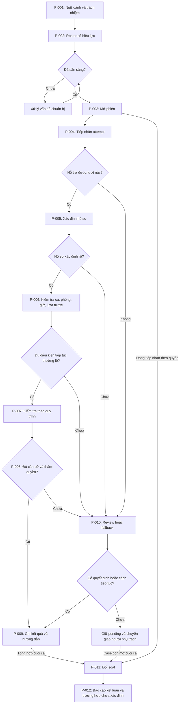
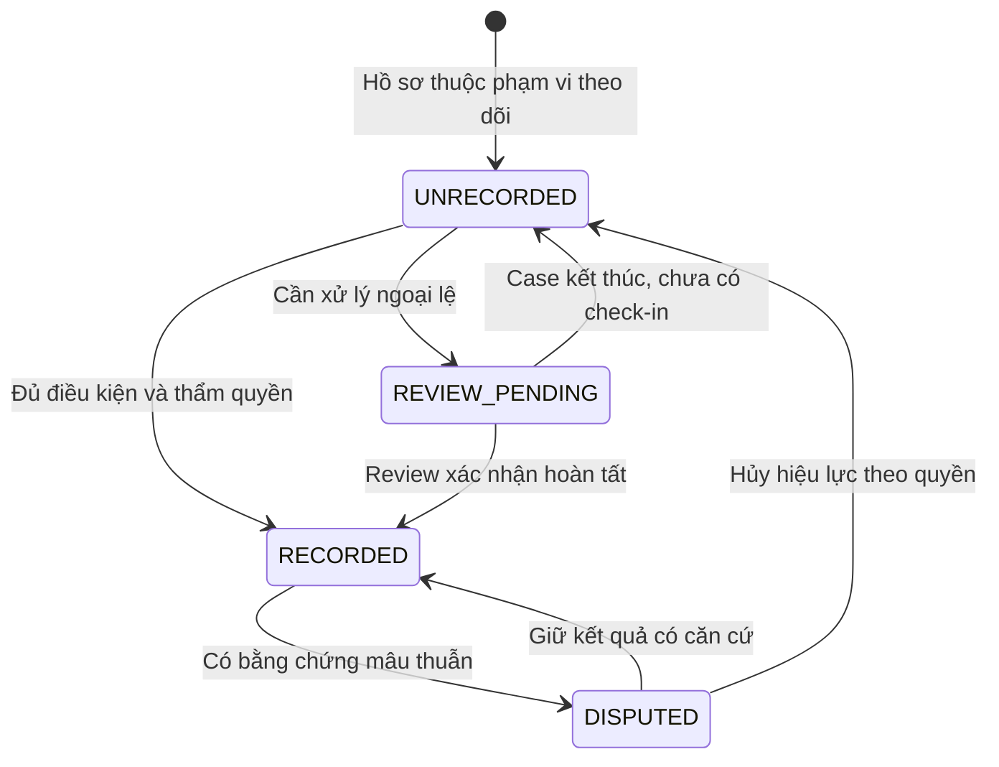

# T-008 — Exam Room Entry & Candidate Check-in Business Analysis

**Trạng thái:** DISCOVERY / REVIEW — chưa freeze, chưa phải specification triển khai.
**Cập nhật:** 2026-09-26. Quốc An phụ trách; Minh Hy review theo Sheet.
**Nguồn:** yêu cầu và phản hồi BA của Quốc An trong trao đổi T-008; [T-002](T-002-quoc-an-proposal.md), [D-001](../00-project/decisions/T-004-D-001-chon-bai-toan-cua-phong-thi.md), [D-002](../00-project/decisions/T-007-D-002-chon-huong-khao-sat-t005.md). Chưa có quan sát/phỏng vấn quy trình một kỳ thi cụ thể.

Bản này đưa nội dung phân tích 20 mục đã thảo luận vào repository, giữ ID và các matrix để review. Thay đổi BA tập trung ở lớp đọc nhanh, As-Is → bottlenecks → To-Be, đánh giá giả định, phân loại requirement và gates ở mục 18/20. Các bảng chi tiết là danh mục phân tích, không phải danh sách chức năng đã cam kết xây.

- **CONFIRMED:** có nguồn trực tiếp; xác nhận định hướng không đồng nghĩa đã có bằng chứng hiệu quả thực tế.
- **ASSUMPTION:** giả định hoặc đề xuất cần xác minh/duyệt.
- **OPEN QUESTION:** câu hỏi có ID OQ-xxx cần trả lời.
- **TBD:** giá trị/chính sách chưa thể xác định.

Mọi process, state, BR, FR, NFR và control đề xuất dưới đây là **ASSUMPTION** trừ khi ghi khác. “The system shall” là cách diễn đạt requirement ứng viên, chưa biểu thị đã phê duyệt.

## 1. Executive Summary

Mục tiêu là hỗ trợ kiểm tra tại cửa phòng thi và giảm công đối chiếu thường lệ. T-008 làm rõ công việc thực tế, quyền quyết định và bằng chứng cần có trước khi đánh giá giải pháp.

### Core Business Flow / Core Decisions — đọc trước các matrix

**Chuẩn bị roster và trách nhiệm → tiếp nhận lượt đến → tìm đúng hồ sơ → kiểm tra điều kiện → ghi nhận theo quyền hoặc chuyển người xử lý → đối soát cuối ca → sửa sai có căn cứ.**

Sáu vấn đề cốt lõi cần nhóm review:

1. **Đang thay đổi công việc nào?** As-Is chưa được quan sát; cần biết ai đối chiếu, bằng gì, mất bao lâu và xử lý lỗi thế nào. Chưa có căn cứ tuyên bố giảm nhân sự.
2. **Kết quả cần chứng minh điều gì?** Một attempt, check-in hoàn tất, quyền vào phòng và attendance cuối ca là bốn khái niệm khác nhau. Định nghĩa attendance còn mở — OQ-001.
3. **Hồ sơ và bằng chứng đến từ đâu?** Cần nguồn roster, cách xác định hồ sơ và tiêu chí kiểm tra được chấp nhận — OQ-003, OQ-006, OQ-013.
4. **Ai được quyết định?** Tách quyền ghi nhận, cho vào, override và sửa sai. Thiết bị chỉ hành động trong quyền đã được phê duyệt — OQ-009, OQ-010.
5. **Nếu không chắc hoặc thiết bị hỏng thì sao?** Cần người nhận ngoại lệ, cách ghi nhận thay thế và đối soát; hiện chưa xác nhận khả năng bố trí thực tế — OQ-011, OQ-018.
6. **Điều gì phải chốt trước bước sau?** Các OQ có thể đổi loại bài toán chặn kết luận phù hợp tại T-009; chi tiết vận hành được giữ mở theo gates, không chờ giải quyết toàn bộ mới nghiên cứu.

Tách bốn kết quả: **lượt xuất hiện/kiểm tra → hoàn tất check-in → cho phép vào → attendance cuối ca**. Không có ghi nhận điện tử chưa đủ để kết luận vắng; check-in tại cửa chưa chứng minh đã tham dự thi.

**Cách đọc:** mục 1–5 để review nền tảng; mục 6–17 là các bảng tham chiếu; mục 18 và 20 xác định bước tiếp theo và điều kiện freeze. Mục 14 phân biệt requirement cần giữ với chi tiết còn quá sớm.

## 2. Business Problem & Objectives

| ID | Vấn đề nghiệp vụ | Căn cứ / trạng thái |
|---|---|---|
| BP-001 | Công việc đối chiếu đầu vào tại từng phòng tạo nhu cầu bố trí người thực hiện. | CONFIRMED — bối cảnh/mục tiêu nhóm cung cấp; khối lượng thực tế chưa đo. |
| BP-002 | Cần phân biệt hợp lệ, đến muộn, nhầm phòng, chưa đến và ngoại lệ liên quan. | CONFIRMED — phạm vi nhóm đã nêu. |
| BP-003 | Cần khả năng đối soát và sửa ghi nhận sai/thiếu có căn cứ. | CONFIRMED — yêu cầu phân tích, chưa có thống kê sự cố thực tế. |
| BP-004 | Quy trình cần tiếp tục khi automation thất bại. | CONFIRMED — mục tiêu human fallback; tính khả thi chưa xác minh. |

Mục tiêu đề xuất: giảm tổng công sức; ghi nhận đúng người/ca/phòng; chuyển ngoại lệ đúng người; điều tra và sửa được; duy trì vận hành khi có sự cố. Cần tính cả chuẩn bị dữ liệu, hỗ trợ, review, phục hồi và đối soát để tránh chỉ chuyển công việc sang chỗ khác.

### Current Process (As-Is) — khoảng trống cần khảo sát

**Chưa có As-Is được xác minh.** Mô tả đối chiếu thủ công là bối cảnh do nhóm cung cấp, chưa chứng minh từng bước dưới đây đang diễn ra tại một đơn vị cụ thể. Bảng này là kế hoạch thu thập bằng chứng, không phải flow hiện trường đã xác nhận.

| Phần cần tìm hiểu | Nội dung cần quan sát/hỏi | Bằng chứng cần ghi | Dùng để quyết định |
|---|---|---|---|
| Chuẩn bị trước ca | Ai tạo/import, chia phòng, sửa lỗi và bàn giao roster? | Vai trò, nguồn danh sách, phiên bản; công sức chuẩn bị. | DATA-001; phần việc To-Be có thể làm tăng. |
| Đối chiếu tại cửa | Người kiểm tra làm từng bước gì, dùng hồ sơ/giấy tờ gì, ai cho vào? | Trình tự, phương tiện, quyền thực tế, thời gian chờ và thời gian xử lý riêng. | OQ-003, OQ-005, OQ-009; bước nào được hỗ trợ. |
| Ngoại lệ | Nhầm phòng, late, thiếu hồ sơ, không khớp được chuyển cho ai? | Đường chuyển giao, thời gian xử lý, kết quả và căn cứ. | Chi phí review/fallback, BR-008. |
| Ghi nhận và cuối ca | Ai ghi hiện diện, kết luận vắng và đối chiếu với nguồn nào? | Biểu mẫu/quy trình đã lược dữ liệu cá nhân, lỗi phát hiện, công sức đối soát. | Định nghĩa attendance; BR-011, BR-012. |
| Gián đoạn và khiếu nại | Khi thiếu dữ liệu/thiết bị hoặc có ghi sai thì tiếp tục và sửa thế nào? | Quy trình thay thế, quyền sửa, dấu vết đang giữ. | Tính khả thi của BR-010, BR-013. |

Mỗi ghi nhận As-Is cần ngày/bối cảnh, nguồn/người cung cấp theo vai trò, cách thu thập, trường hợp quan sát và giới hạn. Chưa có thì ghi **TBD**, không điền số ước đoán thành baseline. Chỉ ghi dữ liệu cá nhân nếu có mục đích và quyền phù hợp.

### Problems/Bottlenecks — giả thuyết cần kiểm chứng

| Giả thuyết | Cần bằng chứng gì? | Nếu không được chứng minh |
|---|---|---|
| Đối chiếu thường lệ chiếm phần lớn công sức | Phân bố thời gian các bước và công sức theo vai trò. | Xem lại giá trị của việc tự động hóa bước này. |
| Ngoại lệ làm chậm hàng chờ | Tần suất, thời gian và đường xử lý ngoại lệ. | Không mặc định cần tổ chức luồng review riêng. |
| Ghi nhận phân tán gây sai/thiếu | Mẫu sai lệch và lịch sử đối soát có nguồn. | Chỉ giữ như risk cần đánh giá, không mô tả như sự cố đã xảy ra. |
| Thiết bị giúp giảm tổng công sức | So As-Is/To-Be cùng phạm vi, khối lượng và độ phức tạp lượt. | Không tuyên bố giảm nhân lực chỉ vì thao tác tại cửa nhanh hơn. |

### Proposed Process (To-Be)

Luồng mục 6–8 là đề xuất để giải quyết các nhu cầu trên: hỗ trợ lượt thường lệ, chuyển ngoại lệ có trách nhiệm, giữ bằng chứng và đối soát. Sự hợp lý hiện dựa trên logic nghiệp vụ; hiệu quả cần bằng chứng As-Is và đánh giá To-Be. Nếu chỉ dùng kịch bản giả lập, kết luận phải giới hạn ở tính nhất quán/khả thi của kịch bản đó.

## 3. Scope & Boundaries

Phạm vi phân tích: chuẩn bị roster và ca/phòng → tiếp nhận tại cửa → xử lý ngoại lệ/fallback → đối soát/correction sau ca.

Chưa chốt kỳ thi, quy chế, mức tự động hóa, kiểm soát cửa vật lý, quản lý re-entry hoặc định nghĩa attendance. Giảm việc đối chiếu không đồng nghĩa bỏ nhân sự hỗ trợ hay thay vai trò giám thị.

**Quan hệ với quyết định đã có:** D-001/D-002 ghi hướng nghiên cứu nhóm đã chọn, gồm đề xuất khai báo hồ sơ và kiểm tra danh tính trong T-002/T-005. T-008 không hủy các quyết định đó, cũng không dùng chúng làm bằng chứng rằng một kỳ thi thật cho phép quy trình ấy. Nhu cầu nghiệp vụ được mô tả độc lập với phương thức; nếu discovery phát hiện mâu thuẫn với hướng đã chọn, đưa về nhóm review quyết định trước khi thay phạm vi.

T-008 không chọn model, dataset, thuật toán, threshold, cấu trúc database hoặc kiến trúc triển khai.

## 4. Confirmed Facts, Assumptions & Open Questions

| ID | Điều đã biết | Status / nguồn |
|---|---|---|
| CF-001 | Nhóm định hướng thiết bị hỗ trợ tại cửa phòng thi. | CONFIRMED — D-001 và yêu cầu T-008. |
| CF-002 | Mục tiêu giảm công đối chiếu và ghi nhận tình trạng thí sinh. | CONFIRMED — yêu cầu nhóm. |
| CF-003 | Chưa chọn kỳ thi/quy chế cụ thể. | CONFIRMED — phản hồi Quốc An. |
| CF-004 | T-008 phân tích nghiệp vụ trước khi chốt giải pháp. | CONFIRMED — chỉ dẫn T-008. |
| CF-005 | Phải xét automation thất bại và human fallback. | CONFIRMED — yêu cầu phân tích, chưa phải năng lực đã có. |

| ID | Giả định còn yếu | Bằng chứng cần / ảnh hưởng nếu sai |
|---|---|---|
| A-001 | Có roster đáng tin cậy và quan hệ hồ sơ–ca/phòng. | Cần nguồn, người chịu trách nhiệm, mẫu cấu trúc không chứa dữ liệu riêng; sai thì phải bổ sung tạo/xác nhận hồ sơ. OQ-013. |
| A-002 | Điểm kiểm tra được gắn rõ một ca/phòng. | Cần xác nhận có dùng chung/đổi ca; sai thì phải review ngữ cảnh lượt. OQ-008. |
| A-003 | Có người nhận ngoại lệ và đủ quyền quyết định. | Cần phân vai và khả năng bố trí; thiếu thì quy trình bị kẹt. OQ-009, OQ-011. |
| A-004 | Có cách ghi nhận thay thế khả dụng khi thiết bị hỏng. | Cần phương án và diễn tập; chưa có thì chưa chứng minh continuity. OQ-018. |
| A-005 | Có bằng chứng bổ sung nếu attendance nghĩa là thực sự tham dự thi. | Cần nguồn đối soát độc lập; thiếu thì chỉ kết luận được hoạt động ở cửa. OQ-001, OQ-015. |
| A-006 | Thay đổi/override quy được trách nhiệm và giữ lịch sử. | Cần xác nhận quyền và quy trình; thiếu thì không giải thích được correction. OQ-009, OQ-012. |

Tất cả A-001–A-006 là ASSUMPTION. “Hợp lệ”, “đến muộn”, “không xác minh được”, “chưa đến” và “override” cần định nghĩa theo nguồn, không dùng như nhãn có nghĩa mặc định. Mục 18 phân loại câu hỏi theo thời điểm thực sự chặn công việc.

## 5. Actors, Responsibilities & Decision Authority

Các vai trò dưới đây là đề xuất; một người có thể kiêm nhiệm nếu được phê duyệt.

| Actor | Trách nhiệm | Quyền đọc/ghi đề xuất | Giới hạn quyết định |
|---|---|---|---|
| Candidate | Cung cấp thông tin, thực hiện kiểm tra, phản ánh sai lệch. | Xem hướng dẫn/kết quả lượt của mình; cung cấp thông tin. | Không tự sửa roster/attendance. |
| Check-in Device/System | Áp dụng quy tắc, ghi event, phát hiện mâu thuẫn, chuyển ngoại lệ. | Đọc dữ liệu tối thiểu; ghi attempt và kết quả hệ thống. | Chỉ tự quyết định trong phạm vi được ủy quyền. |
| Entry Operator / Invigilator | Hỗ trợ và ghi nhận tình huống tại chỗ. | Xem hồ sơ cần xử lý; bổ sung bằng chứng/yêu cầu review. | Hỗ trợ không mặc định có quyền override, sửa roster hoặc kết luận vắng. |
| Authorized Exam Staff | Xử lý ngoại lệ trong phạm vi được giao. | Xem case; ghi quyết định/lý do. | Quyền theo loại quyết định. |
| Attendance Reconciler / Approver | Đối chiếu nguồn và xác nhận/mở lại attendance. | Đọc roster/event/nguồn đối soát; ghi kết luận. | Vai trò và phạm vi quyền cụ thể TBD. |
| Exam Administrator / Roster Owner | Chuẩn bị dữ liệu và chính sách, xác nhận hiệu lực. | Tạo/import/cập nhật theo quyền. | Quản trị hệ thống không mặc định có mọi quyền nghiệp vụ. |
| Exam Management System / Candidate Database | Cung cấp dữ liệu từ nguồn được công nhận. | Cung cấp roster và cập nhật được phép. | Nguồn ưu tiên khi có xung đột TBD. |

Nguyên tắc xuyên suốt project:

- **Business decision:** tổ chức/nhóm có quyền phê duyệt chính sách.
- **System decision:** hệ thống áp dụng một chính sách đã được phê duyệt.
- **Human-authorized decision:** người có quyền xử lý một trường hợp hoặc ngoại lệ.
- **Technical implementation:** cách thực hiện kiểm tra và lưu kết quả.

Khi thẩm quyền tự động chưa rõ, hệ thống ghi bằng chứng/flag/recommend và chuyển review. Không tự suy quyền từ chối, cho vào hoặc miễn một bước kiểm tra từ kết quả kỹ thuật.

## 6. End-to-End Business Process

| ID | Bước To-Be | Đầu ra và vì sao cần bước sau |
|---|---|---|
| P-001 | Xác định ca/phòng, chính sách và trách nhiệm. | Có ngữ cảnh để chuẩn bị nguồn và quyền. |
| P-002 | Kiểm tra/xác nhận roster có hiệu lực. | Có hồ sơ dùng được hoặc ngoại lệ dữ liệu cần giải quyết. |
| P-003 | Kiểm tra sẵn sàng và mở phiên check-in. | Có dữ liệu, người trực và phương án fallback. |
| P-004 | Tiếp nhận và bắt đầu attempt. | Có dấu vết kể cả chưa tìm được hồ sơ. |
| P-005 | Xác định candidate record. | Có đối tượng để kiểm tra hoặc case mơ hồ/không tìm thấy. |
| P-006 | Kiểm tra ca, phòng, thời gian và lượt trước. | Biết điều kiện thường lệ và sai lệch. |
| P-007 | Kiểm tra danh tính/điều kiện đầu vào theo quy trình. | Có bằng chứng và giới hạn của kết quả. |
| P-008 | Áp dụng quy tắc, xác định thẩm quyền. | Tách kết quả kiểm tra khỏi quyền ghi nhận/cho vào. |
| P-009 | Ghi kết quả và thông báo bước tiếp. | Check-in hoàn tất hoặc case được chuyển rõ ràng. |
| P-010 | Xử lý ngoại lệ/fallback/correction. | Có quyết định chịu trách nhiệm, liên kết attempt. |
| P-011 | Đóng tiếp nhận thường lệ và đối soát. | Tổng hợp nguồn điện tử/thủ công, case và khoảng mất dữ liệu. |
| P-012 | Xác nhận báo cáo và tiếp nhận correction. | Attendance có căn cứ và lịch sử thay đổi. |

Review có thể yêu cầu thực hiện lại bước kiểm tra, xác nhận hoàn tất hoặc kết thúc lượt chưa hoàn tất; outcome phụ thuộc chính sách và quyền. Luồng thường lệ không bỏ qua P-007 chỉ vì tìm được đúng hồ sơ.

## 7. Main Flow

**Điều kiện trước đề xuất:** đã mở phiên; roster có hiệu lực; quy trình kiểm tra và phạm vi quyền được phê duyệt.

1. Ghi nhận một attempt khi thí sinh đến.
2. Dùng thông tin được cung cấp để tìm candidate record; phương thức cụ thể TBD.
3. Kiểm tra đúng ca/phòng, thời gian và kết quả trước đó.
4. Thực hiện kiểm tra danh tính và điều kiện đầu vào theo quy trình.
5. Tổng hợp bằng chứng và xác định quyền kết luận.
6. Khi đủ điều kiện/quyền, ghi một kết quả check-in có hiệu lực.
7. Thông báo kết quả và hướng dẫn theo quyết định.
8. Nếu cần chứng minh việc thực sự vào phòng/tham dự thi, dùng nguồn bằng chứng riêng đã được chấp nhận.

**Sau lượt:** có kết quả truy vết được, chưa mặc định có attendance cuối ca. Thứ tự kiểm tra ngữ cảnh trước bước tốn công là ASSUMPTION cần đối chiếu với As-Is.

## 8. Alternative & Exception Flows

| ID | Luồng | Xử lý đề xuất |
|---|---|---|
| AF-001 | Tìm hồ sơ bằng cách khác | Người hỗ trợ tìm theo quyền, ghi phương thức và kết quả; loại mã/thẻ TBD. |
| AF-002 | Kiểm tra lại | Tạo attempt mới liên kết lượt trước; điều kiện/giới hạn thử lại TBD. |
| AF-003 | Quay lại sau check-in | Phân biệt hỏi lại, retry và re-entry; không tạo attendance mới. |
| EF-001 | Sai lệch hồ sơ/ca/phòng hoặc chưa rõ | Tạo case và chuyển đúng người; không tự suy quyền cho vào. |
| EF-002 | Không thực hiện được kiểm tra | Ghi unavailable và nguyên nhân biết được; chuyển fallback. |
| EF-003 | Thiết bị/nguồn dữ liệu không hoạt động | Kích hoạt cách vận hành đã phê duyệt và duy trì dấu vết. |
| EF-004 | Phát hiện ghi sai | Mở correction, giữ bản gốc và xem ảnh hưởng tới attendance. |

**Đối soát cuối ca:** người có quyền đóng tiếp nhận thường lệ → xác định roster có hiệu lực → tập hợp nguồn điện tử/thủ công và khoảng gián đoạn → phân loại có bằng chứng/chưa ghi nhận/mâu thuẫn/pending → xác minh → kết luận theo quyền hoặc giữ chưa xác định → phát hành báo cáo có phiên bản/case còn mở → correction khi có bằng chứng mới.

Không có check-in điện tử không tự chuyển thành absent. Case còn mở có người chịu trách nhiệm và bước tiếp theo ngay cả khi tiếp nhận thường lệ đã đóng.

## 9. Scenario Matrix

Giữ 24 scenario để review coverage; bảng không khẳng định cả 24 đều là chức năng phải triển khai ngay. “Bằng chứng” không mặc định là ảnh/video/sinh trắc học.

| Scenario | Preconditions | Detection Condition | System Action | Recorded State | Human Responsible | Next Step | Audit Evidence | Status |
|---|---|---|---|---|---|---|---|---|
| SC-001 — Hợp lệ, đúng người/phòng/ca | Roster, quy trình có hiệu lực | Các kiểm tra đạt, đủ quyền | Ghi một kết quả; hướng dẫn | RECORDED | Người vận hành/người duyệt theo quyền | Thực hiện hướng xử lý được cho phép | Hồ sơ, attempt, kết quả, quyền | ASSUMPTION |
| SC-002 — Nhầm phòng | Xác định được hồ sơ | Phòng nguồn khác điểm hiện tại | Flag; hướng dẫn/review | REVIEW_PENDING; cờ wrong room | Người hỗ trợ/người có quyền | Xác minh phân phòng/chuyển điểm | Phiên bản roster, hai phòng, quyết định | ASSUMPTION |
| SC-003 — Nhầm ca | Có ca của hồ sơ | Không khớp ca hoạt động | Flag; chuyển review | REVIEW_PENDING; cờ wrong session | Người có quyền | Kiểm tra lịch/thay đổi hợp lệ | Ca nguồn/hiện tại, quyết định | ASSUMPTION |
| SC-004 — Có khả năng đến muộn | Có thời gian lượt đến | So mốc có nguồn nếu có | Giữ thời gian; chỉ gắn late khi đủ căn cứ | Cờ thời gian/review | Người được quyền xử lý late | Áp dụng chính sách | Mốc, thời gian, độ tin cậy, quyết định | TBD |
| SC-005 — Thông tin không khớp | Đã chọn hồ sơ | Mâu thuẫn thông tin/quan sát | Tạo case; giữ sai lệch | REVIEW_PENDING | Người xác minh/roster owner | Xác minh hoặc sửa nguồn theo quyền | Nội dung, nguồn, lý do | ASSUMPTION |
| SC-006 — Kiểm tra danh tính không đạt | Thực hiện được kiểm tra | Không đáp ứng tiêu chí được duyệt | Ghi kết quả; review; không tự kết luận giả mạo | Attempt kết luận; check-in chưa hoàn tất | Người có quyền | Kiểm tra bổ sung/quyết định | Kết quả, quy trình, nguyên nhân biết được | ASSUMPTION |
| SC-007 — Không thể xác minh | Thiếu dữ liệu/phương tiện | Không đủ điều kiện kiểm tra | Phân biệt unavailable và không đạt | REVIEW_PENDING | Người nhận fallback | Phương án được duyệt | Dữ liệu thiếu, lỗi, cách thay thế | ASSUMPTION |
| SC-008 — Nhiều lần thử | Có attempt trước | Tương tác lặp | Liên kết attempt; giữ lần trước | Attempt mới; giữ kết quả hiệu lực | Người hỗ trợ khi cần | Retry/review theo chính sách | Chuỗi attempt, thời gian, lý do | ASSUMPTION |
| SC-009 — Check-in trùng | Có kết quả hiệu lực | Yêu cầu ghi thêm cùng người/ca | Hiển thị kết quả trước; tránh trùng | Giữ RECORDED | Người xử lý khi mâu thuẫn | Kết thúc hoặc mở case | Bản ghi trước và yêu cầu mới | ASSUMPTION |
| SC-010 — Thiết bị hỏng | Điểm đang hoạt động | Không phục vụ được | Fallback; đánh dấu gián đoạn | Lượt thủ công/INTERRUPTED | Người vận hành/được quyền fallback | Tiếp tục, đối soát khi phục hồi | Sự cố, thời gian, người ghi, bản gốc | ASSUMPTION |
| SC-011 — Mất mạng/database | Cần truy cập nguồn | Nguồn không khả dụng | Nêu giới hạn; dùng phương án được duyệt | Review/fallback; chờ đối soát | Người vận hành | Khôi phục, xét dữ liệu cũ/xung đột | Nguồn, phiên bản, thời gian, lượt phát sinh | ASSUMPTION |
| SC-012 — Không tìm thấy hồ sơ | Đã nhận thông tin tra cứu | Không có kết quả phù hợp | Ghi attempt chưa liên kết; review | Case mở, attempt chưa gắn hồ sơ | Roster owner/người có quyền | Xác minh nguồn hoặc thông tin | Thông tin tối thiểu, nguồn đã kiểm tra | ASSUMPTION |
| SC-013 — Manual override | Case cần ngoại lệ | Đề nghị xử lý khác luồng thường lệ | Kiểm tra phạm vi quyền; ghi riêng | Theo quyết định; giữ cờ gốc | Người có quyền tương ứng | Áp dụng, đối soát | Actor, quyền, lý do, trước/sau | TBD |
| SC-014 — Không có ghi nhận xuất hiện | Hồ sơ trong roster đối soát | Không tìm thấy bằng chứng | Danh sách chưa ghi nhận | UNRECORDED; attendance chưa xác nhận | Người đối soát | Xét fallback/case trước kết luận | Nguồn đã xét, khoảng mất dữ liệu | ASSUMPTION |
| SC-015 — Check-in sai phát hiện sau | Có kết quả hiệu lực | Bằng chứng mâu thuẫn | Disputed; mở correction | DISPUTED | Người có quyền correction | Giữ/sửa sau xác minh | Bản gốc, bằng chứng mới, ảnh hưởng báo cáo | ASSUMPTION |
| SC-016 — Ghi vắng sai phát hiện sau | Đã xác nhận vắng | Có bằng chứng trái kết luận | Mở lại attendance; giữ lịch sử | Attendance về review | Người có quyền đối soát/correction | Xác minh và phát hành bản sửa | Kết luận cũ, nguồn mới, trước/sau | ASSUMPTION |
| SC-017 — Rời đi rồi quay lại | Có lịch sử trước | Yêu cầu xử lý lượt quay lại | Tách retry và re-entry | Giữ check-in; cờ yêu cầu nếu thuộc scope | Người có quyền ra/vào | Theo chính sách re-entry | Kết quả cũ, yêu cầu, quyết định | TBD |
| SC-018 — Roster đổi trong ca | Phiên đang mở | Nguồn đổi ca/phòng/tư cách hồ sơ | Ghi phiên bản; tìm kết quả bị ảnh hưởng | Review hồ sơ xung đột | Roster owner/người đối soát | Xác minh hiệu lực | Trước/sau, nguồn, hiệu lực, người xác nhận | ASSUMPTION |
| SC-019 — Case còn mở khi đóng | Có review chưa hoàn tất | Bắt đầu đối soát | Giữ case và người nhận | Attendance chưa xác định | Người đối soát/người xử lý case | Tiếp tục hoặc báo cáo ngoại lệ | Case, người nhận, điều còn thiếu | ASSUMPTION |
| SC-020 — Chưa biết ghi thành công hay chưa | Gián đoạn khi ghi | Thiếu xác nhận kết quả | Tra kết quả trước khi ghi mới | Chờ đối soát | Người vận hành | Tra cứu, đối soát, thông báo | Thao tác gốc, kết quả lưu, retry | ASSUMPTION |
| SC-021 — Bỏ dở lượt | Attempt đang mở | Người rời đi/quy trình dừng | Giữ dấu vết và lý do biết được | INTERRUPTED | Người vận hành khi cần | Lượt mới nếu quay lại; xét cuối ca | Tiến độ, thời gian, lý do | ASSUMPTION |
| SC-022 — Hồ sơ mơ hồ/trùng | Tra cứu nhiều kết quả | Chưa xác định duy nhất | Không tự chọn; review | Case mở | Roster owner/người xác minh | Làm rõ hồ sơ | Các tham chiếu, nguồn, quyết định | ASSUMPTION |
| SC-023 — Sai ngữ cảnh/giờ không tin cậy | Điểm đã cấu hình | Sai ca/phòng hoặc thời gian | Dừng kết luận bị ảnh hưởng; fallback/review | Kết quả cần đối soát | Người vận hành/người có quyền | Sửa ngữ cảnh, rà soát ảnh hưởng | Trước/sau, khoảng thời gian, hồ sơ | ASSUMPTION |
| SC-024 — Không có người nhận ngoại lệ | Cần human decision | Không liên hệ được người đủ quyền | Giữ pending; tuyến escalation | REVIEW_PENDING | Vai trò trực/escalation TBD | Chờ/phương án đã phê duyệt | Lần chuyển giao, thời gian chờ | TBD |

## 10. Business Rules

Các BR là ASSUMPTION. Chưa đặt số phút trễ, số retry, threshold hay mặc định mọi rule đều được override.

| ID | Business Rule | Source | Phụ thuộc chưa chốt |
|---|---|---|---|
| BR-001 | Kết quả gắn với ngữ cảnh ca/phòng và nguồn roster có hiệu lực khi xử lý. | P-001–P-003; SC-018, SC-023 | Nguồn chuẩn/hiệu lực. |
| BR-002 | Chỉ hoàn tất thường lệ khi candidate record được xác định rõ. | P-005; SC-012, SC-022 | Cách xác định hồ sơ. |
| BR-003 | Sai lệch ca/phòng cần được giải quyết theo quyền trước khi hoàn tất ở điểm hiện tại. | P-006; SC-002, SC-003 | Quyền sửa phân phòng/ngoại lệ. |
| BR-004 | Late và quyền tiếp tục dựa chính sách có hiệu lực; giữ riêng thời gian quan sát. | SC-004, SC-023 | Mốc và cách xử lý TBD. |
| BR-005 | Tách không đạt, không thực hiện được, chưa rõ; không tự biến thành success hoặc kết luận giả mạo. | P-007; SC-006, SC-007 | Tiêu chí/quy trình kiểm tra. |
| BR-006 | Quyền hoàn tất check-in và cho vào được xác định riêng; hệ thống chỉ tự quyết trong quyền. | P-008; SC-001, SC-013 | Mức tự động hóa/quyền cuối. |
| BR-007 | Nhiều attempt không tạo nhiều kết quả attendance có hiệu lực cho cùng người/ca; giữ lịch sử attempt. | SC-008, SC-009, SC-020 | Cách xử lý đăng ký trùng. |
| BR-008 | Case chưa rõ có trạng thái, vai trò nhận và bước tiếp; quá thời gian chờ không mặc định bị từ chối. | P-010; SC-019, SC-024 | Escalation/thời hạn. |
| BR-009 | Override đúng loại/phạm vi quyền; ghi actor, thời gian, lý do, trước/sau và bằng chứng. | SC-013 | Rule nào được ngoại lệ. |
| BR-010 | Fallback giữ đủ dấu vết đối soát; không tự ghi đè xung đột thiếu căn cứ. | SC-010, SC-011, SC-020 | Phương án fallback. |
| BR-011 | Thiếu check-in điện tử chưa đủ kết luận absent; xét thủ công, lỗi hệ thống và case mở. | SC-014, SC-016, SC-019 | Định nghĩa attendance/căn cứ vắng. |
| BR-012 | Attendance cuối ca cần bằng chứng và người có quyền; chưa đủ thì giữ chưa xác định. | P-011, P-012 | Người xác nhận/điều kiện khóa báo cáo. |
| BR-013 | Correction giữ bản gốc/lý do; xác định báo cáo và hồ sơ bị ảnh hưởng. | SC-015, SC-016 | Quyền/thời hạn correction. |
| BR-014 | Lượt quay lại không tạo attendance mới; quyền tái nhập là chính sách riêng. | AF-003; SC-017 | Re-entry có thuộc scope. |
| BR-015 | Chỉ thu/hiển thị/lưu dữ liệu phục vụ kiểm tra, xử lý, đối soát; xác định quyền xem và retention. | P-004–P-012; RISK-012 | Danh mục/quyền/thời gian lưu. |
| BR-016 | Đổi roster/ngữ cảnh cho phép xác định kết quả cũ bị ảnh hưởng để review. | SC-018, SC-023 | Quyền cập nhật/hiệu lực. |
| BR-017 | Đóng tiếp nhận không xóa/tự kết luận case mở; chuyển sang đối soát. | P-011; SC-019 | Xử lý sau đóng. |

## 11. Candidate / Check-in State Model

**Mô hình khái niệm đề xuất, chưa phải enum/database/API contract.** Giữ riêng trạng thái attempt, kết quả check-in, attendance và cờ tình huống. Late/sai phòng có thể đồng thời tồn tại; chúng không thay trạng thái chính. Roster giữ trạng thái/hiệu lực riêng.

### Trạng thái một attempt

| State | Meaning / entry condition | Who creates it | Allowed transitions | Terminal? | Sửa và audit |
|---|---|---|---|---|---|
| STARTED | Tiếp nhận lượt | Hệ thống/người ghi fallback | IN_PROGRESS, INTERRUPTED | Không | Ghi thời gian, nguồn. |
| IN_PROGRESS | Đang kiểm tra | Hệ thống/người xử lý | CONCLUDED, INTERRUPTED | Không | Giữ bước đã làm và kết quả. |
| CONCLUDED | Có kết quả: hoàn tất, chuyển review hoặc chưa đáp ứng | Chủ thể trong phạm vi quyền | Lượt mới/correction có liên kết | Có, cho attempt | Không sửa mất bản gốc. |
| INTERRUPTED | Dừng trước kết quả đầy đủ | Hệ thống/người vận hành | Lượt mới nếu tiếp tục | Có, cho attempt | Ghi nguyên nhân biết được. |

Attempt kết thúc không có nghĩa case đã giải quyết. Hồ sơ chưa rõ: giữ attempt/case chưa liên kết, không tạo candidate giả.

### Kết quả check-in theo người/ca

| State | Meaning / entry condition | Who creates it | Allowed transitions | Terminal? / quyền sửa |
|---|---|---|---|---|
| UNRECORDED | Chưa có kết quả hiệu lực | Từ roster hoặc correction | REVIEW_PENDING, RECORDED | Không; theo workflow được cấp quyền. |
| REVIEW_PENDING | Cần xử lý trước xác nhận | Hệ thống/người vận hành tạo case | RECORDED; UNRECORDED khi case kết thúc chưa hoàn tất | Không; có quyết định/lý do. |
| RECORDED | Có check-in được xác nhận | Hệ thống được ủy quyền/người có quyền | DISPUTED khi có mâu thuẫn | Ổn định cho lượt thường lệ; correction vẫn được xét. |
| DISPUTED | Kết quả đã ghi đang được xem xét | Quy trình correction | RECORDED nếu giữ; UNRECORDED nếu hủy hiệu lực | Không; người có quyền quyết, giữ bản gốc. |

### Attendance cuối ca

| State | Meaning / entry condition | Chủ thể | Đường ra / sửa |
|---|---|---|---|
| UNFINALIZED | Chưa đối soát xong hoặc mở lại | Khởi tạo/người có quyền | Sang một kết luận bên dưới. |
| PRESENT_CONFIRMED | Đủ căn cứ “tham dự” theo định nghĩa đã duyệt | Người/vai trò được quyền | Mở lại UNFINALIZED khi có correction. |
| ABSENT_CONFIRMED | Đủ căn cứ vắng sau đối soát | Người/vai trò được quyền | Mở lại khi có bằng chứng mới. |
| UNDETERMINED | Đã review nhưng chưa đủ căn cứ | Người đối soát | UNFINALIZED khi xử lý tiếp. |

Kết luận có hiệu lực cho một phiên bản báo cáo; không bất biến. Mở lại ghi actor/lý do/nguồn/trước–sau. Đổi liên kết nhầm người là correction cho cả hồ sơ cũ và mới. Các state attendance chỉ được chốt sau OQ-001/OQ-015; tên state không giải quyết thay câu hỏi nghiệp vụ.

## 12. Data Requirements

“Cần” dưới đây là cần cho quy trình đề xuất, chưa phải schema hoặc danh mục dữ liệu triển khai đã duyệt.

| ID | Nhóm dữ liệu | Cần theo nghiệp vụ đề xuất | Có thể cần / TBD | Source |
|---|---|---|---|---|
| DATA-001 | Candidate/Roster | Tham chiếu hồ sơ; thông tin phân biệt; quan hệ ca/phòng; nguồn/phiên bản/hiệu lực | Thuộc tính nhận dạng và bằng chứng theo phương thức được duyệt | BR-001–BR-003, BR-016 |
| DATA-002 | Session/Room | Định danh; trạng thái tiếp nhận; chính sách hiệu lực; vai trò phụ trách | Mốc giờ, sơ đồ hướng dẫn, điểm dùng chung | BR-001, BR-004, BR-006 |
| DATA-003 | Attempt | Tham chiếu lượt; thời gian và độ tin cậy; điểm tiếp nhận; hồ sơ nếu xác định; kết quả/cờ; nguồn điện tử/thủ công; lượt trước | Bằng chứng bổ sung theo phương thức | BR-005, BR-007, BR-010 |
| DATA-004 | Check-in/Entry Decision | Kết quả; cơ sở; actor/quyền tự động; thời gian; ca/phòng; attempt/case | Quyết định cho vào riêng nếu thuộc scope | BR-006, BR-009 |
| DATA-005 | Review/Override | Lý do tạo; vai trò/người nhận; trạng thái; bằng chứng; quyết định; quyền; trước/sau | Phê duyệt bổ sung nếu có quy định | BR-008, BR-009, BR-013 |
| DATA-006 | Attendance/Reconciliation | Roster; nguồn đã xét; kết luận; case mở; người/thời gian xác nhận; phiên bản báo cáo | Bằng chứng tham dự trong phòng nếu cần | BR-011, BR-012, BR-017 |
| DATA-007 | Sự cố/Fallback/Recovery | Khoảng gián đoạn; phạm vi ảnh hưởng; bản gốc; người ghi; thời gian sự kiện/nhập; kết quả đối soát | Mức chi tiết điều tra vận hành | BR-010, BR-016 |
| DATA-008 | Quyền/lịch sử thay đổi | Actor/role, phạm vi quyền; thay đổi chính sách/quyền; trước/sau, lý do, thời gian | Thời gian lưu, cách thu hồi quyền | BR-006, BR-009, BR-015 |

Không mặc định thu ảnh, video, bản sao giấy tờ hoặc dữ liệu sinh trắc học. Dữ liệu bổ sung phải có mục đích, requirement sử dụng, quyền truy cập và thời gian lưu. Thông tin đo hàng chờ/công sức chỉ thu trong kế hoạch đánh giá đã duyệt, không suy ra cần theo dõi liên tục mọi người tại cửa.

## 13. Audit & Traceability Requirements

Cần tái dựng hồ sơ/nguồn nào đã dùng, kết quả do ai đưa ra, cơ sở là gì, thời gian có nghĩa gì, có sự cố liên quan không và ai sửa kết quả sau đó.

| ID | Nhu cầu audit đề xuất | Ví dụ |
|---|---|---|
| AUD-001 | Liên kết roster → attempt → case → decision → attendance/report. | Check-in gắn nhầm người. |
| AUD-002 | Tách thời điểm xảy ra và ghi/nhập; đánh dấu độ không chắc. | Nhập lại bản ghi sau sự cố. |
| AUD-003 | Giữ bản gốc và correction. | Sửa kết luận vắng. |
| AUD-004 | Truy thẩm quyền/chính sách có hiệu lực lúc quyết định. | Kiểm tra override. |
| AUD-005 | Ghi nguồn đã đối soát và khoảng mất dữ liệu. | Thiếu event điện tử khi thiết bị hỏng. |
| AUD-006 | Người có quyền truy cập bằng chứng trong thời hạn được duyệt. | Giải quyết khiếu nại. |

Audit một lượt chỉ chứng minh điều được quan sát/ghi; không chứng minh đã ngồi thi nếu thiếu nguồn tương ứng.

## 14. Functional Requirements

### Review BA: giữ nhu cầu nào, hoãn chi tiết nào?

Giữ 19 FR làm **requirement ứng viên**; không biến danh sách này thành backlog triển khai. Các ưu tiên P1/P2 bên dưới là đề xuất cho việc review tính đúng đắn/đo lường, không phải cam kết release.

| Nhóm xử lý | FR liên quan | Điều cần giữ ở discovery | Điều chưa nên khóa |
|---|---|---|---|
| Core — làm rõ để định hình bài toán | FR-001, FR-003–FR-009, FR-012 | Ngữ cảnh, hồ sơ, bằng chứng, quyền, chống trùng, ngoại lệ và đối soát | Phương thức kiểm tra, outcome theo quy chế và mức tự động hóa trước G9 |
| Giữ nguyên tắc, hoãn đặc tả chi tiết | FR-002, FR-010, FR-011, FR-014, FR-016–FR-018 | Dữ liệu đổi phải review; override/correction/fallback có trách nhiệm và dấu vết | Cấu trúc version, biểu mẫu, cấp phê duyệt, cơ chế sync, retention và cấu trúc lưu trữ |
| Phụ thuộc scope — chưa cam kết xây đầy đủ | FR-013, FR-015 | Nêu rõ attendance khác check-in; phân biệt lượt quay lại với lượt mới | Quản lý attendance trong phòng và re-entry trước khi có quyết định scope |
| Kế hoạch đánh giá, chưa cần dashboard | FR-019 | Đo tổng công sức và thời gian để kiểm chứng mục tiêu | Màn hình báo cáo, theo dõi liên tục hoặc chỉ số số học chưa có baseline |

Khái niệm dễ trùng đã được tách: attempt khác kết quả hiệu lực; override là quyết định ngoại lệ trong quyền, correction là sửa kết quả sai; audit ở mục 13 là bằng chứng còn FR-017 là năng lực truy cập; NFR là phẩm chất vận hành còn risk giải thích vì sao cần phẩm chất đó.

| ID | Requirement | Source | Priority | Status |
|---|---|---|---|---|
| FR-001 | The system shall associate each active check-in point with an authorized room, session, roster source and policy context. | P-001–P-003; BR-001; SC-023 | P1 | ASSUMPTION |
| FR-002 | The system shall expose roster readiness issues and identify records affected by roster or context changes. | P-002; BR-016; SC-018, SC-022 | P1 | ASSUMPTION |
| FR-003 | The system shall support recording an attempt before a candidate record is uniquely resolved and preserve its later linkage. | P-004, P-005; BR-002; SC-012 | P1 | ASSUMPTION |
| FR-004 | The system shall identify room and session discrepancies against the effective roster. | P-006; BR-003; SC-002, SC-003 | P1 | ASSUMPTION |
| FR-005 | The system shall retain observed timing separately from policy-based lateness and entry decisions. | BR-004; SC-004, SC-023 | P1 | ASSUMPTION |
| FR-006 | The system shall distinguish completed, unmet, unavailable and inconclusive verification outcomes. | P-007; BR-005; SC-006, SC-007 | P1 | ASSUMPTION |
| FR-007 | The system shall record check-in completion or entry authorization only through an explicitly authorized workflow. | P-008, P-009; BR-006; SC-001, SC-013 | P1 | ASSUMPTION |
| FR-008 | The system shall preserve repeated attempts while preventing duplicate effective attendance caused by repeated submissions. | BR-007; SC-008, SC-009, SC-020 | P1 | ASSUMPTION |
| FR-009 | The system shall route unresolved cases to a responsible role and expose their status and next action. | P-010; BR-008; SC-019, SC-024 | P1 | ASSUMPTION |
| FR-010 | The system shall validate override authority and retain its reason, evidence, actor, timing and before/after outcome. | BR-009; SC-013; AUD-004 | P1 | ASSUMPTION |
| FR-011 | The system shall support reconciliation of authorized fallback records without silent overwriting or duplicate outcomes. | BR-010; SC-010, SC-011, SC-020 | P1 | ASSUMPTION |
| FR-012 | The system shall produce an end-of-session reconciliation view covering unrecorded candidates, open cases, manual records and known data gaps. | P-011; BR-011, BR-017; SC-014, SC-019 | P1 | ASSUMPTION |
| FR-013 | The system shall retain attendance conclusions with their evidence basis, authorized approver and report version. | P-012; BR-012; AUD-001 | P1 | ASSUMPTION |
| FR-014 | The system shall support authorized correction and reopening while preserving prior outcomes and identifying affected reports and candidate records. | BR-013; SC-015, SC-016; AUD-003 | P1 | ASSUMPTION |
| FR-015 | The system shall distinguish a repeat interaction or re-entry request from a new attendance outcome. | BR-014; SC-017 | P1 | ASSUMPTION |
| FR-016 | The system shall restrict data access and retention according to approved purposes, roles and policy. | BR-015; DATA-001–DATA-008; RISK-012 | P1 | ASSUMPTION |
| FR-017 | The system shall provide authorized access to linked audit evidence for investigation and reconciliation. | AUD-001–AUD-006; BR-009–BR-013 | P1 | ASSUMPTION |
| FR-018 | The system shall support the opening and closing workflow and preserve unresolved work when routine intake closes. | P-003, P-011; BR-017 | P1 | ASSUMPTION |
| FR-019 | The system shall make operational counts and timings available for evaluating workload, waiting, exceptions and recovery. | BP-001, BP-004; RISK-002, RISK-006, RISK-007 | P2 | ASSUMPTION |

## 15. Non-functional / Operational Requirements

Nhu cầu là ASSUMPTION; target định lượng TBD. Các mục có thể dùng để đặt câu hỏi khảo sát trước khi trở thành requirement nghiệm thu.

| ID | Khía cạnh | Nhu cầu nghiệp vụ / cơ sở đặt target |
|---|---|---|
| NFR-001 | Throughput | Đáp ứng lượng đến tập trung; cần số thí sinh, phân bố lượt và số điểm phục vụ. |
| NFR-002 | Queue/waiting time | Đo riêng thường lệ và review, tính cả hàng chờ thủ công. |
| NFR-003 | Availability | Xác định khung cần phục vụ và mức gián đoạn fallback xử lý được. |
| NFR-004 | Offline/fallback | Tiếp tục khi mất dịch vụ; có thể là nguồn khả dụng được duyệt, điểm khác hoặc thủ công; chưa chọn cách. |
| NFR-005 | Reliability | Kết quả hiển thị và kết quả hiệu lực nhất quán; biểu diễn rõ thao tác chưa biết đã lưu chưa. |
| NFR-006 | Auditability | Tái dựng diễn biến/quyền trong thời gian lưu được duyệt. |
| NFR-007 | Recoverability | Xác định lượt mất/chưa đối soát/xung đột; thời gian phục hồi và mức mất dữ liệu TBD. |
| NFR-008 | Security/privacy | Chỉ xem/sửa theo quyền; tránh lộ thông tin không cần thiết ở cửa. |
| NFR-009 | Operator usability | Người dùng hiểu kết quả, nguyên nhân review và bước tiếp; cần kiểm tra với người dùng thực tế. |
| NFR-010 | Time/context integrity | Nhận biết thời gian/ngữ cảnh không tin cậy trước khi dùng để kết luận. |

Không đặt số giây, tỷ lệ sẵn sàng hoặc giới hạn phần cứng từ suy đoán. Target cần cho thí nghiệm phải được chốt tại T-010 trước phép đo tương ứng; không hoãn tới khi đã xem kết quả.

## 16. Human Fallback & Recovery

**Khi chưa chắc:** tạo case liên kết attempt → nêu nguyên nhân/điều còn thiếu → chuyển người có quyền → thực hiện kiểm tra bổ sung được duyệt → ghi quyết định riêng với kết quả gốc. Nếu chưa có người nhận, giữ pending và tuyến escalation; cách phục vụ thí sinh lúc chờ là TBD.

**Khi thiết bị/nguồn không hoạt động:**

1. Xác định sự cố, phạm vi và thời điểm.
2. Người có quyền kích hoạt phương án được phê duyệt.
3. Dùng nguồn roster khả dụng đã xác nhận hoặc chuyển đầu mối có thể xác minh.
4. Ghi tối thiểu lượt, hồ sơ nếu biết, ca/phòng, thời gian/độ chắc chắn, kết quả, người ghi/người quyết định và lý do.
5. Giữ bản gốc để đối soát.

**Khi phục hồi:** xác nhận ngữ cảnh/roster → tập hợp fallback → tách thời gian sự kiện và nhập → xét trùng, nhầm người, xung đột và thao tác chưa rõ kết quả → người có quyền xử lý → correction attendance/báo cáo nếu cần → xác định case còn mở trước khi đóng sự cố.

Nếu cả nguồn hồ sơ lẫn người có quyền đều không khả dụng, chưa thể khẳng định tiếp tục check-in được. A-003/A-004, OQ-011/OQ-018 là phụ thuộc thật của continuity. Giữ nhu cầu fallback ở discovery; chưa thiết kế cơ chế đồng bộ hoặc khẳng định có đội hỗ trợ sẵn.

## 17. Risks & Success Criteria

“Current Control” là chưa xác minh vì chưa khảo sát hiện trường. “Required Control” là đề xuất ASSUMPTION, không phải control đã vận hành.

| Risk | Cause | Business Impact | Current Control | Required Control | Measurement Candidate |
|---|---|---|---|---|---|
| RISK-001 — False acceptance | Sai người vẫn được hoàn tất/cho vào | Sai người tham gia quy trình/thi | Chưa xác minh | Kiểm tra có căn cứ, quyền, review/correction | Kết quả chấp nhận sai được xác minh / kết quả được đối soát |
| RISK-002 — False rejection | Người hợp lệ bị từ chối/trì hoãn sai | Chậm, khiếu nại, nguy cơ lỡ quyền tham dự | Chưa xác minh | Human review và kiểm tra bổ sung | Số ca hợp lệ bị xử lý sai; thời gian giải quyết |
| RISK-003 — Sai ca/phòng | Roster/ngữ cảnh sai, bỏ qua discrepancy | Vào sai ca/phòng, sai attendance | Chưa xác minh | Kiểm tra ngữ cảnh/cập nhật | Số chấp nhận sai ca/phòng đã xác minh |
| RISK-004 — Attendance trùng | Retry, nhiều điểm, nhập fallback | Báo cáo sai | Chưa xác minh | Kết quả hiệu lực duy nhất, đối soát | Số bản trùng hiệu lực sau đối soát |
| RISK-005 — Vắng sai | Thiếu event/fallback, nghĩa attendance mơ hồ | Sai kết luận | Chưa xác minh | Đối soát nguồn trước kết luận vắng | Kết luận vắng bị sửa / kết luận vắng được kiểm tra |
| RISK-006 — Ùn hàng | Lượng đến lớn, kiểm tra/review lâu | Chậm vào thi, tăng nhân lực | Chưa xác minh | Đo toàn luồng, tổ chức hỗ trợ phù hợp | Thông lượng, thời gian chờ, hàng chờ, thời gian review |
| RISK-007 — Gián đoạn | Hỏng thiết bị/mất nguồn | Không kiểm tra/ghi được | Chưa xác minh | Fallback và recovery có trách nhiệm | Thời gian gián đoạn, lượt ảnh hưởng, công sức đối soát |
| RISK-008 — Thiếu audit | Mất liên kết, sửa đè, thiếu actor | Không giải thích được kết quả | Chưa xác minh | Lịch sử quyết định/correction | Case có đủ bằng chứng bắt buộc / case được xét |
| RISK-009 — Override trái quyền | Quyền mơ hồ/cấp rộng | Bỏ qua kiểm soát | Chưa xác minh | Quyền theo loại quyết định, lý do/audit | Số override ngoài quyền/thiếu căn cứ |
| RISK-010 — Roster sai/cũ | Import sai, cập nhật chưa hiệu lực | Sai ca/phòng, thiếu hồ sơ | Chưa xác minh | Kiểm tra nguồn/phiên bản | Số sai lệch và lượt ảnh hưởng |
| RISK-011 — Mất/xung đột khi phục hồi | Ghi một phần, nguồn khác kết quả | Attendance sai/thiếu | Chưa xác minh | Đối soát có quyền | Lượt chưa giải quyết sau recovery |
| RISK-012 — Lộ/thu thập thừa dữ liệu | Quyền rộng, hiển thị nhiều, giữ lâu | Ảnh hưởng thông tin thí sinh | Chưa xác minh | Tối thiểu dữ liệu, quyền, retention | Dữ liệu không có mục đích; truy cập/sửa ngoài quyền |

**Tiêu chí thành công cần xây dựng:**

- Giảm tổng công sức nhân sự cho chuẩn bị, đối chiếu, hỗ trợ, review và đối soát so với As-Is trong điều kiện so sánh được.
- Ghi nhận đúng theo nguồn đối soát độc lập với kết quả đang được đánh giá.
- Đo thời gian chờ/hoàn tất cả lượt thường lệ và ngoại lệ.
- Giải trình được lượt phát sinh trong sự cố và case chưa giải quyết.
- Có đủ bằng chứng cho điều tra/correction.

Target TBD. Baseline giả lập chỉ giúp kiểm tra giả thuyết trong kịch bản, không chứng minh giảm người ở kỳ thi thật. Tỷ lệ lỗi từ mẫu đối soát cần ghi cách lấy mẫu/mẫu số, không mặc định đại diện toàn bộ lượt.

**Vì sao cần phép đo kỹ thuật sau này:** RISK-002 → review tăng → chờ tăng → cần xác định stage gây lỗi; RISK-001 → cần đo sai lệch của năng lực xác minh nếu có; RISK-006 → đo thời gian bước và toàn luồng; RISK-010 → kiểm tra chất lượng dữ liệu. Lỗi có thể do dữ liệu, thao tác, quy tắc hoặc kỹ thuật, chưa mặc định do model.

## 18. Open Questions

### Gates — câu hỏi chặn quyết định nào?

Mọi OQ dưới đây vẫn **OPEN QUESTION**. Gate là phân loại phụ thuộc đề xuất, không phải bằng chứng đã trả lời:

- **G9 — Blocking for T-009:** chặn việc kết luận candidate phù hợp với nghiệp vụ hoặc khóa yêu cầu dữ liệu/năng lực phụ thuộc. Không chặn đọc nguồn, kiểm tra xuất xứ/quyền/khả dụng hoặc ghi kết quả khảo sát có điều kiện.
- **GI — Blocking for implementation:** phải giải quyết trước khi thực hiện luồng phụ thuộc. Nếu phục vụ thiết kế thí nghiệm, checkpoint là **T-010**, sớm hơn implementation.
- **GO — Can remain open:** chưa chặn nghiên cứu hiện tại; phải có checkpoint và giới hạn kết luận, không có nghĩa được bỏ qua mãi.

T-009 có thể chuẩn bị song song T-008 theo Sheet. Phân loại này không đổi T-009 thành “đợi toàn bộ T-008”; mỗi kết luận cần chỉ rõ gate nào liên quan. Câu trả lời cho kịch bản generic có thể là lựa chọn phạm vi nghiên cứu được nhóm duyệt và ghi nguồn, không được giả làm quy chế đã xác minh.

### Exam Policy

| ID | OPEN QUESTION | Why this matters | Gate / mức cần giải quyết |
|---|---|---|---|
| OQ-001 | Attendance nghĩa là đến cửa, vào phòng hay tham dự thi? | Đổi output, bằng chứng cần có và cách đánh giá. | G9 — chốt nghĩa trong phạm vi nghiên cứu trước kết luận candidate bao phủ đầu-cuối. |
| OQ-002 | Mốc giờ nào áp dụng và ai xử lý sau mỗi mốc? | Quyết định late/quyền tiếp tục. | GI — trước luồng phụ thuộc; trước T-010 nếu thử logic giờ. Có thể nghiên cứu biến chính sách chưa gán giá trị. |
| OQ-003 | Điều kiện đầu vào và bằng chứng xác minh nào được chấp nhận? | Có thể thay đổi chính bài toán kỹ thuật. | G9 — chốt năng lực/bằng chứng cần cho kịch bản; quy chế thật còn phải xác minh trước vận hành. |
| OQ-004 | Retry/re-entry có được phép, và quản lý re-entry có thuộc scope? | Quyết định AF-002/AF-003 và BR-014. | GI — phải quyết định in/out scope trước xây luồng này; chốt trước T-010 nếu đo nó. |

### Business Process

| ID | OPEN QUESTION | Why this matters | Gate / mức cần giải quyết |
|---|---|---|---|
| OQ-005 | As-Is ai làm, bằng gì, mất bao lâu, lỗi được xử lý thế nào? | Thiếu baseline thì không chứng minh giảm công sức. | GO — không chặn audit T-009; cần trước phép so As-Is/To-Be hoặc tuyên bố giảm nhân sự. Freeze có điều kiện phải công khai thiếu bằng chứng. |
| OQ-006 | Dùng thông tin gì để tìm hồ sơ, nếu thiếu thì hỗ trợ thế nào? | Đổi input và quan hệ lượt–hồ sơ. | G9 — chốt loại thông tin đầu vào và trường hợp chưa xác định; chưa cần chọn phương tiện nhập. |
| OQ-007 | Khi nào mở/đóng, case còn mở sau đóng được giao ai? | Lifecycle và trách nhiệm cuối ca. | GI — trước luồng đóng/đối soát; trước T-010 nếu kiểm chứng luồng đó. |
| OQ-008 | Điểm riêng/chung/đổi ca? Có kiểm soát cửa vật lý không? | Đổi phạm vi ngữ cảnh và ý nghĩa “cho vào”. | GI — xác định trước thiết kế điểm vận hành; nâng G9 nếu lựa chọn làm đổi input/output candidate. |

### Authority

| ID | OPEN QUESTION | Why this matters | Gate / mức cần giải quyết |
|---|---|---|---|
| OQ-009 | Ai được hoàn tất check-in, cho vào, xử lý late, sửa roster, override và correction? | Không thể chọn giải pháp nếu chưa biết bằng chứng sẽ được ai sử dụng để quyết định. | G9 — chốt ranh giới quyền theo vai trò; danh tính người trực cụ thể có thể đợi GI. |
| OQ-010 | Trường hợp nào tự động, trường hợp nào bắt buộc human approval? | Đổi output, tiêu chí và hậu quả lỗi. | G9 — xác định phạm vi tự động nghiên cứu; chưa tự cấp quyền vận hành thật. |
| OQ-011 | Ai nhận ngoại lệ/sự cố, thay thế khi vắng và làm gì lúc chờ? | Điều kiện khả thi của fallback. | GI — trước vận hành/diễn tập fallback; không khẳng định đã có người trực. |
| OQ-012 | Ai xác nhận attendance, mở lại và phát hành bản sửa? | Trách nhiệm đối soát/correction. | GI — trước luồng attendance nếu thuộc scope; vai trò nguyên tắc phải phù hợp OQ-009. |

### Data

| ID | OPEN QUESTION | Why this matters | Gate / mức cần giải quyết |
|---|---|---|---|
| OQ-013 | Nguồn roster, người chịu trách nhiệm, cấu trúc và cách nhận biết hồ sơ trùng là gì? | Quyết định khả năng tìm đúng hồ sơ và dữ liệu cần kiểm tra. | G9 — biết nguồn dự kiến/mẫu cấu trúc hoặc fixture có giới hạn được duyệt; không cần lấy dữ liệu cá nhân thật chỉ để đóng gate. |
| OQ-014 | Cập nhật ca/phòng có hiệu lực lúc nào, xử lý kết quả cũ ra sao? | Quyết định correction và dữ liệu thay đổi. | GI — trước xây cập nhật; trước T-010 nếu kiểm chứng cập nhật giữa ca. |
| OQ-015 | Có bằng chứng độc lập cho việc vào phòng/tham dự thi không? | Giới hạn kết luận attendance. | G9 — trả lời “ngoài phạm vi” có thể hợp lệ nếu OQ-001 chỉ xét tại cửa; nếu cần attendance trong phòng mà thiếu nguồn thì vẫn blocked. |
| OQ-016 | Cần bằng chứng gì, quyền sử dụng/xem nào, giữ bao lâu? | Quyết định dữ liệu có thể nghiên cứu và audit. | G9 cho mục đích/loại dữ liệu/quyền dùng; GI cho retention và quyền vận hành chi tiết. T-009 tiếp tục xác minh quyền từng nguồn. |

### Operational

| ID | OPEN QUESTION | Why this matters | Gate / mức cần giải quyết |
|---|---|---|---|
| OQ-017 | Số thí sinh, phân bố đến, số điểm/người hỗ trợ? | Cơ sở throughput, queue và tải đánh giá. | GI; checkpoint T-010 trước phép đo liên quan, dùng kịch bản được duyệt nếu chưa có thực địa. |
| OQ-018 | Điện/mạng/hỗ trợ thực tế và fallback nào được chấp nhận? | Quyết định continuity/recovery có khả thi. | GI — trước triển khai/diễn tập; nâng G9 nếu tạo ràng buộc loại candidate. |
| OQ-019 | Có nơi xử lý ngoại lệ riêng, hướng dẫn thí sinh thế nào khi chờ? | Ảnh hưởng hàng chờ và cách tổ chức hỗ trợ. | GO — trước thiết kế vận hành/pilot; nâng gate nếu cách bố trí ảnh hưởng trực tiếp giải pháp. |
| OQ-020 | Mức sai lệch/chờ/phục hồi/công sức nào chấp nhận được? | Cơ sở acceptance criteria. | GI; checkpoint T-010 trước thử nghiệm đưa kết luận tương ứng. Không chờ có test result mới đặt target. |

### Technical Dependency

| ID | OPEN QUESTION | Why this matters | Gate / mức cần giải quyết |
|---|---|---|---|
| OQ-021 | Nguồn quản lý thi cho phép truy cập/cập nhật dữ liệu theo cách nào? | Tính khả thi kết nối nguồn theo quyền. | GI — trước tích hợp; nâng G9 nếu giới hạn nguồn làm thay đổi khả dụng của candidate. |
| OQ-022 | Năng lực nào cung cấp bằng chứng cho quy trình xác minh được duyệt? | Đầu vào nghiên cứu AI/non-AI sau này. | GO — câu hỏi nghiên cứu giao cho T-009 sau OQ-003, không bắt T-008 chọn solution để đóng gate. |
| OQ-023 | Nhiều điểm cùng ghi một người/ca không; thời gian giữa nguồn tin cậy đến mức nào? | Chống trùng, xung đột và giải thích thời gian. | GI — trước thiết kế ghi nhận; trước T-010 nếu kiểm chứng đồng thời/giờ. |

### Điều kiện giải quyết một gate

Mỗi câu trả lời cần: **nguồn → người/ngày xác nhận → phạm vi áp dụng → nội dung đã chốt → phần còn mở → BR/FR/task bị ảnh hưởng**. Quốc An tổng hợp, Minh Hy review; chỉ đóng gate khi có căn cứ và quyết định phạm vi rõ. Nếu câu hỏi GI/GO phát hiện ràng buộc đổi loại bài toán hoặc candidate, nâng lên G9 và review phần phụ thuộc.

Không “đóng” OQ bằng một ASSUMPTION chưa được duyệt. Nếu nhóm duyệt kịch bản nghiên cứu tạm thời, gate chỉ giải quyết trong phạm vi kịch bản đó; việc thiếu bằng chứng thực địa vẫn được ghi rõ.

## 19. Requirement Traceability Matrix

| Business Problem | Process/Scenario | Business Rule | System Requirement | Risk |
|---|---|---|---|---|
| BP-002 | P-001–P-003; SC-023 | BR-001 | FR-001 | RISK-003, RISK-010 |
| BP-002, BP-003 | P-002; SC-018, SC-022 | BR-001, BR-016 | FR-002 | RISK-010 |
| BP-003 | P-004, P-005; SC-012, SC-022 | BR-002 | FR-003 | RISK-005, RISK-008 |
| BP-002 | P-006; SC-002, SC-003 | BR-003 | FR-004 | RISK-003 |
| BP-002 | SC-004, SC-023 | BR-004 | FR-005 | RISK-002, RISK-008 |
| BP-002, BP-004 | P-007; SC-006, SC-007 | BR-005 | FR-006 | RISK-001, RISK-002 |
| BP-002 | P-008, P-009; SC-001, SC-013 | BR-006 | FR-007 | RISK-001, RISK-009 |
| BP-003 | SC-008, SC-009, SC-020 | BR-007 | FR-008 | RISK-004 |
| BP-004 | P-010; SC-019, SC-024 | BR-008 | FR-009 | RISK-002, RISK-006 |
| BP-003 | SC-013 | BR-009 | FR-010 | RISK-008, RISK-009 |
| BP-004 | SC-010, SC-011, SC-020 | BR-010 | FR-011 | RISK-007, RISK-011 |
| BP-002, BP-003 | P-011; SC-014, SC-019 | BR-011, BR-017 | FR-012 | RISK-005 |
| BP-003 | P-012; SC-014, SC-019 | BR-012 | FR-013 | RISK-005, RISK-008 |
| BP-003 | SC-015, SC-016 | BR-013 | FR-014 | RISK-005, RISK-008 |
| BP-002 | AF-003; SC-017 | BR-014 | FR-015 | RISK-003, RISK-004 |
| BP-003 | DATA-001–DATA-008; SC-013 | BR-015 | FR-016 | RISK-009, RISK-012 |
| BP-003 | P-010–P-012; SC-015, SC-016 | BR-009–BR-013 | FR-017 | RISK-008 |
| BP-002, BP-004 | P-003, P-011; SC-019 | BR-017 | FR-018 | RISK-005, RISK-007 |
| BP-001, BP-004 | P-004–P-012; SC-010, SC-024 | BR-008, BR-010 | FR-019 | RISK-002, RISK-006, RISK-007 |

### Liên kết với ID trong bản repository cũ

Bản ngắn trước dùng BR-01–BR-08 cho cả nghiệp vụ và năng lực kỹ thuật. Bản 20 mục đã thảo luận dùng BR-001–BR-017 và FR-001–FR-019. Không hiểu BR-01 cũ là cùng rule với BR-001 mới chỉ vì gần giống tên.

| ID cũ | Nội dung được giữ ở bản này |
|---|---|
| BR-01 | Ngữ cảnh/phiên bản → BR-001, BR-016; FR-001, FR-002. |
| BR-02 | Tìm đúng hồ sơ, khai báo chưa chứng minh danh tính → BR-002, BR-005; FR-003, FR-006. |
| BR-03 | Bằng chứng thuộc người đang làm thủ tục, thiếu/mơ hồ có đường xử lý → P-007, BR-005, BR-008; OQ-003, OQ-022. Chi tiết thị giác giữ ở T-005. |
| BR-04 | Xác minh và mức không chắc → BR-005, FR-006; hướng nghiên cứu lịch sử vẫn ở D-001/D-002, không biến thành quy chế thi. |
| BR-05 | Tách danh tính với điều kiện vào → BR-003, BR-004, BR-006, BR-007. |
| BR-06 | Chuyển người có quyền → BR-006, BR-008; FR-007, FR-009. |
| BR-07 | Chống trùng và audit sửa sai → BR-007, BR-009, BR-013; FR-008, FR-010, FR-014, FR-017. |
| BR-08 | Đối soát chưa ghi nhận/pending → BR-011, BR-012, BR-017; FR-012, FR-013, FR-018. |

## 20. Implications for Later Technical Tasks

| Nhu cầu nghiệp vụ | Năng lực cần nghiên cứu sau | OQ phụ thuộc |
|---|---|---|
| Tìm đúng hồ sơ | Tra cứu và giải quyết hồ sơ mơ hồ từ nguồn được công nhận | OQ-006, OQ-013 |
| Đúng ca/phòng/thời gian | Áp dụng business rule trên dữ liệu/chính sách hiệu lực | OQ-002, OQ-014 |
| Người trước điểm kiểm tra tương ứng hồ sơ đã chọn | Technical capability required — Candidate for later AI/non-AI analysis | OQ-003, OQ-022 |
| Không ghi trùng khi lặp/nhiều điểm | Duy trì kết quả hiệu lực và đối soát tương tác lặp | OQ-023 |
| Tiếp tục khi automation thất bại | Human fallback và khả năng khôi phục ghi nhận | OQ-011, OQ-018 |
| Điều tra/sửa/attendance | Liên kết bằng chứng và nguồn đối soát | OQ-001, OQ-012, OQ-015, OQ-016 |
| Chứng minh giảm công sức/chờ | Đo As-Is/To-Be trong điều kiện so sánh được | OQ-005, OQ-017, OQ-020 |

### T-009 được làm gì khi gates còn mở?

- Tiếp tục chuẩn bị/audit nguồn và khả dụng theo T-005/T-007; ghi rõ giả định và giới hạn của kết quả.
- Chưa kết luận candidate “đủ phù hợp với hệ thống” nếu G9 liên quan chưa có câu trả lời được duyệt.
- Khi nghiên cứu dưới nhiều phương án nghiệp vụ, giữ kết luận có điều kiện và chỉ rõ phương án làm thay đổi kết luận.
- Không bổ sung rule nghiệp vụ chỉ để candidate hiện có trở nên phù hợp.

### Điều kiện freeze T-008 làm đầu vào T-009

**Hiện tại: chưa freeze.** Cần:

1. Nhóm review sáu Core Decisions và ranh giới As-Is/To-Be.
2. Có câu trả lời có nguồn hoặc phạm vi nghiên cứu tạm thời được nhóm duyệt cho G9: OQ-001, OQ-003, OQ-006, OQ-009, OQ-010, OQ-013, OQ-015 và phần dữ liệu/quyền dùng của OQ-016.
3. Chọn các FR thực sự thuộc phạm vi nghiên cứu, ghi rõ phần hoãn/out of scope; cập nhật process, state và traceability nếu câu trả lời thay đổi.
4. As-Is có bằng chứng, hoặc ghi rõ **chưa có — chỉ freeze cho nghiên cứu kịch bản, chưa đánh giá lợi ích thực địa**; giữ OQ-005 tới trước phép so hiệu quả.
5. Mỗi câu còn mở có checkpoint, người/vai trò theo dõi và giới hạn kết luận. Quốc An tổng hợp, Minh Hy review theo workflow.
6. Ghi ngày, nguồn, người chốt và commit/phiên bản của đầu vào đã freeze. Freeze phục vụ nghiên cứu không đồng nghĩa cho phép triển khai một kỳ thi thật.

T-010 chỉ khóa phép thử khi các OQ ảnh hưởng dữ liệu, phép đo và acceptance criteria của phép thử đã được xử lý. Các GI còn lại phải chốt trước luồng triển khai tương ứng. Kết quả experiment mới hỗ trợ final technical decision; T-008 không sản sinh lựa chọn kỹ thuật cuối.

### Consistency review sau chỉnh sửa BA

| Câu hỏi review | Kết quả và phần còn thiếu |
|---|---|
| As-Is có thiếu không? | Có: chưa khảo sát thực địa. Mục 2 đã tách nguồn đã có, kế hoạch thu bằng chứng và giả thuyết bottleneck; không dựng flow hiện tại như fact. |
| To-Be có hợp lý không? | Có đường thường lệ, ngoại lệ, pending, cuối ca và correction ở mức logic; khả thi phụ thuộc roster, quyền và fallback chưa xác nhận. |
| Giả định yếu nào ảnh hưởng lớn? | A-001, A-003, A-004, A-005; có OQ/bằng chứng cần thu. |
| Requirement có nguồn không? | FR-001–FR-019 đều có process/scenario/rule/risk và traceability. |
| Có điều gì quá sớm? | Tên state, chi tiết quyền/retention/version/sync/re-entry không bị khóa; mục 14 phân loại giữ/hoãn/theo scope. |
| Có khái niệm trùng không? | Tách attempt/check-in/entry/attendance; override/correction; audit evidence/năng lực truy cập. |
| Có tự chọn kỹ thuật không? | Không chọn model/dataset/thuật toán/threshold; D-001/D-002 được giữ như quyết định lịch sử, không suy thành quy chế. |
| Có quyền tự động sai không? | Mọi kết luận theo quyền; thiếu quyền/không chắc chuyển review, không tự tước quyền dự thi. |
| State có đường vào/ra không? | Attempt kết thúc có liên kết lượt sau; check-in có correction; attendance có mở lại. Late/sai phòng là cờ riêng. |
| Có dữ liệu vô mục đích không? | DATA-001–DATA-008 có nguồn BR và FR-016/FR-017 sử dụng; dữ liệu bổ sung cần xét mục đích/quyền. |
| Automation thất bại có tiếp tục được không? | Có quy trình fallback đề xuất, chưa đủ bằng chứng khả thi; giữ OQ-011/OQ-018. |
| Đã giải quyết gates/chốt T-008 chưa? | Chưa. Review tài liệu không phải phê duyệt nghiệp vụ; T-009 chỉ chuẩn bị/kết luận có điều kiện trong phạm vi được phép. |
