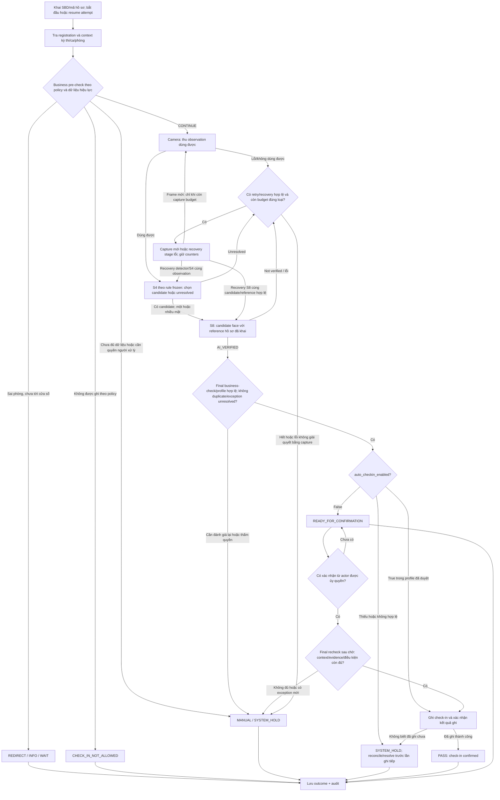

# T-024 — Policy quyết định cho demo cửa phòng thi

**Trạng thái:** DRAFT — **Group 1 và Group 2: Approved for demo profile**, toàn profile chưa freeze. **Cập nhật:** 2026-09-30. **Người phụ trách:** Quốc An. [D-004](../00-project/decisions/T-024-D-004-duyet-default-demo.md) duyệt default; [D-005](../00-project/decisions/T-024-D-005-auto-checkin-co-dieu-kien.md) duyệt auto-check-in có điều kiện và mode chờ xác nhận. Group 3/4 (manual authority, risk) còn mở. Đây là profile demo, không tự áp quy chế kỳ thi thật.

## 1. Mục tiêu và ba đầu ra

T-024 trả lời: **với kết quả business và AI hiện có, demo được tự ghi nhận gì, xử lý ngoại lệ thế nào, và ai được chỉnh policy?**

1. **Tài liệu này:** quy trình tổng business × AI, nghĩa các outcome và điều kiện khóa profile.
2. [AI rule, xử lý và retry](T-024-ai-rule-and-retry.md): camera → S4 → S8, ngân sách thử lại và giới hạn capability.
3. [Business policy và cấu hình](T-024-business-policy.md): các case trước/sau camera, nguồn dữ liệu, quyền chỉnh và audit.

[T-008](T-008-requirements.md) là baseline generic; T-024 cụ thể hóa profile demo để An/Hy dùng chung khi nối AI với app. [T-023](../05-evaluation/T-023-encoder-evaluation-result.md) có 55/55 selected genuine accept, 30/38 hard negative reject và **8/38 hard negative accept** tại `θ_research=0,23`. Evidence này hỗ trợ giữ encoder nghiên cứu, chưa chứng minh cấu hình auto-check-in đạt mức rủi ro demo. S8 trong phép thử vẫn dùng cùng cosine với S4, không tạo tín hiệu nhận dạng độc lập.

## 2. Phân lớp policy, dữ liệu và cấu hình AI

**Business Policy không phải các giá trị nghiệp vụ hard-code.** Cấu trúc workflow giữ ổn định; quy định thay đổi theo kỳ thi/ca/phòng phải được cấu hình trong quyền đã duyệt.

| Lớp | Nội dung | Quyền thay đổi |
| --- | --- | --- |
| Cấu trúc nghiệp vụ chung | Khai hồ sơ → kiểm business → xác minh → kiểm lại → ghi hoặc chuyển người xử lý; tách attempt/check-in/entry/attendance. | Thay đổi contract cần review phạm vi; không là nút chỉnh hàng ngày. |
| Dữ liệu có thẩm quyền | Registration, room/session assignment, eligibility, reference mapping, kết quả check-in hiện hành. | Sửa qua workflow dữ liệu có quyền và audit; không đổi “sự thật” bằng AI hoặc tùy chỉnh policy. |
| `ExamPolicy` | Time, eligibility actions, duplicate/re-entry, manual routing, `RetryPolicy` và quyền `auto_checkin_enabled`. | Người quản lý profile demo/kỳ thi có quyền phê duyệt; operator chỉ thực hiện quyền được cấp. |
| `AIConfig` | Model/weight, detector/config, preprocessing, S4 `τ,δ`, S8 rule/threshold, tiêu chí quality kỹ thuật nếu có. | Version/freeze cùng bằng chứng đánh giá; operator không đổi trong ca. |

Retry count chỉ có **một nguồn: `ExamPolicy.RetryPolicy`**. Nó điều khiển tương tác, không thay score/threshold AI. Thay retry count có thể đổi rủi ro và runtime toàn lượt nên phải phê duyệt/version lại; profile đã freeze không đổi giữa phép thử. Quality criterion kỹ thuật thuộc AIConfig; hành động/retry khi ảnh không dùng được thuộc RetryPolicy.

Mỗi attempt lưu `policy_version`, `ai_config_version`, context và phiên bản dữ liệu được dùng. Trước ghi check-in, kiểm hiệu lực business/data một lần nữa. Nếu policy/data thay đổi, phải đánh giá lại và ghi cả phiên bản trước/sau; không âm thầm trộn kết quả. Giữ AIConfig cố định trong attempt; muốn thay phải kết thúc lượt cũ và tạo lượt có version mới.

## 3. Nghĩa các kết quả

- **Attempt:** lượt tương tác gắn registration/context, có thể chứa nhiều observation/capture và kết thúc `CONCLUDED/INTERRUPTED`. Retry không tạo check-in mới.
- **Check-in:** kết quả kiểm tra đầu vào được ghi có hiệu lực; `PASS` chỉ hiển thị sau khi biết việc ghi đã thành công.
- **Entry authorization:** quyền vào phòng; profile này chưa có điều khiển cửa vật lý hoặc tự cấp quyền dự thi.
- **Attendance:** kết luận sau đối soát theo policy riêng; không tự suy từ PASS.

| Outcome | Nghĩa và hành động trong demo profile |
| --- | --- |
| `CONTINUE` | Business đủ điều kiện để đi tiếp; chưa xác minh danh tính. |
| `AI_VERIFIED` | S8 đạt rule trong AIConfig; còn phải qua final business-check. Không phải bảo đảm ground truth đúng. |
| `READY_FOR_CONFIRMATION` | Pipeline/business đạt nhưng quyền auto-check-in tắt; nhánh chờ chưa terminal, chưa có effective check-in. Khác MANUAL do exception; người được ủy quyền xác nhận rồi recheck trước ghi. |
| `PASS` | Check-in đã được ghi thành công qua route được duyệt: tự động có điều kiện hoặc xác nhận có thẩm quyền. Không đồng nghĩa đã vào phòng/đã dự thi. |
| `RETRY` | Thêm observation mới hoặc phục hồi lỗi kỹ thuật có ích, còn ngân sách; sau đó đánh giá lại. |
| `MANUAL` | Không tự hoàn tất; chuyển người có quyền. Người xử lý/timeout còn cần gán trong demo. |
| `INFO/WAIT`, `REDIRECT` | Hướng dẫn chờ hoặc đến đúng context; không cần chạy camera cho case đã rõ. |
| `CHECK_IN_NOT_ALLOWED` | Policy hiện hành không cho luồng này ghi check-in tự động. Có đường khiếu nại/manual theo quyền; không tự kết luận cấm dự thi. |
| `SYSTEM_HOLD` | Dữ liệu/thiết bị/config không đáng tin để tiếp tục tự động; không ghi PASS. |
| `INTERRUPTED` | Attempt bị bỏ hoặc gián đoạn; không suy thành vắng thi. |

`BLOCK` trong nội dung nguồn được chuẩn hóa thành `CHECK_IN_NOT_ALLOWED`. Không dùng `REJECT` chung chung làm outcome cuối: `S8 REJECT/NOT_VERIFIED` là kết quả component dẫn đến retry/manual, không là cáo buộc gian lận hoặc quyết định từ chối dự thi.

**Group 2 đã duyệt:** AI_VERIFIED không trực tiếp tạo PASS. Decision Engine chỉ tự ghi khi `auto_checkin_enabled=true` trong profile đã duyệt và business pre-check/final-check đều OK, không duplicate/exception unresolved. Nếu flag false, lượt đủ điều kiện chuyển READY_FOR_CONFIRMATION; người có quyền xác nhận rồi final recheck/ghi thành công mới PASS. Flag/profile thiếu hoặc không đáng tin → SYSTEM_HOLD. Nhánh chờ không tự cấp quyền cho một role khi Group 3 chưa chốt.

## 4. Quy trình tổng business × AI

**Nhiều mặt không tự động là lỗi.** S4 chọn được candidate theo rule frozen thì sang S8; không chọn được mới retry/manual. “Một mặt” cũng không tự PASS hoặc bỏ các điều kiện của phương pháp S4 đã freeze. T-024 không đổi P2. Mất dấu/selection theo thời gian là tình huống app cần hỗ trợ, chưa là capability đã kiểm bằng nghiên cứu ảnh tĩnh.

Manual có thể kết thúc bằng ghi nhận được người có quyền xác nhận, giữ pending hoặc kết thúc không ghi, kèm lý do. Kết quả manual phải phân biệt với AI-verified; override và correction không xóa attempt/evidence cũ.

## 5. Core decisions và phần còn cần chốt

Giữ ID của draft ban đầu để trace:

| ID | Nội dung đã cụ thể hóa từ bản Quốc An cung cấp | Phần còn mở trước freeze |
| --- | --- | --- |
| DP-01 | Profile cho demo nghiên cứu; không áp quy chế kỳ thi thật. | Demo bằng nguồn sẵn có/live camera, thiết bị và phạm vi người thật nếu có. |
| DP-02 | Group 2 approved theo D-005: auto-check-in có điều kiện khi flag true; false → READY_FOR_CONFIRMATION → người có quyền → recheck/write → PASS. | Gán role xác nhận ở Group 3 và freeze mode/config/test scope; entry/attendance vẫn tách riêng. |
| DP-03 | AI chưa verify → retry/manual; BLOCK nghiệp vụ được đặt tên rõ. | Quyền người xử lý tranh chấp, không bổ sung quyền cấm thi. |
| DP-04 | Group 1 approved: technical recovery 1; no-face/quality/S4 unresolved tối đa 2 retry mỗi nhóm, S8 not verified 1 capture mới; mọi capture chịu tổng 3/attempt. | Quality criterion/timeout và các retry phụ chưa xác nhận giữ trạng thái riêng; quyền manual thuộc Group 3. |
| DP-05 | Failure nguy hiểm: non-target/impostor được ghi check-in như đã xác minh. | False-accept cap và acceptance criteria demo **TBD**; không dùng 8/38 làm cap. |
| DP-06 | Group 1 approved: late 15 phút/intake mở, re-entry/duplicate, eligibility, reference và data-unreliable actions theo D-004. | Early window TBD; context/data profile thực sự dùng và quyền xử lý ngoại lệ còn mở. |
| DP-07 | Audit version, actor, reason, kết quả trước/sau; giữ pending khi chưa xử lý. | Gán người/role manual, override/correction và thời hạn lưu bằng chứng. |

Group 1/2 đã được duyệt theo D-004/D-005; không đồng nghĩa freeze toàn profile hoặc chứng minh auto-check-in đạt cap. False-accept cap còn TBD không ngăn thiết kế capability, nhưng chưa thể kết luận test “đạt cap” hay hệ thống đủ an toàn. Thứ tự tiếp theo: **Group 3 — manual authority → Group 4 — risk/test acceptance**.

## 6. Đầu vào cho bước freeze và kiểm end-to-end

Sau khi profile demo được duyệt, khóa policy/version, roster/reference/context, model/weight/detector/P2/S8 rule, camera hoặc nguồn replay, quality capability thực sự có, ground truth, exclusions, metric và điều kiện đo **trước** test. `θ=0,23` T-023 chỉ là mốc nghiên cứu, không tự điền thành deployment threshold.

**T-024 không thay model, P2 hoặc retune S8. AIConfig hiện tại được giữ nguyên làm cấu hình nghiên cứu tham chiếu; operating point dùng cho end-to-end demo sẽ được freeze trước khi test và không được tuning từ chính test đó.**

Báo tách S4 selection, S8 verification, business outcomes, effective check-in sai/đúng, retry/manual, latency và lỗi ghi dữ liệu. Lượt lặp cùng người có tương quan; báo số người/attempt/observation riêng. Kiểm false acceptance **toàn attempt sau retry**, không chỉ từng ảnh, vì retry có thể tạo nhiều cơ hội accept.

Giữ ràng buộc hiện có: chỉ dùng dữ liệu sẵn có, không tự thu ảnh/video mới. Nếu chưa có đầu vào/thiết bị phù hợp, có thể kiểm luồng bằng replay/fixture đã khai báo, nhưng không gọi đó là live-camera/near-domain evidence. Khi Quốc An thay phạm vi dữ liệu, ghi quyết định trước.

**Bước sau:** duyệt profile và các TBD thiết yếu → freeze cấu hình → test end-to-end theo phạm vi dữ liệu được duyệt → nếu đạt requirement thì khóa AI/integration; nếu fail rõ thì mở câu hỏi kỹ thuật riêng. T-024 không chạy experiment, retune hoặc sửa kết quả T-022/T-023.
