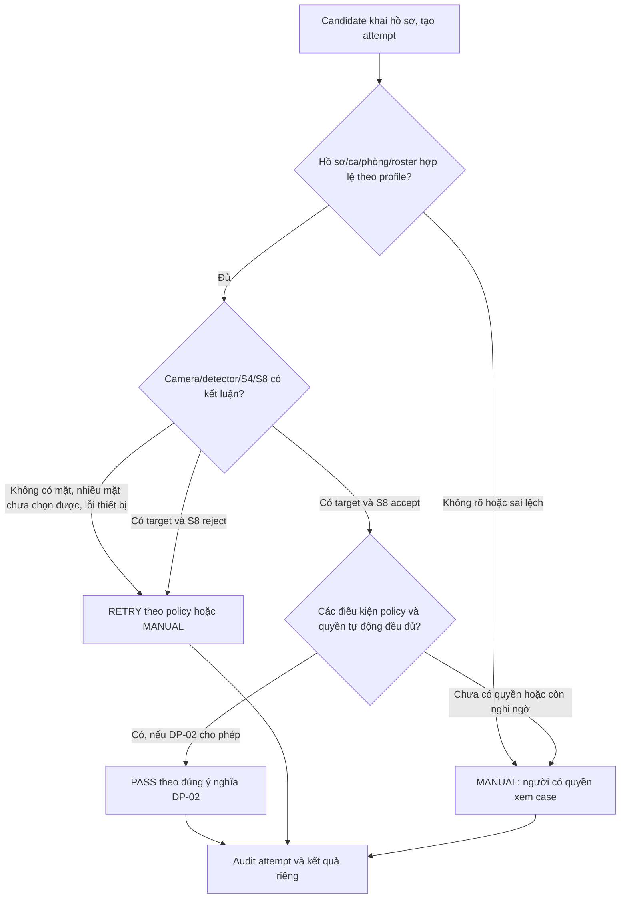

# T-024 — Profile quyết định và rủi ro cho demo cửa phòng thi

**Trạng thái:** DRAFT để Quốc An cùng chọn; chưa là policy đã duyệt, chưa có quyền auto-pass hoặc ngưỡng triển khai. **Ngày bắt đầu:** 2026-09-30. **Phạm vi:** demo nghiên cứu, không tự áp dụng quy chế của một kỳ thi thật.

## 1. Vì sao T-024 tồn tại

[T-008](T-008-requirements.md) yêu cầu tách lượt thử, check-in, quyền vào phòng và attendance; hệ thống chỉ tự quyết trong quyền được cấu hình. [T-023](../05-evaluation/T-023-encoder-evaluation-result.md) cho thấy MobileFaceNet còn **8/38** hard negative proxy được accept ở mốc nghiên cứu `θ=0,23`. Vì thế score tốt trên ảnh không tự tạo quyền cho người qua cửa. Trước khi khóa pipeline và kiểm camera/thiết bị gần điều kiện demo, nhóm cần định nghĩa **decision policy** và rủi ro chấp nhận được.

T-024 chỉ chốt cách **ứng dụng diễn giải và xử lý kết quả** trong demo. Nó không chọn lại model, `τ,δ`, threshold S8, dataset, hay xác nhận hệ thống phù hợp kỳ thi thật.

## 2. Bốn tầng kết quả cần giữ riêng

1. **Attempt:** một lượt tương tác; có thể hoàn tất, bị gián đoạn hoặc cần thử lại.
2. **Check-in:** hồ sơ đã hoàn thành kiểm tra đầu vào theo profile hay chưa; không tự chứng minh đã bước vào phòng.
3. **Entry authorization:** quyền vào phòng, chỉ tồn tại nếu demo bật feature này và có thẩm quyền phê duyệt riêng.
4. **Attendance:** kết luận sau đối soát theo định nghĩa đã chọn; không tự suy từ check-in hoặc entry authorization.

AI trả về detection/target/verification evidence. **Business policy** quyết định hệ thống được tự ghi nhận gì; **người được ủy quyền** xử lý ngoại lệ. Không xem `S8 ACCEPT` đơn lẻ là `PASS` nghiệp vụ.

## 3. Những quyết định cần Quốc An/nhóm chốt

| ID | Câu hỏi policy demo | Lựa chọn cần chốt | Trạng thái và tác động |
| --- | --- | --- | --- |
| DP-01 | Demo mô phỏng lượt vào cửa hay vận hành với người thật có quyền vào phòng? | Chế độ demo và giới hạn tuyên bố. | **TBD**. Xác định mức thẩm quyền và loại ground truth cần có. |
| DP-02 | `PASS` có nghĩa hệ thống tự ghi check-in, chỉ đề xuất cho người phụ trách, hay tự cấp quyền vào? | Quyền tự động hóa, kết quả cụ thể được ghi, vai trò phê duyệt. | **TBD**. Không bật auto-pass khi chưa xác định. |
| DP-03 | `REJECT` là từ chối **quyết định tự động** và chuyển người xử lý, hay từ chối người vào? | Ý nghĩa trên màn hình/log và người có quyền quyết định cuối. | **TBD**. Không suy `REJECT` là cấm vào khi chưa có policy. |
| DP-04 | Trường hợp nào phải `RETRY` và khi nào chuyển `MANUAL`? | Số lần/điều kiện retry, người nhận case, khi camera/verification không sẵn có. | **TBD**. Chưa đặt số lần thử. |
| DP-05 | False accept nào cần kiểm soát và mức nào được chấp nhận cho demo? | Mẫu số/loại ca, mức rủi ro/tiêu chí dừng, cách diễn giải khi mẫu ít. | **TBD**. `8/38` BFW là conditional proxy, không phải cap hay tỷ lệ phòng thi. |
| DP-06 | Khi hồ sơ sai ca/phòng, không tìm thấy, trùng check-in, muộn hoặc dữ liệu không sẵn thì ai quyết? | Hành động tự động cho từng case và người có quyền review/override. | **TBD**. Giữ invariant T-008: không silently ghi success/attendance. |
| DP-07 | Ai xem/duyệt/sửa kết quả manual và bằng chứng nào phải giữ? | Vai trò demo, audit tối thiểu, correction. | **TBD**. Cần để app và phép thử end-to-end có expected outcome. |

Các lựa chọn trong bảng là **câu hỏi cần chốt**, không phải yêu cầu một kỳ thi cụ thể. DP-01–DP-05 xác định ranh giới quyết định/rủi ro cho luồng AI demo. DP-06–DP-07 chỉ cần cụ thể hóa các case thực sự đưa vào phép thử demo; các nhánh app chi tiết còn lại thuộc phần triển khai do Minh Hy nghiên cứu. Không tự đồng nhất quyền của operator với quyền override.

## 4. Khung luồng quyết định để cùng duyệt

Đây là **khung đề xuất**, chưa xác nhận outcome cho DP-01–DP-07:

Đặc biệt: `S4 false selection → S8 ACCEPT` đã xảy ra trong proxy T-023; nhánh `D` phải dựa trên policy/risk được duyệt, không chỉ score. `REJECT` chưa đặt trong flow vì DP-03 chưa rõ; nếu dùng, phải định nghĩa nó là kết quả của **quyết định nào** và quyền nào.

## 5. Bằng chứng và tiêu chí để khóa policy

- Ghi chủ thể/phạm vi/ngày duyệt profile và phiên bản policy. Một demo profile có thể khác policy kỳ thi thật; báo cáo phải nói rõ.
- Với DP-05, phân biệt **failure nguy hiểm** (người không đúng hồ sơ được tự ghi check-in hoặc cho vào, tùy DP-02) và **failure gây phiền** (người đúng bị retry/manual). Chọn metric/mẫu số tương ứng; không chuyển tỷ lệ BFW thành rủi ro thực.
- Nếu nhóm chưa chọn được false-accept cap hoặc không có bằng chứng near-domain đủ để chứng minh cap, nhánh quyết định phụ thuộc cap phải giữ `MANUAL`/chưa tự pass trong demo. Đây là ranh giới thẩm quyền, không phải một threshold số mới.
- Cần một đường fallback khi thiết bị, mạng hoặc dữ liệu lỗi; mọi attempt/manual override/correction có actor, thời gian, lý do và liên kết kết quả trước/sau theo T-008.

## 6. Hợp đồng đầu vào cho phép thử gần miền triển khai

Chỉ sau khi DP-01–DP-07 cần cho demo được duyệt, task kiểm end-to-end mới khóa: phiên bản policy, model/weight, detector, P2 `τ,δ`, S8 rule/operating point, camera/thiết bị, input/roster demo, ground truth, tiêu chí loại và metric. Chạy `camera → detect → S4 → S8 → decision policy` trên cùng điều kiện đã định; báo riêng `PASS/RETRY/MANUAL/REJECT` **theo nghĩa đã chốt**, cùng false accept/false reject và runtime đúng mẫu số. Không dùng evaluation đó để sửa policy/threshold rồi báo lại trên cùng tập.

**Gate sau test:** nếu đạt profile demo đã duyệt, khóa AI cho integration/app/report trong đúng phạm vi; nếu fail rõ, phân tích lỗi stage/miền rồi mở câu hỏi kỹ thuật riêng. Không mặc định giải pháp là model khác hoặc fine-tune.
