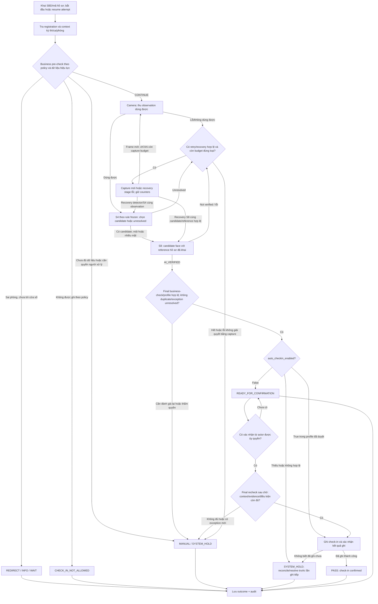

# T-024 — Policy quyết định cho demo cửa phòng thi

**Trạng thái:** **Bốn group policy chính đã chốt — Approved for demo profile** theo [D-004](../00-project/decisions/T-024-D-004-duyet-default-demo.md), [D-005](../00-project/decisions/T-024-D-005-auto-checkin-co-dieu-kien.md), [D-006](../00-project/decisions/T-024-D-006-manual-authority.md), [D-007](../00-project/decisions/T-024-D-007-workflow-va-risk-evaluation.md). **Cập nhật:** 2026-10-01. **Người phụ trách:** Quốc An. Hoàn tất phạm vi chốt policy T-024; test profile cụ thể chưa freeze, test chưa chạy. Đây là profile demo, không tự áp quy chế kỳ thi thật.

## 1. Mục tiêu và ba đầu ra

T-024 trả lời: **với kết quả business và AI hiện có, demo được tự ghi nhận gì, xử lý ngoại lệ thế nào, và ai được chỉnh policy?**

1. **Tài liệu này:** quy trình tổng business × AI, nghĩa các outcome và điều kiện khóa profile.
2. [AI rule, xử lý và retry](T-024-ai-rule-and-retry.md): camera → S4 → S8, ngân sách thử lại và giới hạn capability.
3. [Business policy và cấu hình](T-024-business-policy.md): các case trước/sau camera, nguồn dữ liệu, quyền chỉnh và audit.

[T-008](T-008-requirements.md) là baseline generic; T-024 cụ thể hóa profile demo để An/Hy dùng chung khi nối AI với app. [T-023](../05-evaluation/T-023-encoder-evaluation-result.md) có 55/55 selected genuine accept, 30/38 hard negative reject và **8/38 hard negative accept** tại `θ_research=0,23`. Evidence này hỗ trợ giữ encoder nghiên cứu, chưa chứng minh cấu hình auto-check-in đạt mức rủi ro demo. S8 trong phép thử vẫn dùng cùng cosine với S4, không tạo tín hiệu nhận dạng độc lập.

## 2. Phân lớp policy, dữ liệu và cấu hình AI

**Business Policy không phải các giá trị nghiệp vụ hard-code.** Cấu trúc workflow giữ ổn định; quy định thay đổi theo kỳ thi/ca/phòng phải được cấu hình trong quyền đã duyệt.

| Lớp | Nội dung | Quyền thay đổi |
| --- | --- | --- |
| Cấu trúc nghiệp vụ chung | Khai hồ sơ → kiểm business → xác minh → kiểm lại → ghi hoặc chuyển người xử lý; tách attempt/check-in/entry/attendance. | Thay đổi contract cần review phạm vi; không là nút chỉnh hàng ngày. |
| Dữ liệu có thẩm quyền | Registration, room/session assignment, eligibility, reference mapping, kết quả check-in hiện hành. | Sửa qua workflow dữ liệu có quyền và audit; không đổi “sự thật” bằng AI hoặc tùy chỉnh policy. |
| `ExamPolicy` | Time, eligibility actions, duplicate/re-entry, manual routing, `RetryPolicy` và quyền `auto_checkin_enabled`. | Người quản lý profile demo/kỳ thi có quyền phê duyệt; operator chỉ thực hiện quyền được cấp. |
| `AIConfig` | Model/weight, detector/config, preprocessing, S4 `τ,δ`, S8 rule/threshold, tiêu chí quality kỹ thuật nếu có. | Version/freeze cùng bằng chứng đánh giá; operator không đổi trong ca. |

Retry count chỉ có **một nguồn: `ExamPolicy.RetryPolicy`**. Nó điều khiển tương tác, không thay score/threshold AI. Thay retry count có thể đổi rủi ro và runtime toàn lượt nên phải phê duyệt/version lại; profile đã freeze không đổi giữa phép thử. Quality criterion kỹ thuật thuộc AIConfig; hành động/retry khi ảnh không dùng được thuộc RetryPolicy.

Mỗi attempt lưu `policy_version`, `ai_config_version`, context và phiên bản dữ liệu được dùng. Trước ghi check-in, kiểm hiệu lực business/data một lần nữa. Nếu policy/data thay đổi, phải đánh giá lại và ghi cả phiên bản trước/sau; không âm thầm trộn kết quả. Giữ AIConfig cố định trong attempt; muốn thay phải kết thúc lượt cũ và tạo lượt có version mới.

## 3. Nghĩa các kết quả

- **Attempt:** lượt tương tác gắn registration/context, có thể chứa nhiều observation/capture và kết thúc `CONCLUDED/INTERRUPTED`. Retry không tạo check-in mới.
- **Check-in:** kết quả kiểm tra đầu vào được ghi có hiệu lực; `PASS` chỉ hiển thị sau khi biết việc ghi đã thành công.
- **Entry authorization:** quyền vào phòng; profile này chưa có điều khiển cửa vật lý hoặc tự cấp quyền dự thi.
- **Attendance:** kết luận sau đối soát theo policy riêng; không tự suy từ PASS.

| Outcome | Nghĩa và hành động trong demo profile |
| --- | --- |
| `CONTINUE` | Business đủ điều kiện để đi tiếp; chưa xác minh danh tính. |
| `AI_VERIFIED` | S8 đạt rule trong AIConfig; còn phải qua final business-check. Không phải bảo đảm ground truth đúng. |
| `READY_FOR_CONFIRMATION` | Pipeline/business đạt nhưng quyền auto-check-in tắt; nhánh chờ chưa terminal, chưa có effective check-in. Khác MANUAL do exception; người được ủy quyền xác nhận rồi recheck trước ghi. |
| `PASS` | Check-in đã được ghi thành công qua route được duyệt: tự động có điều kiện, xác nhận lượt đạt hoặc manual-authorized HUMAN. Ghi nguồn quyết định riêng; không đồng nghĩa đã vào phòng/đã dự thi hoặc AI success. |
| `RETRY` | Thêm observation mới hoặc phục hồi lỗi kỹ thuật có ích, còn ngân sách; sau đó đánh giá lại. |
| `MANUAL` | Không tự hoàn tất; chuyển theo authority ba tầng D-006. Người/tài khoản, delegation, evidence method và timeout cần được gán cho nhánh demo dùng tới. |
| `INFO/WAIT`, `REDIRECT` | Hướng dẫn chờ hoặc đến đúng context; không cần chạy camera cho case đã rõ. |
| `CHECK_IN_NOT_ALLOWED` | Policy hiện hành không cho luồng này ghi check-in tự động. Có đường khiếu nại/manual theo quyền; không tự kết luận cấm dự thi. |
| `SYSTEM_HOLD` | Dữ liệu/thiết bị/config không đáng tin để tiếp tục tự động; không ghi PASS. |
| `INTERRUPTED` | Attempt bị bỏ hoặc gián đoạn; không suy thành vắng thi. |

`BLOCK` trong nội dung nguồn được chuẩn hóa thành `CHECK_IN_NOT_ALLOWED`. Không dùng `REJECT` chung chung làm outcome cuối: `S8 REJECT/NOT_VERIFIED` là kết quả component dẫn đến retry/manual, không là cáo buộc gian lận hoặc quyết định từ chối dự thi.

**Group 2 đã duyệt:** AI_VERIFIED không trực tiếp tạo PASS. Decision Engine chỉ tự ghi khi `auto_checkin_enabled=true` trong profile đã duyệt và business pre-check/final-check đều OK, không duplicate/exception unresolved. Nếu flag false, lượt đủ điều kiện chuyển READY_FOR_CONFIRMATION; người có quyền xác nhận rồi final recheck/ghi thành công mới PASS. Flag/profile thiếu hoặc không đáng tin → SYSTEM_HOLD. Authority theo Group 3/D-006; phải bind actor/quyền/scope trước dùng nhánh, không suy quyền từ score.

## 4. Quy trình tổng business × AI

**Nhiều mặt không tự động là lỗi.** S4 chọn được candidate theo rule frozen thì sang S8; không chọn được mới retry/manual. “Một mặt” cũng không tự PASS hoặc bỏ các điều kiện của phương pháp S4 đã freeze. T-024 không đổi P2. Mất dấu/selection theo thời gian là tình huống app cần hỗ trợ, chưa là capability đã kiểm bằng nghiên cứu ảnh tĩnh.

**Nhánh HUMAN theo Group 3:** MANUAL → actor có quyền + evidence method được policy duyệt + case trong scope phòng/ca → xác minh thủ công → final business-check/authority/duplicate → ghi thành công mới manual-approved check-in/PASS. Thiếu một guard → ESCALATE; thiếu evidence đáng tin thì giữ pending. Không cần đổi S8 NOT_VERIFIED thành AI_VERIFIED để đi route HUMAN. SYSTEM_HOLD/data conflict/unknown write phải resolve hoặc reconcile theo authority trước, không nối thẳng sang PASS. Re-entry/duplicate giữ check-in cũ, không ghi lần hai.

Kết quả HUMAN và verdict AI được báo riêng; manual không tính thành AI success, không sửa score/threshold/ground truth. Override xử lý ngoại lệ đang có; correction sửa kết quả đã ghi với lịch sử trước/sau, không xóa attempt/evidence cũ. Chi tiết authority nằm ở [business-policy mục 3.1](T-024-business-policy.md#31-group-3--manual-authority-đã-duyệt).

## 5. Core decisions và phần còn cần chốt

Giữ ID của draft ban đầu để trace:

| ID | Nội dung đã cụ thể hóa từ bản Quốc An cung cấp | Phần còn mở trước freeze |
| --- | --- | --- |
| DP-01 | D-007 duyệt demo nghiên cứu bằng existing data + replay/fixture + business states giả lập; không áp quy chế kỳ thi thật. | Bind nguồn/manifest/runner/thiết bị test cụ thể; không thu ảnh/video mới hoặc gọi replay là camera thực địa. |
| DP-02 | Group 2 approved theo D-005: auto-check-in có điều kiện khi flag true; false → READY_FOR_CONFIRMATION → người có quyền → recheck/write → PASS. Group 3/D-006 duyệt role/scope. | Bind tài khoản/delegation và freeze mode/config/test scope; entry/attendance vẫn tách riêng. |
| DP-03 | AI chưa verify → retry/manual; D-006 duyệt HUMAN độc lập với verdict AI. BLOCK nghiệp vụ được đặt tên rõ. | Evidence method cụ thể phải được duyệt trước dùng nhánh manual; không bổ sung quyền cấm thi. |
| DP-04 | Group 1 approved: technical recovery 1; no-face/quality/S4 unresolved tối đa 2 retry mỗi nhóm, S8 not verified 1 capture mới; mọi capture chịu tổng 3/attempt. | Quality criterion/timeout và các retry phụ chưa xác nhận giữ trạng thái riêng; quyền manual đã duyệt theo D-006. |
| DP-05 | D-007 duyệt workflow invariants có PASS/FAIL và báo AI/pipeline error ở attempt-level; manual riêng với AI. | False-accept cap **TBD**: test được chạy nhưng chưa có safety PASS/FAIL hoặc kết luận đạt mức rủi ro chấp nhận được. |
| DP-06 | Group 1 approved: late 15 phút/intake mở, re-entry/duplicate, eligibility, reference và data-unreliable actions theo D-004. D-006 duyệt phân quyền ngoại lệ. | Early window TBD; context/data profile và delegation thực sự dùng cần bind. |
| DP-07 | Audit version, actor/quyền/scope, reason, kết quả trước/sau; giữ pending khi chưa xử lý. AI/HUMAN riêng theo D-006. | Gán người/tài khoản, evidence method, timeout và thời hạn lưu bằng chứng cho case test. |

Group 1/2/3/4 đã được duyệt; không đồng nghĩa đã freeze test profile hoặc chứng minh auto-check-in đạt cap. **Tiếp theo là freeze test profile**, không bàn lại bốn group. Quyền manual không tự chặn một wrong accept đã đi qua nhánh tự động.

### 5.1. Group 4 — hai loại acceptance đã duyệt

**A — Workflow acceptance:** [WI-001–WI-011 trong D-007](../00-project/decisions/T-024-D-007-workflow-va-risk-evaluation.md#a-workflow-acceptance--passfail-rõ) có expected behavior và PASS/FAIL trên case đã định nghĩa trước. Vi phạm bất kỳ mandatory invariant → workflow FAIL; case chưa chạy → NOT_RUN. Kết quả workflow PASS khác outcome PASS/check-in của một attempt.

**B — AI/risk evaluation:** genuine accept/not verified/unresolved; non-target/impostor/hard-negative rejected/no-select, false-selected, S8 accepted và effective false check-in; retry/manual/hold đều báo có mẫu số rõ, **ở mức toàn attempt**, kèm component/capture trace. Một capture impostor được S8 accept làm attempt có AI false acceptance, dù capture trước bị reject; chỉ confirmed write sai mới tính effective false check-in. Manual không sửa verdict AI hoặc được tính thành AI success. Fixture giả lập verdict không đi vào metric chất lượng nhận dạng.

**False-accept cap = TBD thì test vẫn chạy được**, nhưng chỉ kết luận workflow đạt/không đạt và mức lỗi quan sát được; chưa kết luận AI đạt mức rủi ro chấp nhận được, safe/deployment-ready hoặc đạt false-accept requirement. Giữ riêng đường lỗi `S4 wrong selection → S8 false accept → final business-check OK → auto-check-in → write confirmed → effective false check-in` và stage/reason nếu bị chặn. AI lỗi không tự đồng nghĩa workflow fail; lỗi business/authority/write nếu có vẫn báo độc lập.

## 6. Bước tiếp — freeze test profile và kiểm end-to-end

Theo D-007, khóa dataset/input manifest, ground truth, ExamPolicy/retry budget, roster/reference/context, AIConfig/model/hash/detector/P2/S8 operating point, auto mode, scenario list/expected result, exclusions, metrics/mẫu số, acceptance rules, code/runtime và điều kiện đo **trước** test. [Bản chuẩn bị test profile](T-024-test-profile-preparation.md) cụ thể hóa case list/input đề xuất; nó chưa là freeze record. `θ=0,23` T-023 chỉ là mốc nghiên cứu, không tự điền thành deployment threshold.

**T-024 không thay model, P2 hoặc retune S8. AIConfig hiện tại được giữ nguyên làm cấu hình nghiên cứu tham chiếu; operating point dùng cho end-to-end demo sẽ được freeze trước khi test và không được tuning từ chính test đó.**

Báo tách S4 selection, S8 verification, business outcomes, effective check-in sai/đúng, retry/manual, latency và lỗi ghi dữ liệu. Lượt lặp cùng người có tương quan; báo số người/attempt/observation riêng. Kiểm false acceptance **toàn attempt sau retry**, không chỉ từng ảnh, vì retry có thể tạo nhiều cơ hội accept.

Phạm vi đã duyệt: **existing data + replay/fixture + simulated business states**, không thu ảnh/video mới. Báo reuse/recompute và dữ liệu đã xem nếu replay; không gọi đó là holdout mới hoặc live-camera/near-domain evidence.

**Bước sau:** bind input/config/scenario/expected result → freeze version/hash → chạy test → kết luận workflow PASS/FAIL trong scope đã chạy và báo observed AI/pipeline errors → integration/report theo phạm vi demo. Thay threshold/retry/policy/input/code sau kết quả là version mới và evaluation độc lập khác; không sửa cùng evaluation hoặc dùng kết quả để tune. T-024 chốt policy, chưa thực thi test hoặc thay kết quả T-022/T-023.
