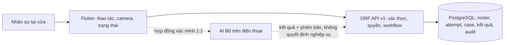

# T-018 — Kế hoạch xây dựng ứng dụng cửa phòng thi

**Ngày lập:** 2026-09-28. **Trạng thái:** kế hoạch triển khai để Minh Hy và Quốc An review; [D-005](../00-project/decisions/T-018-D-005-pham-vi-android-ai-tren-may.md) đã chốt Android trước, AI trên điện thoại, ca thi học phần giả lập và check-in do nhân sự xác nhận sau khi backend nhận kết quả. Chưa có chính sách kỳ thi thật hay quyết định model cuối. **Task:** T-018 trên [Sheet chung](https://docs.google.com/spreadsheets/d/14BQCQ_LbGkZS15Grfi4AZNWBX15h479XjoyQvP9jHcU/edit?gid=0#gid=0), Minh Hy thực hiện, Quốc An review. Các ký hiệu M0–M8 bên dưới là **mốc kỹ thuật trong kế hoạch**, không phải task ID mới, người phụ trách mới hoặc deadline.

## 1. Mục tiêu và ranh giới

Xây một ứng dụng tham chiếu có thể chạy từ thao tác tại cửa đến kết quả có dấu vết, theo [T-008](../01-problem/T-008-requirements.md), [E3](../03-baseline/T-010-E3-fixture-contract.md) và [D-004](../00-project/decisions/T-018-D-004-chon-stack-app-tham-chieu.md). Stack đã chọn là **Flutter + Django REST Framework + PostgreSQL**. B0 của Quốc An (**SCRFD-500MF → A0 → MobileFaceNet**) là pipeline AI tham chiếu để kiểm luồng; kết quả nghiên cứu tối ưu và model triển khai cuối thuộc các task sau.

Một lượt phải giữ riêng bốn đối tượng: **attempt** (lần xử lý), **check-in có hiệu lực** (bản ghi tiếp nhận), **entry authorization** (quyết định cho vào, nếu thuộc scope) và **attendance** (kết luận theo định nghĩa được duyệt). AI chỉ tạo bằng chứng xác minh, không tự cho vào phòng, kết luận vắng hay sửa quyết định cũ. Khi thiếu policy, quyền hoặc bằng chứng cần thiết, giữ `unresolved`/review; không tự điền mặc định.

Phạm vi mốc tham chiếu: chuẩn bị ca/phòng/roster/policy, tiếp nhận mã khai báo, tra cứu hồ sơ, kiểm điều kiện, xác minh 1:1, xử lý ngoại lệ, ghi kết quả được phép, đối soát và correction có audit. Điều khiển cửa vật lý, tái nhập đầy đủ, chấm attendance trong phòng và vận hành trên dữ liệu thật chỉ làm khi scope/profile được duyệt. Không đặt mục tiêu giảm nhân sự khi chưa có As-Is và phép đo thực địa.

## 2. Kiến trúc thống nhất

- **Flutter:** giao diện và trạng thái thao tác; không tự tính check-in/attendance. Giữ mã lỗi và bước tiếp rõ ràng; không lưu bí mật trong `dart-define`.
- **DRF:** nguồn duy nhất thực thi quyền, policy, chuyển trạng thái và idempotency; API có phiên bản, serializer tách khỏi service nghiệp vụ.
- **PostgreSQL:** lưu phiên bản roster/policy gắn từng attempt, ràng buộc chống check-in trùng, lịch sử review/audit/correction. Migration đi cùng mã; dữ liệu nhạy cảm không vào Git.
- **AI adapter:** chạy trên Android theo D-005, đầu vào là đúng attempt và hồ sơ đã chọn, đầu ra có loại `satisfied | unmet | unavailable | inconclusive`, phiên bản pipeline và tham chiếu bằng chứng theo quyền. Cách đóng gói, lưu ảnh và ngưỡng vẫn phải kiểm thiết bị và quyền dùng tài sản. Với B0 A0, không/nhiều mặt trả unresolved, không tự chọn mặt. Khi mất mạng, thao tác chờ đồng bộ; backend nhận và nhân sự xác nhận sau đồng bộ rồi mới có check-in hiệu lực.

## 3. Thứ tự triển khai và điều kiện qua mốc

| Mốc | Công việc và đầu ra cần thấy | Điều kiện để qua mốc |
|---|---|---|
| **M0 — Khóa hợp đồng cho app tham chiếu** | Rà 8 góp ý còn mở của T-008; lập profile **giả lập** gồm ca/phòng, roster, policy, vai trò, outcome và đường fallback. Ghi người/ngày/phiên bản phê duyệt profile, phạm vi entry/attendance, thiết bị và Android/iOS mục tiêu. Chốt API/state contract v1 trước khi mở check-in. | Quốc An và Minh Hy review; policy cần cho từng nhánh có nguồn, quyền và expected outcome. Điểm chưa thống nhất ở `questions.md`, không âm thầm biến thành default. |
| **M1 — Nền tảng mã nguồn** | Backend chia model/service/API/test; Flutter chia app/feature/core; schema ban đầu, health, context, tạo/đọc attempt, case tra cứu, audit, idempotency; hướng dẫn chạy. Mã đang được dựng lại trong PR #9 theo yêu cầu mới của Minh Hy. | Test unit/API và build Flutter đạt trên mã dựng lại; migration PostgreSQL thật được kiểm ở M2. |
| **M2 — Môi trường và dữ liệu thử** | Chạy migration trên PostgreSQL sạch; seed roster/ca/phòng giả lập có version; đăng nhập nhân sự, quyền theo context; Flutter chọn ca/phòng được cấp; health/readiness phân biệt API sống với DB sẵn sàng. | Có kịch bản cài mới và chạy lại; thử quyền sai, context đóng, roster thiếu, migration và dữ liệu version; không có dữ liệu cá nhân/bí mật trong repo. |
| **M3 — Lượt tại cửa chưa dùng AI** | Flutter nhập mã và hiện bước tiếp; API tạo attempt trước lookup, kiểm ca/phòng, thời gian và kết quả trước theo profile; retry/mất phản hồi dùng idempotency; case thiếu/mơ hồ/sai phòng có người nhận. | Chạy được một luồng mã hợp lệ và các nhánh bất thường với fixture; không tạo check-in từ việc chỉ tìm thấy hồ sơ; audit và trạng thái khớp contract. |
| **M4 — Xác minh B0** | Đo khả năng chạy B0 trên thiết bị Android đích, tích hợp camera và adapter B0 1:1 trên máy; liên kết người đang làm lượt với registration; trả bốn outcome, mã lỗi, phiên bản pipeline; hướng dẫn thử lại/review. | Kiểm không mặt, nhiều mặt, mất camera/AI, retry và người không khớp; không xem cosine hoặc `unresolved` là quyền vào. Ghi nguồn weight, thiết bị, thời gian và giới hạn; không commit ảnh/embedding/weight. Nếu không đạt, trình nhóm quyết định thay đổi. |
| **M5 — Kết quả nghiệp vụ và ngoại lệ** | Service đánh giá policy/quyền trên bằng chứng; ghi **một** check-in có hiệu lực hoặc review; màn hình reviewer xử lý case, lý do, actor; entry authorization chỉ khi profile đưa vào scope. | Test transaction/race/retry, người không đủ quyền, policy thiếu, duplicate và override; cùng một sự kiện không tạo hai check-in. Check-in, entry và attendance vẫn là kết quả riêng. |
| **M6 — Đóng ca, đối soát, correction** | Danh sách case mở, nguồn thủ công/sự cố, bản ghi đối soát; correction giữ bản gốc, người/lý do/trước–sau và ảnh hưởng tới báo cáo. Attendance chỉ theo định nghĩa đã duyệt, có `UNDETERMINED` khi thiếu căn cứ. | Chạy fixture E3-F07, F09–F12; không suy vắng chỉ vì thiếu check-in; kết quả/báo cáo có phiên bản và truy được audit. |
| **M7 — Kiểm hệ thống và đóng T-018** | Chạy catalog E3-F01–F12 với profile đã pin, ghi pass/fail/not-runnable; thử chuỗi thực trên emulator/thiết bị nêu tên, PostgreSQL thật, mạng lỗi, khởi động lại, quyền và bảo mật dữ liệu. Tài liệu cài đặt, test, giới hạn và demo. | Có bằng chứng app → camera → xác minh → check-in **hoặc** review → xem kết quả theo quyền; không gọi `not-runnable` là pass. Quốc An review PR và note bàn giao; Sheet cập nhật sau đầu ra/trạng thái thực tế theo workflow. |
| **M8 — Sau app tham chiếu** | T-019 thay pipeline B0 bằng model/config được chọn sau T-013–T-017 và so cùng dữ liệu/split/protocol/metric/thiết bị. | Chỉ bắt đầu khi có quyết định kỹ thuật cuối và điều kiện đo rõ; không tự đưa model tối ưu vào T-018 trước. |

**Phụ thuộc:** M0 là cổng cho các nhánh M3 liên quan thời gian/policy, toàn bộ M5/M6 và chấm E3; M2 là cổng để gọi backend tích hợp; M3/M4 có thể phát triển adapter riêng trên fixture nhưng chỉ nối thành luồng thật sau các cổng; M7 cần M2–M6 hoàn thành theo phạm vi profile. M8 phụ thuộc quyết định nghiên cứu, không là điều kiện hoàn thành app tham chiếu T-018.

### Các phần sẽ xây theo cùng một luồng

| Chức năng | Flutter | DRF/service | PostgreSQL |
|---|---|---|---|
| Chuẩn bị và đăng nhập | Đăng nhập, chọn context được cấp, hiển thị trạng thái sẵn sàng | Xác thực, quyền, API context/readiness | User, quyền, session, room, roster/policy version |
| Tiếp nhận | Nhập mã, trạng thái tra cứu, bước tiếp hoặc ngoại lệ | Tạo attempt, lookup, kiểm điều kiện theo profile | Registration, attempt, case, audit |
| Xác minh | Camera, hướng dẫn một người trong khung, trạng thái thử lại | Nhận kết quả adapter theo attempt, kiểm tính hợp lệ/liên kết | Metadata bằng chứng được phép, version, audit; không mặc định lưu ảnh |
| Kết quả | Hiển thị check-in/review riêng với quyền vào/attendance | Policy evaluator, transaction ghi kết quả, quyền reviewer | Check-in, quyết định/case, ràng buộc chống trùng |
| Cuối ca | Danh sách tồn đọng và màn hình đối soát/correction theo quyền | Tổng hợp nguồn, phát hành phiên bản, giữ lịch sử sửa | Audit, reconciliation, correction và report version |

Bảng này là **thiết kế đích**, không mô tả toàn bộ màn hình/API đã có. Mã thử nghiệm cũ được gỡ ngày 2026-09-29; mốc kết nối đang được dựng lại. Xem tiến độ thực tế ở cuối tài liệu và [hướng dẫn VS Code](T-018-vscode-local-setup.md).

## 4. Hợp đồng tối thiểu cần giữ nhất quán

1. Mọi request thay đổi kết quả mang actor, context, idempotency key hoặc precondition, và trả mã lỗi/bước tiếp xác định. Backend kiểm quyền ở từng request, không tin trạng thái màn hình.
2. Attempt lưu `roster_version` và `policy_version` đã dùng; thay version không sửa ngầm kết quả cũ. Registration phải có khóa nguồn; lookup thiếu/mơ hồ không tạo hồ sơ giả.
3. Evidence AI liên kết attempt + registration đúng người; trạng thái kỹ thuật khác với quyết định nghiệp vụ. Nếu AI không chạy, kết quả là `unavailable`/`inconclusive` theo profile, không tự chuyển thành `unmet`.
4. Chỉ service nghiệp vụ được mở/đóng case và ghi check-in; giao dịch và ràng buộc DB bảo vệ chống trùng. Review/override và correction là thao tác khác nhau, đều giữ audit.
5. FE chỉ hiển thị thông tin tối thiểu theo vai trò; lỗi mạng giữ trạng thái chưa xác nhận, sau reconnect tra kết quả server trước khi gửi lại. Không giả success từ thông báo đã gửi.
6. API/DB schema thay đổi phải có migration, test contract và cập nhật tài liệu; dữ liệu fixture không chứa mặt/danh tính thật. Các API cho M2–M6 được thiết kế và review trước khi thêm, chưa coi là đã tồn tại ở M1.

## 5. Bộ kiểm tra chung và câu hỏi cần chốt

**Kiểm tra theo lớp:** model/service/permission và PostgreSQL migration; API contract và retry; Flutter widget/luồng lỗi; E3 nghiệp vụ trên fixture; AI component theo protocol T-010; cuối cùng tích hợp thiết bị. E3 là pass/fail logic, không trộn vào accuracy AI. Mỗi mốc ghi cấu hình, phiên bản mã, thiết bị, dữ liệu/fixture, kết quả và giới hạn trong PR/handoff.

**Cần nhóm trả lời trước khi mở các nhánh phụ thuộc:** tên kỳ thi thật/profile và authority; thiết bị Android đích; thiết kế hàng đợi/đồng bộ khi mất mạng; nguồn roster và quy tắc hiệu lực; quyền xem/sửa/review/override; arrival/late/fallback; retention và dữ liệu nào được phép thu. Các câu hỏi này đang ở [questions.md](../00-project/questions.md) và T-008; kế hoạch không tự chọn giá trị.

**Cách quản lý:** một mốc chỉ được đánh dấu xong khi có đầu ra và bằng chứng kiểm tra. Phạm vi/decision thay đổi phải cập nhật D-004 hoặc quyết định mới và liên kết từ tài liệu này; task, người phụ trách, trạng thái, deadline vẫn quản lý trên Sheet, không sao chép bảng task vào repo.

## 6. Tiến độ thực tế — cập nhật 2026-09-29

| Mốc | Trạng thái có bằng chứng | Còn thiếu để qua mốc |
|---|---|---|
| M0 | Minh Hy đã chọn [profile ca thi giả lập `0.2-dev`](T-018-profile-ca-thi-gia-lap.md) làm fixture phát triển theo [D-006](../00-project/decisions/T-018-D-006-profile-gia-lap-cho-phat-trien.md); đã có nhánh và câu hỏi mở. | Quốc An còn review; nhóm chưa phê duyệt phiên bản/expected outcome cho E3. Arrival, quyền reviewer, fallback/retention và các policy phụ thuộc còn `TBD`. **Chưa hoàn tất.** |
| M1 | Đã dựng backend/Flutter mới; API health/readiness/login/logout/context/attempt, quyền theo context, khóa idempotency và UI trạng thái/đăng nhập/danh sách ca. Theo phản hồi Minh Hy, có bản xem thử Edge; Android vẫn là đích chính. 12 test backend, 4 test Flutter, Flutter analyze/web/APK debug build đạt. | Chưa có API lookup/case và test contract đầy đủ cho M1. **Đang làm, không đánh dấu xong.** |
| M2 | Minh Hy chọn phạm vi DB theo [D-007](../00-project/decisions/T-018-D-007-pham-vi-du-lieu-app.md); [thiết kế DB](T-018-thiet-ke-co-so-du-lieu.md) và migration `0002`–`0007` đã áp trên PostgreSQL `exam_entry_app`: 24 bảng nghiệp vụ/35 bảng tổng. Dữ liệu cũ được nối vào schema mới; 1 user, 1 context `SETUP`, 2 candidate/registration, roster và policy `DRAFT`, 0 check-in. Schema `public` cũ được giữ nguyên. | Import CSV/Excel, API nghiệp vụ và thử UI bằng tài khoản hiện có chưa xong; Android thật chưa kiểm. Các bảng tương lai chưa bật chức năng, policy thật còn `TBD`. **Phần schema xong, M2 chưa qua cổng.** |
| M3–M8 | Chưa triển khai trên mã mới. | Chờ cổng và bằng chứng theo bảng mốc ở mục 3. |

### Thành phần đã tạo và lý do

| Vị trí | Lý do |
|---|---|
| `backend/pyproject.toml`, `backend/uv.lock`, `backend/.python-version` | Khóa Python 3.12 và các thư viện backend để máy khác tái lập. |
| `backend/.env.example`, `backend/config/settings.py`, `backend/config/test_settings.py` | Cấu hình PostgreSQL từ biến môi trường, cô lập schema mới và test nhanh trong bộ nhớ. `backend/.env` chứa secret chỉ ở máy Minh Hy, bị Git ignore. |
| `backend/foundation/models/`, `backend/foundation/migrations/0001_initial.py` | Khung context/quyền/roster/attempt ban đầu đã tách thành các nhóm model để tiếp tục phát triển mà giữ app label và bảng cũ. |
| `backend/foundation/models/{catalog,roster,governance,workflow}.py`, `migrations/0002`–`0007` | Bổ sung danh mục ca/phòng, roster có version/lỗi import, policy và tham chiếu tệp, check-in/review/offline/correction/entry/attendance tách riêng; migration liên kết dữ liệu cũ và thêm khóa/ràng buộc chống trùng. |
| `backend/foundation/test_schema.py`, `services.py`, `views.py` | Kiểm ràng buộc DB và chặn attempt khi roster/policy mới vẫn nháp; readiness kiểm các bảng lõi của schema hiện tại. |
| `docs/06-mobile/T-018-thiet-ke-co-so-du-lieu.md`, `docs/00-project/decisions/T-018-D-007-pham-vi-du-lieu-app.md` | Ghi ERD, lựa chọn của Minh Hy, ranh giới dữ liệu thật và cách mở rộng/kiểm tra migration. |
| `backend/.local/*.dump` (ngoài Git), `.gitignore` | Sao lưu schema trước migration; file có thể chứa password hash nên chỉ giữ cục bộ, không đưa vào PR. |
| `backend/foundation/services.py`, `serializers.py`, `views.py`, `urls.py`, `tests.py`, `admin.py` | Tách nghiệp vụ khỏi API, chặn attempt khi profile chưa duyệt, chống retry tạo trùng, kiểm quyền và thử được bằng test. |
| `backend/foundation/management/commands/seed_demo.py` | Tạo ca/phòng và roster giả có version, gán operator cho tài khoản Django do Minh Hy tạo; giữ ca ở `SETUP` để thử an toàn. |
| `mobile/android/`, `mobile/pubspec.*`, `mobile/lib/main.dart`, `app.dart` | Khung Flutter với Android là đích chính và điểm khởi động giao diện Material 3. |
| `mobile/lib/core/api/system_status.dart`, `mobile/lib/features/status/status_screen.dart`, `mobile/test/widget_test.dart`, `mobile/test/system_status_test.dart` | Gọi API health/readiness, hiện trạng thái mạng/DB và kiểm UI/HTTP không tự mở tiếp nhận. |
| `mobile/lib/core/api/exam_api.dart`, `mobile/lib/features/auth/sign_in_screen.dart`, `mobile/lib/features/contexts/context_screen.dart` | Đăng nhập, giữ token trong phiên app, đọc ca được gán và hiển thị rõ trạng thái `SETUP`; không mở nút tiếp nhận. |
| `mobile/android/app/src/debug/AndroidManifest.xml` | Cho bản debug gọi HTTP tới Django local khi thử trên emulator/điện thoại; không áp dụng cho bản phát hành. |
| `mobile/web/`, `mobile/.metadata` | Bổ sung bản xem thử Edge theo yêu cầu Minh Hy, không đổi mục tiêu Android của D-005. |
| `mobile/pubspec.yaml`, `mobile/lib/core/api/{system_status,exam_api}.dart`, `mobile/lib/main.dart` | Dùng cùng thư viện HTTP cho Android và Edge; Edge mặc định gọi Django ở `127.0.0.1:8000`. |
| `backend/pyproject.toml`, `backend/config/settings.py` | Chỉ cho Edge tại cổng local `7357` gọi API khi chạy debug; giữ giới hạn origin thay vì mở mọi website. |
| `backend/README.md`, `mobile/README.md`, [hướng dẫn VS Code](T-018-vscode-local-setup.md) | Lệnh chạy, URL, cách thử và giới hạn hiện tại cho Minh Hy. |

**Bằng chứng đã chạy:** `manage.py check`; 12 test backend trên SQLite trong bộ nhớ (gồm CORS và khóa/ràng buộc mới); migration `0002`–`0007` hoàn tất trên PostgreSQL 18 schema `exam_entry_app` sau backup; dữ liệu giả cũ còn nguyên, có FK/version mới, 0 check-in. HTTP health/ready 200 ở mốc trước; Flutter analyze, 3 widget test, 1 test HTTP, web/APK debug build đạt ở mốc trước; `flutter run -d edge` khởi động và CORS local đạt. Chưa có thiết bị/emulator Android kết nối và chưa dùng mật khẩu của tài khoản hiện có để thử, nên **chưa xác nhận đăng nhập/ca trên Edge hoặc tích hợp camera/AI**. Không dùng kết quả này để chấm E3 hoặc tuyên bố check-in hoạt động.
