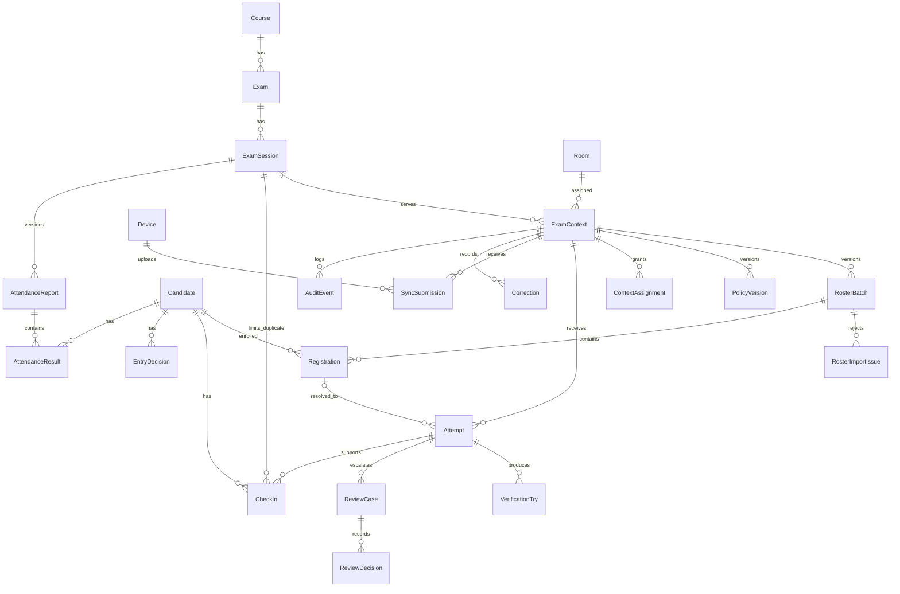

# T-018 — Thiết kế cơ sở dữ liệu cho app cửa phòng thi

**Ngày:** 2026-09-29. **Phạm vi:** một trường, nhiều học phần/kỳ thi/ca/phòng; ca học phần giả lập theo [profile 0.2-dev](T-018-profile-ca-thi-gia-lap.md) là dữ liệu đang chạy. **Người chọn hướng:** Minh Hy trả lời 5 câu hỏi thiết kế ngày 2026-09-29; Quốc An review qua PR T-018. **Trạng thái:** schema kỹ thuật đã tạo, policy kỳ thi thật và E3 còn chờ duyệt. Xem [D-004](../00-project/decisions/T-018-D-004-chon-stack-app-tham-chieu.md), [D-005](../00-project/decisions/T-018-D-005-pham-vi-android-ai-tren-may.md), [D-006](../00-project/decisions/T-018-D-006-profile-gia-lap-cho-phat-trien.md) và [T-008](../01-problem/T-008-requirements.md).

## 1. Các lựa chọn đã xác nhận

| Chủ đề | Thiết kế áp dụng |
|---|---|
| Phạm vi | Một trường; nhiều môn, kỳ thi, ca và phòng. Không tạo tenant/trường thứ hai khi chưa có nhu cầu. |
| Roster | Nhập CSV/Excel thành **batch có version**. Chỉ batch được duyệt và kích hoạt mới dùng cho tiếp nhận; bản cũ còn để tra lịch sử. Bản đầu vẫn dùng mã giả. |
| Dữ liệu mặt | PostgreSQL chỉ có metadata và khóa tham chiếu tệp ở nơi lưu bảo vệ bên ngoài; không chứa ảnh/embedding/weight dạng byte hoặc URL có token. |
| Vòng đời | Tách check-in, review, đồng bộ, correction, quyền vào phòng và attendance thành các bảng khác nhau. Bảng có sẵn không đồng nghĩa chức năng đã bật. |
| Dữ liệu thật | Chưa có retention và quyền xem/sửa chính thức. Chỉ dùng fixture giả; các giá trị đó giữ `TBD`, không đặt mặc định cho dữ liệu thật. |

## 2. Sơ đồ quan hệ chính

`ExamContext` là điểm tiếp nhận của một ca/phòng. `exam_key`, `session_key`, `room_key`, `roster_version` và `policy_version` cũ được giữ như **snapshot tương thích** để không làm mất dữ liệu/API hiện tại; FK `session`, `room`, `active_roster`, `active_policy` là liên kết cấu trúc mới. Mỗi write path phải giữ snapshot khớp FK; `clean()` kiểm tra một phần, còn service phải gọi kiểm tra trước khi ghi vì Django không tự chạy `full_clean()` ở mọi lệnh `save()`.

## 3. Bảng theo module

| Module | Bảng (`foundation_*`) | Vai trò |
|---|---|---|
| Danh mục | `course`, `exam`, `examsession`, `room`, `examcontext`, `contextassignment` | Môn/kỳ thi/ca/phòng, điểm tiếp nhận và quyền nhân sự theo context. Django `auth_user` giữ tài khoản; không dùng tài khoản PostgreSQL để đăng nhập app. |
| Roster | `candidate`, `rosterbatch`, `rosterimportissue`, `registration` | Khóa người giả/được phép nhập, batch CSV/Excel có version/hash/nguồn, lỗi từng dòng không chứa PII và phân công vào context. `declared_code` **không unique** vì mã trùng phải vào review. |
| Policy/tài sản | `policyversion`, `assetreference` | Policy có version/schema version/người-ngày duyệt; tham chiếu tệp bảo vệ chỉ chứa khóa opaque và SHA-256. Policy hiện `DRAFT`, `rules={}`. |
| Tiếp nhận/xác minh | `attempt`, `verificationtry`, `checkin`, `reviewcase`, `reviewdecision` | Lượt được tạo trước lookup, tối đa hai lần xác minh trong lượt, check-in do người có quyền xác nhận, ngoại lệ có lịch sử quyết định. |
| Offline/thiết bị | `device`, `syncsubmission` | Định danh thiết bị do app cấp, event ID/idempotency, hash payload, thời điểm trên máy và nhận ở server, trạng thái đồng bộ. Không coi nhận event là check-in. |
| Kết quả sau cửa | `entrydecision`, `attendancereport`, `attendanceresult`, `correction` | Quyền vào, báo cáo attendance có version, kết luận theo người và yêu cầu sửa có target/bản trước–sau; chưa bật nghiệp vụ bản đầu. |
| Truy vết | `auditevent` | Actor/role, context, attempt, loại/chủ thể, thời điểm xảy ra/ghi, request ID và metadata tối thiểu. Không lưu ảnh mặt trong metadata. |

Có **24 bảng nghiệp vụ** của app; tổng 35 bảng trong schema `exam_entry_app` gồm cả 11 bảng Django/DRF. `on_delete=PROTECT` bảo vệ các bản ghi lịch sử và khóa ngoại; không xóa dây chuyền kết quả khi sửa danh mục.

## 4. Ràng buộc chống sai dữ liệu

| Quy tắc | Bảo vệ hiện có |
|---|---|
| Một roster version/context; tối đa một roster `ACTIVE`/context | Unique và partial unique ở `RosterBatch`. |
| Một source key trong một roster version/context | Unique ở `Registration`; mã khai báo vẫn có thể trùng để phát hiện ngoại lệ. |
| Một policy version/context; policy `APPROVED` phải có actor và thời điểm | Unique và check constraint ở `PolicyVersion`. |
| Một check-in còn hiệu lực cho **candidate/ca**, kể cả khi đổi phòng | Partial unique ở `CheckIn(session, candidate)` khi `RECORDED` hoặc `DISPUTED`; bản `VOIDED` vẫn lưu lịch sử correction. |
| Một/lần hai lần xác minh trong một attempt | Unique `(attempt, try_no)` và check `try_no ∈ {1,2}` ở `VerificationTry`. Retry xuyên attempt còn `TBD`. |
| Không xử lý lại cùng event offline của một thiết bị | Unique `(device, client_event_id)` ở `SyncSubmission`; attempt có thêm `client_event_id` và idempotency key. |
| Một báo cáo attendance/ca/version, một kết quả/người/báo cáo | Hai unique constraint ở `AttendanceReport` và `AttendanceResult`. |
| Mỗi correction chỉ nhắm đúng một record | Check constraint trên bốn FK target của `Correction`; người có quyền áp dụng còn `TBD`. |

Quan hệ cùng context giữa registration/batch, attempt/check-in và policy active cần được xác minh trong service trước khi ghi. Các phương thức `clean()` hỗ trợ admin/form nhưng **không thay thế** kiểm tra trong transaction. Luồng check-in/correction chưa có API ghi nên không thể tạo từ Flutter hiện tại. Khi thêm API, phải dùng transaction, kiểm quyền, version và idempotency, sau đó mới ghi audit; không cho client ghi trực tiếp các bảng quyết định.

## 5. Phiên bản, thời gian và bảo vệ dữ liệu

- `RosterBatch`: version, format `DEMO|CSV|XLSX`, format version, SHA-256 nguồn, người nhập, trạng thái. `RosterImportIssue` dành cho mã lỗi và số dòng không chứa PII. File roster gốc không lưu trong PostgreSQL/Git; service import và xác nhận batch là bước triển khai tiếp.
- `PolicyVersion`: version và schema version; chỉ bản được duyệt mới có actor/thời điểm. `ExamContext` hiện trỏ bản `P-SIM-001-draft`, chưa có policy thời gian/override thật.
- `Attempt` giữ snapshot version roster/policy tại lúc bắt đầu. Đổi roster/policy sau đó không viết lại lịch sử lượt cũ.
- `observed_at` là thời gian trên thiết bị, `received_at`/`created_at` là thời gian server; chưa dùng đồng hồ thiết bị để tự quyết late.
- `AssetReference.storage_key` là khóa nội bộ của nơi lưu được bảo vệ, không phải URL công khai; không lưu dữ liệu mặt trong DB. Chưa có quyết định thời gian lưu/xóa và quyền xem, nên không nhập dữ liệu người thật.
- `EntryDecision` và `AttendanceResult` độc lập với `CheckIn`. Thiếu check-in không tự kết luận vắng; check-in không tự cấp quyền vào phòng.

## 6. Migration và trạng thái PostgreSQL

Mã Django nằm tại `backend/foundation/models/` theo nhóm `catalog`, `roster`, `governance`, `workflow` và `core`. Migration `0002` tạo schema, `0003` liên kết dữ liệu cũ, `0004` siết FK/ràng buộc, `0005` chống check-in trùng theo **ca**, `0006` bổ sung audit/version/role và `0007` thêm bảng lỗi import roster. Không reset database hay sửa migration `0001` đã áp dụng.

Ngày 2026-09-29 đã áp migration lên database **`exam_entry`**, schema **`exam_entry_app`**. Kiểm tra sau migration: 1 tài khoản Django, 1 context `CTX-SIM-01`, 1 môn/1 kỳ thi/1 ca/1 phòng, 2 candidate/2 registration, 1 roster và 1 policy đều `DRAFT`, 0 attempt, 0 check-in. Ca vẫn `SETUP`. Schema `public` cũ không bị thay đổi trong đợt này.

Trước migration đã sao lưu schema cục bộ tại `backend/.local/exam-entry-app-before-schema-v2-20260929-205649.dump` (Git ignore, có thể chứa password hash; không gửi công khai). Muốn xem trong pgAdmin, kết nối đúng server `127.0.0.1:5432`, Refresh **Databases**, rồi mở `exam_entry → Schemas → exam_entry_app → Tables`.

## 7. Cổng còn thiếu trước khi vận hành dữ liệu thật

Quốc An cần review profile/E3; nhóm cần quy tắc giờ đến, authority cho reviewer/override/correction, nguồn dữ liệu thật, retention, bảo vệ tệp mặt, thiết bị Android và phép đo B0. Các bảng tương ứng đã có cấu trúc để mở rộng qua migration; **không** đặt policy mặc định hoặc chuyển ca sang `OPEN` khi các quyết định này chưa có. [Kế hoạch T-018](T-018-ke-hoach-trien-khai-app.md) theo dõi việc xây service/API/import/UI ở các mốc tiếp theo.
