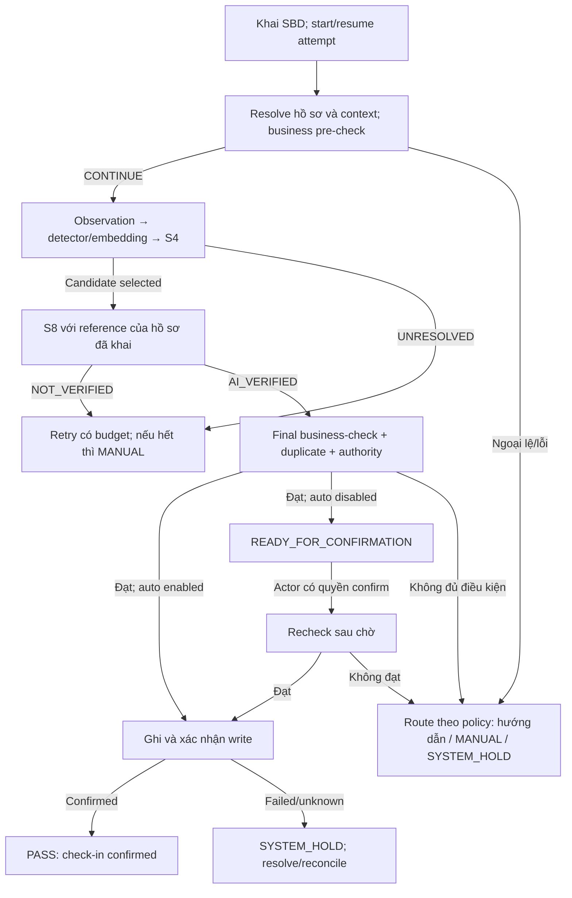

# T-024 — 02. Loại người dùng, quyền và quy trình

## 1. Actor và role đã xác định

| Actor/role | Chức năng trong app | Ranh giới quyền |
| --- | --- | --- |
| Candidate — thí sinh | Khai mã, kiểm thông tin hồ sơ được hiển thị, đứng camera, nhận hướng dẫn/kết quả. | Không sửa roster/reference, verdict hoặc tự duyệt ngoại lệ. Là actor tương tác, chưa yêu cầu account/login riêng. |
| OPERATOR — người vận hành | Hướng dẫn, retry/resume trong budget, redirect theo dữ liệu, route case. | Không xác nhận identity/PASS, duyệt late/re-entry, sửa record hoặc giảm threshold. |
| AUTHORIZED_ROOM_STAFF — cán bộ phòng có quyền | Confirm READY; manual identity; late/re-entry/duplicate cục bộ trong delegation. | Chỉ trong scope phòng/ca và quyền được cấp. Data conflict, blocked status, ca đóng, unknown write, correction → Admin. |
| EXAM_ADMIN — quản lý | Source data/policy/role, conflict, lifecycle, correction, reconciliation/fallback có căn cứ. | Không sửa lịch sử AI/score hoặc biến chưa rõ thành success; thiếu thẩm quyền nguồn thì giữ pending/escalate. |

Nguồn: [D-006](../../00-project/decisions/T-024-D-006-manual-authority.md) và [business policy §3.1](../../01-problem/T-024-business-policy.md#31-group-3--manual-authority-đã-duyệt). Một người demo có thể giữ nhiều role khi gán rõ; audit ghi role/quyền sử dụng tại từng action. Chưa gán tài khoản thật hoặc mặc định An/Hy là Exam Admin.

**Manual identity cần cả ba:** quyền role + evidence method đã được policy duyệt + scope phòng/ca. Thiếu một điều kiện → ESCALATE/pending. HUMAN là quyết định độc lập, không sửa NOT_VERIFIED thành AI_VERIFIED, không tính manual-approved check-in là AI success.

## 2. Happy path và điểm chuyển quyền

AI_VERIFIED không tự ghi PASS. Luồng manual có thể tạo check-in nguồn HUMAN khi có đủ evidence/quyền, business final-check và confirmed write; không bỏ qua data hold hoặc duplicate.

## 3. Outcome để app hiển thị/route

| Outcome | Nghĩa và action |
| --- | --- |
| CONTINUE | Đi tiếp bước kiểm còn lại; chưa kết luận thành công. |
| RETRY | Thu mới hoặc recovery đúng loại/budget; ghi reason và counters. |
| MANUAL | Có ngoại lệ/thiếu evidence cần người có quyền xử lý; chưa ghi success. |
| READY_FOR_CONFIRMATION | Luồng đạt nhưng auto flag false; chờ authorized confirmation, rồi recheck/write. |
| PASS | Check-in đã ghi thành công; ghi nguồn AUTO/HUMAN tương ứng, không suy đã vào/đã thi. |
| INFO/WAIT, REDIRECT | Hướng dẫn chờ/đúng phòng-ca theo dữ liệu; không phải AI failure. |
| CHECK_IN_NOT_ALLOWED | Policy không cho ghi trong luồng hiện tại; không đồng nghĩa AI kết luận cấm thi/gian lận. |
| SYSTEM_HOLD | Data/config/device/write không đáng tin; dừng nhánh tự động và route phục hồi. |
| INTERRUPTED | Lượt bỏ/gián đoạn, giữ history; không tự gán absent. |

LATE, WRONG_ROOM và WRONG_SESSION là **situation flags**, có thể cùng tồn tại với lifecycle/outcome. ESCALATE là routing tới authority cao hơn, không phải check-in thành công.

## 4. Cuối ca và correction

Đóng routine intake → gom pending/fallback → đối soát records điện tử/thủ công → attendance theo định nghĩa cấu hình. Thiếu evidence thì giữ UNDETERMINED. Admin sửa/reopen trong quyền, lưu trước/sau/reason/evidence và liên kết record gốc; không xóa lịch sử AI.

Hy cần bind receiver, scope, evidence method và account cho các nhánh demo dùng tới. Có thể làm happy path trước, nhưng nhánh chưa có authority/evidence không được mặc định approve.
